# Technical Design Document

## Overview

This ZModel schema defines the data structures and access policies for a comprehensive test management application. It covers various aspects from user authentication and project management to detailed test case and test run lifecycle, session-based testing, milestones, issue tracking, and advanced AI/LLM integrations. The schema emphasizes robust access control, data integrity, and extensibility.

## Functionality

- User Authentication and Authorization: Supports internal, OAuth, and SAML authentication with roles, access levels, and granular permissions.
- Project Management: Allows creation, assignment of users/groups, and defines project-specific access policies.
- Test Case Repository: Manages test cases, folders, versions, custom fields, and shared steps.
- Test Run Management: Facilitates planning, execution, and reporting of test runs, including integration with automated test results (JUnit).
- Session-Based Testing: Supports exploratory testing sessions with results and field values.
- Milestone Tracking: Organizes project work into hierarchical milestones.
- Integrations: Connects with external issue tracking systems (Jira, GitHub) and Large Language Models (LLMs).
- API Access: Provides API tokens for programmatic access with scoped permissions.
- Notifications: In-app and email notifications for user-relevant events.
- System Configuration: Manages application-wide settings, SSO providers, and user registration policies.
- Audit Logging: Records critical actions and system events for security and compliance.
- AI/LLM Features: Configures LLM providers, prompt templates, tracks usage, caches responses, and applies rate limits.

## Enums

### Access

Defines different system-wide access levels for users (NONE, USER, PROJECTADMIN, ADMIN).

- NONE
- USER
- PROJECTADMIN
- ADMIN

### ApplicationArea

Defines distinct functional areas within the application for granular permission management (e.g., Documentation, TestRuns, Issues).

- Documentation
- Milestones
- TestCaseRepository
- TestCaseRestrictedFields
- TestRuns
- ClosedTestRuns
- TestRunResults
- TestRunResultRestrictedFields
- Sessions
- SessionsRestrictedFields
- ClosedSessions
- SessionResults
- Tags
- SharedSteps
- Issues
- IssueIntegration
- Forecasting
- Reporting
- Settings

### AuditAction

Defines distinct actions that are recorded in the audit log (e.g., CREATE, UPDATE, LOGIN, PASSWORD_CHANGED).

- CREATE
- UPDATE
- DELETE
- BULK_CREATE
- BULK_UPDATE
- BULK_DELETE
- LOGIN
- LOGOUT
- LOGIN_FAILED
- SESSION_INVALIDATED
- PASSWORD_CHANGED
- PASSWORD_RESET
- PERMISSION_GRANT
- PERMISSION_REVOKE
- ROLE_CHANGED
- API_KEY_CREATED
- API_KEY_REGENERATED
- DATA_EXPORTED
- SSO_CONFIG_CHANGED
- SYSTEM_CONFIG_CHANGED

### AuthMethod

Specifies the authentication method used by a user (INTERNAL, SSO, BOTH).

- INTERNAL
- SSO
- BOTH

### DateFormat

Defines available date format options for user preferences (e.g., MM/DD/YYYY, YYYY-MM-DD).

- MM_DD_YYYY_SLASH
- MM_DD_YYYY_DASH
- DD_MM_YYYY_SLASH
- DD_MM_YYYY_DASH
- YYYY_MM_DD
- MMM_D_YYYY
- D_MMM_YYYY

### IntegrationAuthType

Defines authentication methods for integrations (NONE, OAUTH2, PERSONAL_ACCESS_TOKEN, API_KEY).

- NONE
- OAUTH2
- PERSONAL_ACCESS_TOKEN
- API_KEY

### IntegrationProvider

Lists supported providers for external integrations (e.g., JIRA, GITHUB, AZURE_DEVOPS, SIMPLE_URL).

- JIRA
- GITHUB
- AZURE_DEVOPS
- SIMPLE_URL

### IntegrationStatus

Indicates the current operational status of an integration (ACTIVE, INACTIVE, ERROR).

- ACTIVE
- INACTIVE
- ERROR

### ItemsPerPage

Defines options for the number of items to display per page in lists (10, 25, 50, 100, 250).

- P10
- P25
- P50
- P100
- P250

### JUnitAttachmentType

Defines the type of JUnit attachment (FILE, URL, INLINE content).

- FILE
- URL
- INLINE

### JUnitResultType

Defines the possible outcomes for a JUnit test result (PASSED, FAILURE, ERROR, SKIPPED).

- PASSED
- FAILURE
- ERROR
- SKIPPED

### LinkType

Defines the type of relationship between linked test cases (e.g., SAME_TEST_DIFFERENT_SOURCE, DEPENDS_ON).

- SAME_TEST_DIFFERENT_SOURCE
- DEPENDS_ON

### LlmProvider

Lists supported Large Language Model (LLM) providers (e.g., OPENAI, ANTHROPIC, OLLAMA).

- OPENAI
- ANTHROPIC
- AZURE_OPENAI
- GEMINI
- OLLAMA
- CUSTOM_LLM

### Locale

Defines available language and region settings (en_US, es_ES, fr_FR).

- en_US
- es_ES
- fr_FR

### NotificationMode

Defines user preferences for how they receive notifications (e.g., In-App, In-App & Email Immediate).

- NONE
- IN_APP
- IN_APP_EMAIL_IMMEDIATE
- IN_APP_EMAIL_DAILY
- USE_GLOBAL

### NotificationType

Defines different types of notifications that can be sent (e.g., Work Assigned, System Announcement).

- WORK_ASSIGNED
- SESSION_ASSIGNED
- SYSTEM_ANNOUNCEMENT
- USER_REGISTERED
- COMMENT_MENTION
- MILESTONE_DUE_REMINDER

### ProjectAccessType

Specifies how user permissions are determined for a project (DEFAULT, NO_ACCESS, GLOBAL_ROLE, SPECIFIC_ROLE).

- DEFAULT
- NO_ACCESS
- GLOBAL_ROLE
- SPECIFIC_ROLE

### RepositoryCaseSource

Specifies the origin or import source of a test case (e.g., MANUAL, JUNIT, API).

- MANUAL
- JUNIT
- TESTNG
- XUNIT
- NUNIT
- MSTEST
- MOCHA
- CUCUMBER
- API

### SsoProviderType

Lists supported types of Single Sign-On (SSO) providers (GOOGLE, SAML, APPLE, MAGIC_LINK).

- GOOGLE
- SAML
- APPLE
- MAGIC_LINK

### TestmoImportPhase

Defines the different phases an import job goes through (UPLOADING, ANALYZING, IMPORTING, FINALIZING).

- UPLOADING
- ANALYZING
- CONFIGURING
- IMPORTING
- FINALIZING

### TestmoImportStatus

Defines the possible statuses for a Testmo import job (QUEUED, RUNNING, COMPLETED, FAILED, CANCELED).

- QUEUED
- RUNNING
- READY
- COMPLETED
- FAILED
- CANCELED

### TestRunType

Categorizes different types of test runs (e.g., REGULAR, JUNIT, API).

- REGULAR
- JUNIT
- TESTNG
- XUNIT
- NUNIT
- MSTEST
- MOCHA
- CUCUMBER

### Theme

Defines available UI themes for user preferences (Light, Dark, System, Green, Orange, Purple).

- Light
- Dark
- System
- Green
- Orange
- Purple

### TimeFormat

Defines available time format options for user preferences (e.g., HH:mm, hh:mm a).

- HH_MM
- HH_MM_A
- HH_MM_Z
- HH_MM_Z_A

### WorkflowScope

Specifies what entities a workflow applies to (CASES, RUNS, SESSIONS).

- CASES
- RUNS
- SESSIONS

### WorkflowType

Categorizes workflows based on their general state (NOT_STARTED, IN_PROGRESS, DONE).

- NOT_STARTED
- IN_PROGRESS
- DONE

## Models

- [Account](#account)
- [AllowedEmailDomain](#allowedemaildomain)
- [ApiToken](#apitoken)
- [AppConfig](#appconfig)
- [Attachments](#attachments)
- [AuditLog](#auditlog)
- [CaseFieldAssignment](#casefieldassignment)
- [CaseFields](#casefields)
- [CaseFieldTypes](#casefieldtypes)
- [CaseFieldValues](#casefieldvalues)
- [CaseFieldVersionValues](#casefieldversionvalues)
- [Color](#color)
- [ColorFamily](#colorfamily)
- [Comment](#comment)
- [CommentMention](#commentmention)
- [ConfigCategories](#configcategories)
- [ConfigurationConfigVariant](#configurationconfigvariant)
- [Configurations](#configurations)
- [ConfigVariants](#configvariants)
- [FieldIcon](#fieldicon)
- [FieldOptions](#fieldoptions)
- [GroupAssignment](#groupassignment)
- [GroupProjectPermission](#groupprojectpermission)
- [Groups](#groups)
- [Integration](#integration)
- [Issue](#issue)
- [JUnitAttachment](#junitattachment)
- [JUnitProperty](#junitproperty)
- [JUnitTestResult](#junittestresult)
- [JUnitTestStep](#junitteststep)
- [JUnitTestSuite](#junittestsuite)
- [LlmFeatureConfig](#llmfeatureconfig)
- [LlmIntegration](#llmintegration)
- [LlmPromptTemplate](#llmprompttemplate)
- [LlmProviderConfig](#llmproviderconfig)
- [LlmRateLimit](#llmratelimit)
- [LlmResponseCache](#llmresponsecache)
- [LlmUsage](#llmusage)
- [Milestones](#milestones)
- [MilestoneTypes](#milestonetypes)
- [MilestoneTypesAssignment](#milestonetypesassignment)
- [Notification](#notification)
- [OllamaModelRegistry](#ollamamodelregistry)
- [ProjectAssignment](#projectassignment)
- [ProjectIntegration](#projectintegration)
- [ProjectLlmIntegration](#projectllmintegration)
- [Projects](#projects)
- [ProjectStatusAssignment](#projectstatusassignment)
- [ProjectWorkflowAssignment](#projectworkflowassignment)
- [RegistrationSettings](#registrationsettings)
- [Repositories](#repositories)
- [RepositoryCaseLink](#repositorycaselink)
- [RepositoryCases](#repositorycases)
- [RepositoryCaseVersions](#repositorycaseversions)
- [RepositoryFolders](#repositoryfolders)
- [ResultFieldAssignment](#resultfieldassignment)
- [ResultFields](#resultfields)
- [ResultFieldValues](#resultfieldvalues)
- [RolePermission](#rolepermission)
- [Roles](#roles)
- [SamlConfiguration](#samlconfiguration)
- [SessionFieldValues](#sessionfieldvalues)
- [SessionResults](#sessionresults)
- [Sessions](#sessions)
- [SessionVersions](#sessionversions)
- [SharedStepGroup](#sharedstepgroup)
- [SharedStepItem](#sharedstepitem)
- [SsoProvider](#ssoprovider)
- [Status](#status)
- [StatusScope](#statusscope)
- [StatusScopeAssignment](#statusscopeassignment)
- [Steps](#steps)
- [Tags](#tags)
- [TemplateCaseAssignment](#templatecaseassignment)
- [TemplateProjectAssignment](#templateprojectassignment)
- [TemplateResultAssignment](#templateresultassignment)
- [Templates](#templates)
- [TestmoImportDataset](#testmoimportdataset)
- [TestmoImportJob](#testmoimportjob)
- [TestmoImportMapping](#testmoimportmapping)
- [TestmoImportStaging](#testmoimportstaging)
- [TestRunCases](#testruncases)
- [TestRunResults](#testrunresults)
- [TestRuns](#testruns)
- [TestRunStepResults](#testrunstepresults)
- [User](#user)
- [UserIntegrationAuth](#userintegrationauth)
- [UserPreferences](#userpreferences)
- [UserProjectPermission](#userprojectpermission)
- [VerificationToken](#verificationtoken)
- [Workflows](#workflows)

### Account

Stores user account information for OAuth providers, required by NextAuth for authentication.
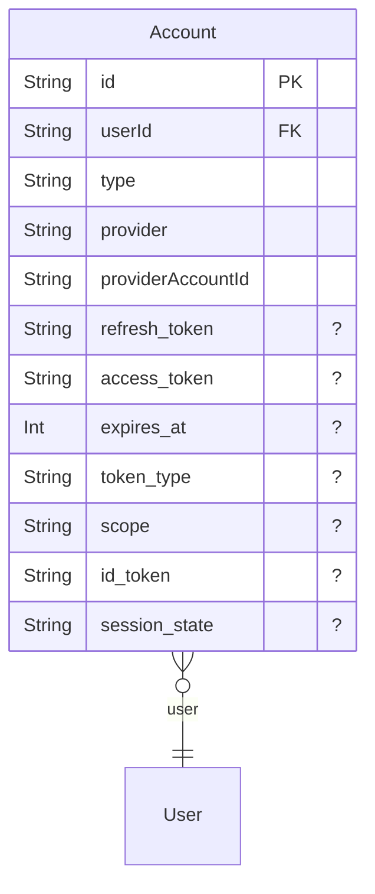

- Deny all operations if the user is not authenticated.
- Allow creation of accounts (during sign-in).
- Allow read, update, and delete operations if the authenticated user's ID matches the 'userId' associated with the account, or if the authenticated user has 'ADMIN' access.

### AllowedEmailDomain

Manages a list of email domains allowed for user registration, used to restrict who can sign up for the application.
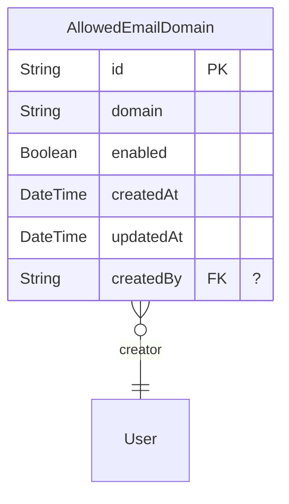

- Allow read operations for all users, including unauthenticated ones.
- Allow create, update, and delete operations if the authenticated user has 'ADMIN' access.

### ApiToken

Manages API tokens for programmatic access to the application, including CLI, CI/CD, and integrations.
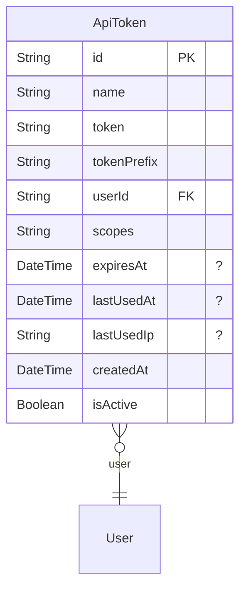

- Deny all operations if the user is not authenticated.
- Allow creation of API tokens if the authenticated user has any access level (not null).
- Allow read, update, and delete operations if the authenticated user's ID matches the 'userId' associated with the token, or if the authenticated user has 'ADMIN' access.

### AppConfig

Stores application-wide configuration settings as key-value pairs.
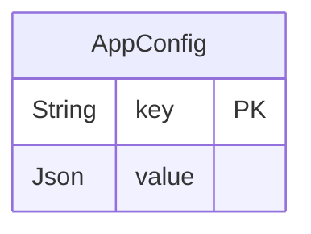

- Deny delete, update, and read access if the user is not authenticated.
- Allow all operations if the authenticated user has 'ADMIN' access.
- Allow read access if the authenticated user has any access level (not null).

### Attachments

Manages file attachments for various entities like test cases, sessions, and test runs.
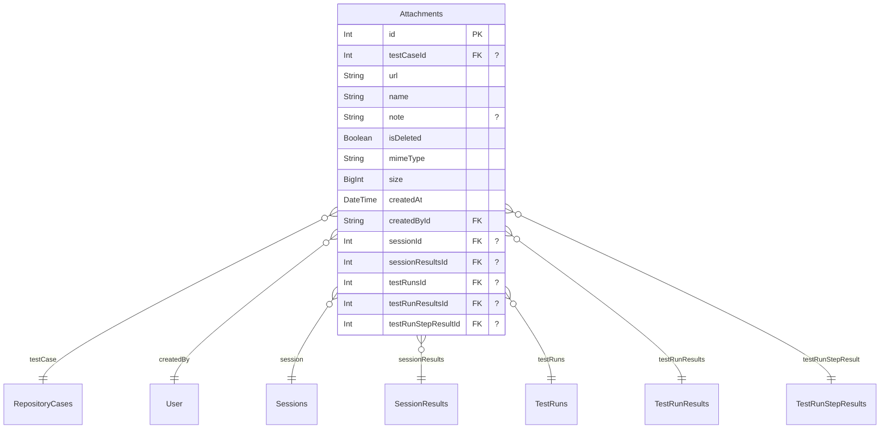

- Deny all operations if the user is not authenticated.
- Deny all operations if the authenticated user's access level is 'NONE'.
- Allow all operations if the authenticated user has 'ADMIN' access.
- Allow create, read, and update operations if the authenticated user has any access level (not null).

### AuditLog

Records audit trails of significant user actions and system events for security, compliance, and debugging purposes.
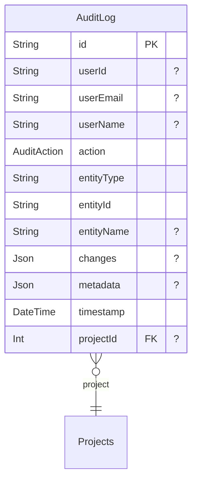

- Deny all operations if the user is not authenticated.
- Deny update and delete operations for all users, including admins (logs are immutable).
- Allow read operations if the authenticated user has 'ADMIN' access.

### CaseFieldAssignment

Assigns 'FieldOptions' to 'CaseFields', for example, defining the possible values for a dropdown field.
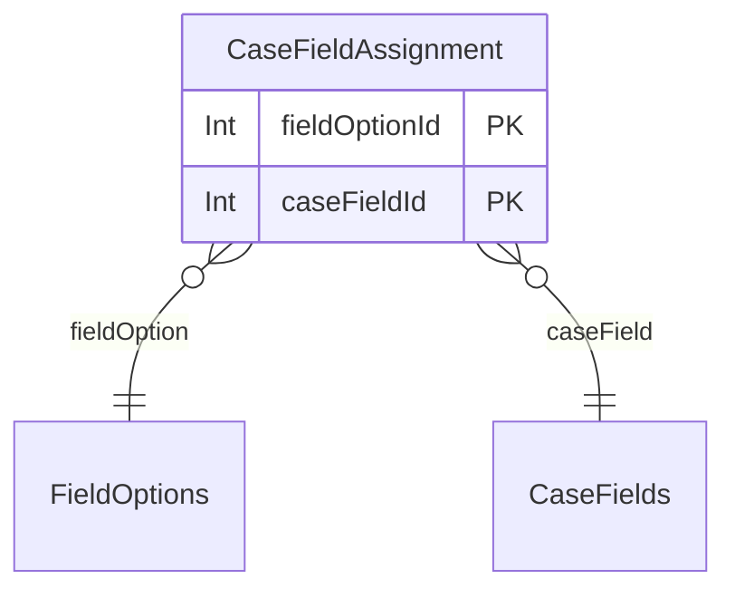

- Deny all operations if the user is not authenticated.
- Allow all operations if the authenticated user has 'ADMIN' access.
- Allow read access if the authenticated user has any access level (not null).

### CaseFields

Defines custom fields that can be used for test cases, including their display name, system name, type, validation rules, and default values.
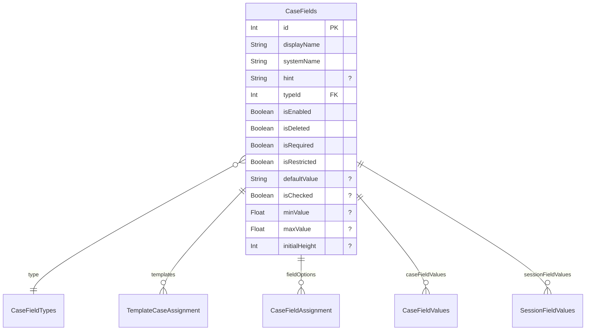

- Deny all operations if the user is not authenticated.
- Allow all operations if the authenticated user has 'ADMIN' access or 'PROJECTADMIN' access.
- Allow all operations if the authenticated user has any access level (not null), which is needed in case the user has add/edit access to test cases.

### CaseFieldTypes

Defines the available data types for custom case and result fields (e.g., text, number, boolean, date).
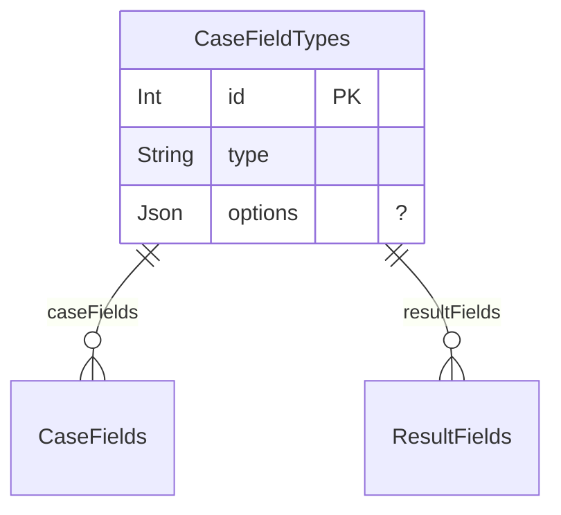

- Deny all operations if the user is not authenticated.
- Allow all operations if the authenticated user has 'ADMIN' access.
- Allow read access if the authenticated user has any access level (not null).

### CaseFieldValues

Stores the values for custom 'CaseFields' associated with 'RepositoryCases'.
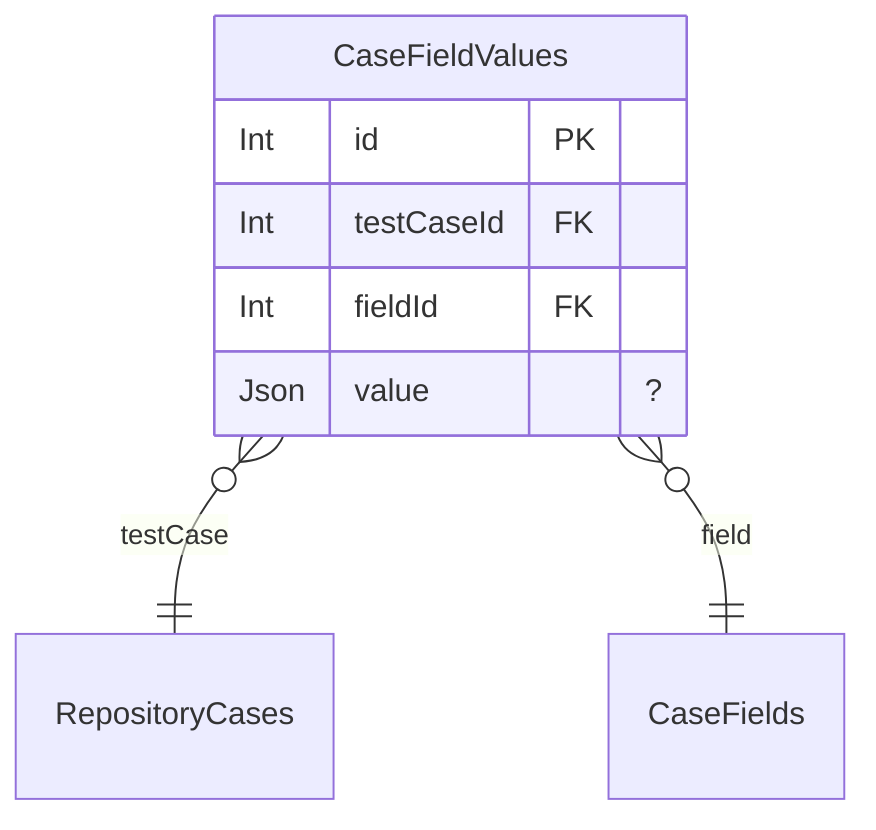

- Deny all operations if the user is not authenticated.
- Deny all operations if the authenticated user's access level is 'NONE'.
- Deny read access if the associated test case's project user permissions explicitly deny 'NO_ACCESS' for the authenticated user.
- Allow read access if the user is the project creator of the test case's project.
- Allow read access if the user has explicit 'SPECIFIC_ROLE' or 'GLOBAL_ROLE' user permissions for the test case's project.
- Allow read access if the user belongs to a group with 'SPECIFIC_ROLE' or 'GLOBAL_ROLE' permissions for the test case's project.
- Allow read access if the test case's project's default access type is 'GLOBAL_ROLE' and the user has a valid role and not 'NONE' access.
- Allow read access if the user is assigned to the test case's project, and its default access type is 'SPECIFIC_ROLE' with a default role.
- Allow create, update, and delete access if the user is the project creator of the test case's project.
- Allow create, update, and delete access if the user has 'SPECIFIC_ROLE' project permissions for the test case's project and the role is 'Project Admin' or allows adding/editing in 'TestCaseRepository' area.
- Allow create, update, and delete access if the user has 'GLOBAL_ROLE' project permissions for the test case's project and their global role allows adding/editing in 'TestCaseRepository' area.
- Allow create, update, and delete access if the user has 'PROJECTADMIN' access and is assigned to the test case's project.
- Allow create, update, and delete access if the user belongs to a group with 'SPECIFIC_ROLE' or 'GLOBAL_ROLE' project permissions for the test case's project that allow adding/editing in 'TestCaseRepository' area.
- Allow create, update, and delete access if the test case's project uses 'GLOBAL_ROLE' as default and the user's global role allows adding/editing in 'TestCaseRepository' area.
- Allow create, update, and delete access if the user is assigned to the test case's project, and its default role allows adding/editing in 'TestCaseRepository' area.
- Allow all operations if the authenticated user has 'ADMIN' access.

### CaseFieldVersionValues

Stores the values for custom fields for a specific version of a test case.
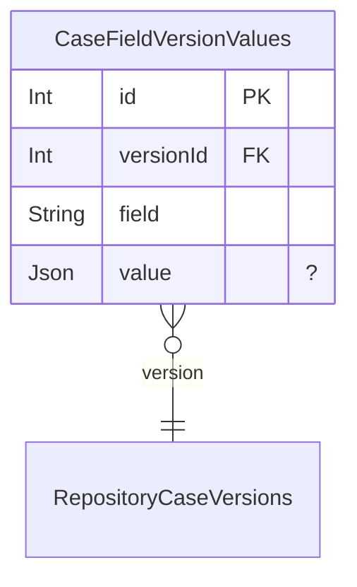

- Deny all operations if the user is not authenticated.
- Deny all operations if the authenticated user's access level is 'NONE'.
- Deny read access if the associated version's project user permissions explicitly deny 'NO_ACCESS' for the authenticated user.
- Allow read access if the user is the project creator of the version's project.
- Allow read access if the user has explicit 'SPECIFIC_ROLE' or 'GLOBAL_ROLE' user permissions for the version's project.
- Allow read access if the user belongs to a group with 'SPECIFIC_ROLE' or 'GLOBAL_ROLE' permissions for the version's project.
- Allow read access if the version's project's default access type is 'GLOBAL_ROLE' and the user has a valid role and not 'NONE' access.
- Allow read access if the user is assigned to the version's project, and its default access type is 'SPECIFIC_ROLE' with a default role.
- Allow create, update, and delete access if the user is the project creator of the version's project.
- Allow create, update, and delete access if the user has 'SPECIFIC_ROLE' project permissions for the version's project and the role is 'Project Admin' or allows adding/editing in 'TestCaseRepository' area.
- Allow create, update, and delete access if the user has 'GLOBAL_ROLE' project permissions for the version's project and their global role allows adding/editing in 'TestCaseRepository' area.
- Allow create, update, and delete access if the user has 'PROJECTADMIN' access and is assigned to the version's project.
- Allow create, update, and delete access if the user belongs to a group with 'SPECIFIC_ROLE' or 'GLOBAL_ROLE' project permissions for the version's project that allow adding/editing in 'TestCaseRepository' area.
- Allow create, update, and delete access if the version's project uses 'GLOBAL_ROLE' as default and the user's global role allows adding/editing in 'TestCaseRepository' area.
- Allow create, update, and delete access if the user is assigned to the version's project, and its default role allows adding/editing in 'TestCaseRepository' area.
- Allow all operations if the authenticated user has 'ADMIN' access.

### Color

Defines specific colors, grouped by color family, which can be used for UI elements or field options.
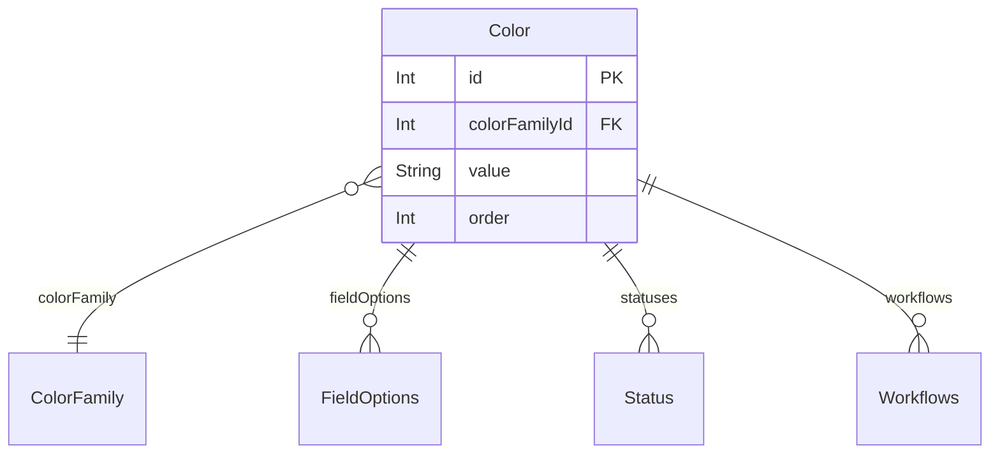

- Deny all operations if the user is not authenticated.
- Allow all operations if the authenticated user has 'ADMIN' access.
- Allow create and read access if the authenticated user has any access level (not null).

### ColorFamily

Organizes colors into families for better management and selection.
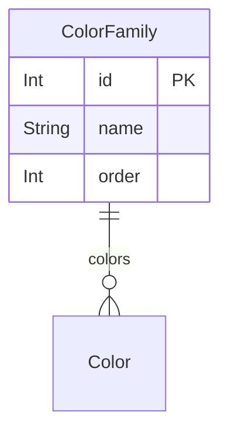

- Deny all operations if the user is not authenticated.
- Allow all operations if the authenticated user has 'ADMIN' access.
- Allow create and read access if the authenticated user has any access level (not null).

### Comment

Represents user comments on various entities (cases, runs, sessions, milestones), supporting rich text content and user mentions.
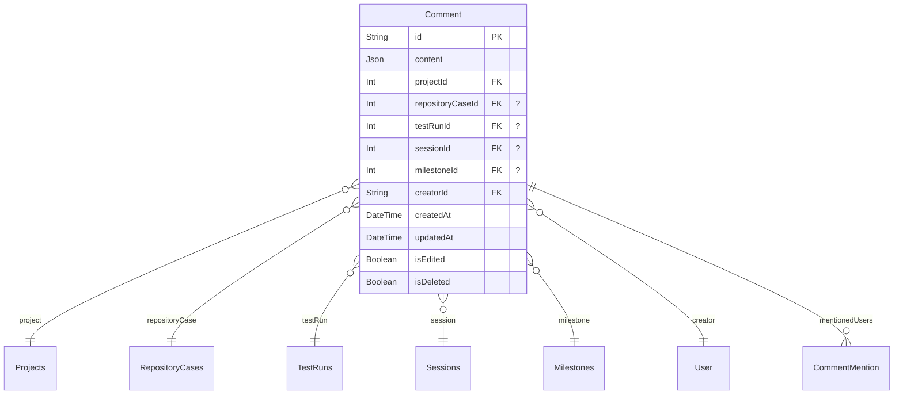

- Deny all operations if the user is not authenticated.
- Deny all operations if the authenticated user's access level is 'NONE'.
- Deny read access if the associated project's user permissions explicitly deny 'NO_ACCESS' for the authenticated user.
- Allow read access if the user is the project creator.
- Allow read access if the user has explicit 'SPECIFIC_ROLE' or 'GLOBAL_ROLE' user permissions for the project.
- Allow read access if the user belongs to a group with 'SPECIFIC_ROLE' or 'GLOBAL_ROLE' permissions for the project.
- Allow read access if the project's default access type is 'GLOBAL_ROLE' and the user has a valid role and not 'NONE' access.
- Allow read access if the user is assigned to the project, and the project's default access type is 'SPECIFIC_ROLE' with a default role.
- Allow create access if the user has read access as described above.
- Allow update access if the authenticated user is the creator of the comment and the comment is not deleted.
- Allow delete access if the authenticated user is the creator of the comment or has 'ADMIN' access.
- Allow all operations if the authenticated user has 'ADMIN' access.

### CommentMention

Records mentions of users within comments, facilitating notification and communication.
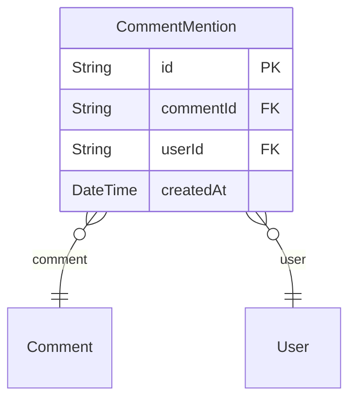

- Deny all operations if the user is not authenticated.
- Allow read operations if the authenticated user has any access level (not null).
- Allow create operations if the authenticated user has any access level (not null).
- Allow all operations if the authenticated user has 'ADMIN' access.

### ConfigCategories

Organizes configurations into logical categories.
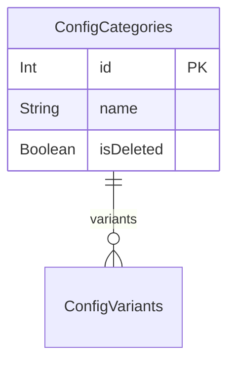

- Deny all operations if the user is not authenticated.
- Allow all operations if the authenticated user has 'ADMIN' access.
- Allow read access if the authenticated user has any access level (not null).

### ConfigurationConfigVariant

Links configurations to their specific variants, forming a complete configuration.
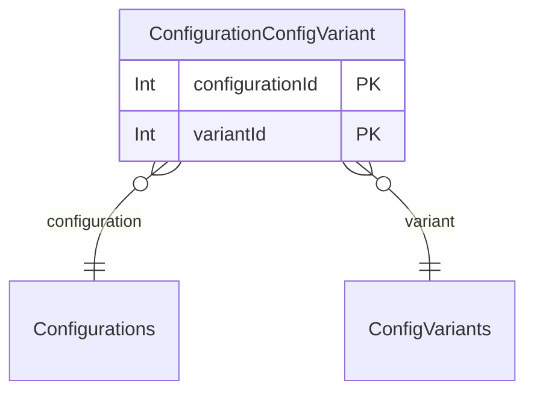

- Deny all operations if the user is not authenticated.
- Allow all operations if the authenticated user has 'ADMIN' access.
- Allow read access if the authenticated user has any access level (not null).

### Configurations

Defines specific configurations, composed of variants, which can be applied to sessions and test runs.
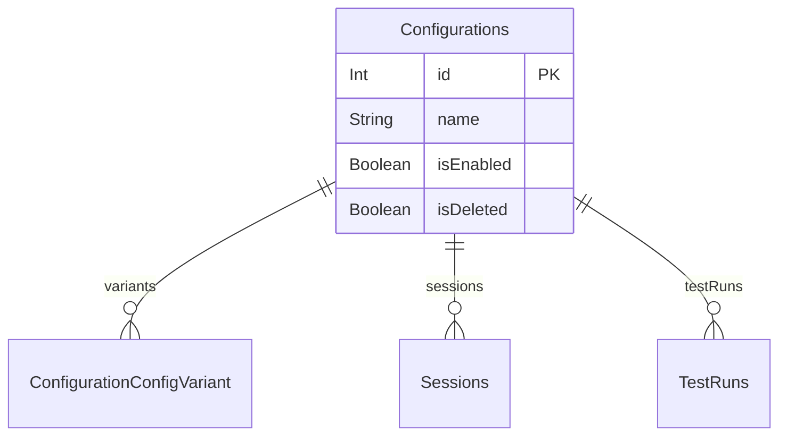

- Deny all operations if the user is not authenticated.
- Allow all operations if the authenticated user has 'ADMIN' access.
- Allow read access if the authenticated user has any access level (not null).

### ConfigVariants

Represents variations within configuration categories (e.g., 'OS' category might have 'Windows', 'macOS' variants).
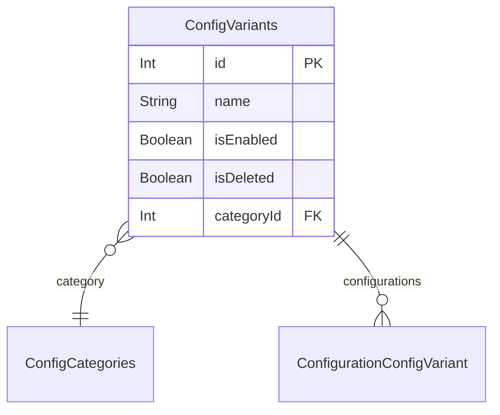

- Deny all operations if the user is not authenticated.
- Allow all operations if the authenticated user has 'ADMIN' access.
- Allow read access if the authenticated user has any access level (not null).

### FieldIcon

Stores icons that can be associated with various fields and types.
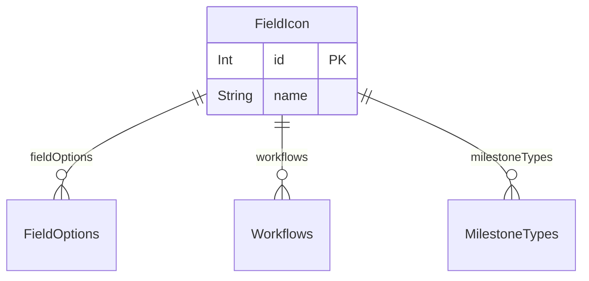

- Deny all operations if the user is not authenticated.
- Allow all operations if the authenticated user has 'ADMIN' access.
- Allow create and read access if the authenticated user has any access level (not null).

### FieldOptions

Provides options for 'CaseFields' and 'ResultFields', such as dropdown choices with associated icons and colors.
```mermaid
erDiagram
"FieldOptions" {
  Int id PK
  String name
  Int iconId FK "?"
  Boolean isEnabled
  Boolean isDeleted
  Int iconColorId FK "?"
  Boolean isDefault
  Int order
}

"FieldOptions" }o--|| "FieldIcon": icon
"FieldOptions" }o--|| "Color": iconColor
"FieldOptions" ||--o{ "CaseFieldAssignment": caseFields
"FieldOptions" ||--o{ "ResultFieldAssignment": resultFields

```

- Deny all operations if the user is not authenticated.
- Allow all operations if the authenticated user has 'ADMIN' access.
- Allow read access if the authenticated user has any access level (not null).

### GroupAssignment

Links users to groups, indicating which users belong to which groups.
```mermaid
erDiagram
"GroupAssignment" {
  String userId PK
  Int groupId PK
}

"GroupAssignment" }o--|| "User": user
"GroupAssignment" }o--|| "Groups": group

```

- Deny all operations if the user is not authenticated.
- Allow all operations if the authenticated user has 'ADMIN' access.
- Allow read access if the authenticated user has any access level (not null).

### GroupProjectPermission

Defines explicit access permissions for a user group on a specific project.
```mermaid
erDiagram
"GroupProjectPermission" {
  Int groupId PK
  Int projectId PK
  ProjectAccessType accessType
  Int roleId FK "?"
}

"GroupProjectPermission" }o--|| "Groups": group
"GroupProjectPermission" }o--|| "Projects": project
"GroupProjectPermission" }o--|| "Roles": role

```

- Deny all operations if the user is not authenticated.
- Allow all operations if the authenticated user has 'ADMIN' access.
- Allow all operations if the authenticated user is the project creator.
- Allow all operations if the authenticated user has 'PROJECTADMIN' access and is assigned to the project.
- Allow all operations if the authenticated user has an explicit 'SPECIFIC_ROLE' as 'Project Admin' within the project's user permissions.
- Allow read access if the authenticated user belongs to the group.
- Allow read access if the authenticated user is assigned to the project.
- Deny create and update operations if 'accessType' is 'SPECIFIC_ROLE' but 'roleId' is null.

### Groups

Represents groups of users within the application, used for managing permissions.
```mermaid
erDiagram
"Groups" {
  Int id PK
  String name
  String externalId  "?"
  String url  "?"
  String note  "?"
  Boolean isDeleted
}

"Groups" ||--o{ "GroupAssignment": assignedUsers
"Groups" ||--o{ "GroupProjectPermission": projectPermissions

```

- Deny all operations if the user is not authenticated.
- Allow all operations if the authenticated user has 'ADMIN' access.
- Allow read access if the authenticated user has any access level (not null).

### Integration

Configures external integrations (e.g., Jira, GitHub) at a global level, including credentials and provider-specific settings.
```mermaid
erDiagram
"Integration" {
  Int id PK
  String name
  IntegrationProvider provider
  IntegrationAuthType authType
  IntegrationStatus status
  Json credentials
  Json settings  "?"
  DateTime lastSyncAt  "?"
  Boolean isDeleted
  DateTime createdAt
  DateTime updatedAt
}

"Integration" ||--o{ "UserIntegrationAuth": userIntegrationAuths
"Integration" ||--o{ "ProjectIntegration": projectIntegrations
"Integration" ||--o{ "Issue": issues

```

- Deny all operations if the user is not authenticated.
- Allow read access if the authenticated user has any access level (not null).
- Allow all operations if the authenticated user has 'ADMIN' access.

### Issue

Represents an issue, potentially linked to external issue tracking systems, associated with various testing entities like cases, runs, and sessions.
```mermaid
erDiagram
"Issue" {
  Int id PK
  String name
  String title
  String description  "?"
  String status  "?"
  String priority  "?"
  String externalId  "?"
  String externalKey  "?"
  String externalUrl  "?"
  String externalStatus  "?"
  Json externalData  "?"
  String issueTypeId  "?"
  String issueTypeName  "?"
  String issueTypeIconUrl  "?"
  DateTime lastSyncedAt  "?"
  Json data  "?"
  Json note  "?"
  Boolean isDeleted
  DateTime createdAt
  String createdById FK
  Int projectId FK "?"
  Int integrationId FK "?"
}

"Issue" }o--|| "User": createdBy
"Issue" }o--o{ "RepositoryCases": repositoryCases
"Issue" }o--o{ "Sessions": sessions
"Issue" }o--o{ "SessionResults": sessionResults
"Issue" }o--o{ "TestRuns": testRuns
"Issue" }o--o{ "TestRunResults": testRunResults
"Issue" }o--o{ "TestRunStepResults": testRunStepResults
"Issue" }o--|| "Projects": project
"Issue" }o--|| "Integration": integration

```

- Deny all operations if the user is not authenticated.
- Deny all operations if the authenticated user's access level is 'NONE'.
- Allow all operations if the authenticated user has 'ADMIN' access.
- Allow create, read, and update operations if the authenticated user has any access level (not null).

### JUnitAttachment

Stores attachments linked to JUnit test results, associated with a repository case.
```mermaid
erDiagram
"JUnitAttachment" {
  Int id PK
  String name
  String value
  JUnitAttachmentType type
  Int repositoryCaseId FK
  DateTime createdAt
  String createdById FK
}

"JUnitAttachment" }o--|| "RepositoryCases": repositoryCase
"JUnitAttachment" }o--|| "User": createdBy

```

- Deny all operations if the user is not authenticated.
- Deny all operations if the authenticated user's access level is 'NONE'.
- Deny read access if the associated repository case's project user permissions explicitly deny 'NO_ACCESS' for the authenticated user.
- Allow read access if the user is the project creator of the repository case's project.
- Allow read access if the user has explicit 'SPECIFIC_ROLE' or 'GLOBAL_ROLE' user permissions for the repository case's project.
- Allow read access if the user belongs to a group with 'SPECIFIC_ROLE' project permissions for the repository case's project.
- Allow read access if the repository case's project's default access type is 'GLOBAL_ROLE' and the user has a valid role and not 'NONE' access.
- Allow read access if the user is assigned to the repository case's project, and its default access type is 'SPECIFIC_ROLE' with a default role.
- Allow create and update operations if the authenticated user is the creator of the attachment.
- Allow all operations if the authenticated user has 'ADMIN' access.

### JUnitProperty

Stores properties associated with JUnit test suites or repository cases, often used for additional metadata from test reports.
```mermaid
erDiagram
"JUnitProperty" {
  Int id PK
  String name
  String value  "?"
  Int testSuiteId FK "?"
  Int repositoryCaseId FK "?"
  DateTime createdAt
  String createdById FK
}

"JUnitProperty" }o--|| "JUnitTestSuite": testSuite
"JUnitProperty" }o--|| "RepositoryCases": repositoryCase
"JUnitProperty" }o--|| "User": createdBy

```

- Deny all operations if the user is not authenticated.
- Deny all operations if the authenticated user's access level is 'NONE'.
- Deny read access if the associated test suite's project or repository case's project explicitly denies 'NO_ACCESS' for the authenticated user.
- Allow read access through test suite: If the user has read access to the test suite's project.
- Allow read access through repository case: If the user has read access to the repository case's project.
- Allow create and update operations if the authenticated user is the creator of the property.
- Allow all operations if the authenticated user has 'ADMIN' access.

### JUnitTestResult

Stores individual JUnit test results, linked to a test suite and a repository case.
```mermaid
erDiagram
"JUnitTestResult" {
  Int id PK
  JUnitResultType type
  String message  "?"
  String content  "?"
  Int repositoryCaseId FK
  DateTime executedAt  "?"
  Float time  "?"
  Int assertions  "?"
  String file  "?"
  Int line  "?"
  String systemOut  "?"
  String systemErr  "?"
  Int testSuiteId FK
  DateTime createdAt
  String createdById FK
  Int statusId FK "?"
}

"JUnitTestResult" }o--|| "RepositoryCases": repositoryCase
"JUnitTestResult" }o--|| "JUnitTestSuite": testSuite
"JUnitTestResult" }o--|| "User": createdBy
"JUnitTestResult" }o--|| "Status": status

```

- Deny all operations if the user is not authenticated.
- Deny all operations if the authenticated user's access level is 'NONE'.
- Deny read access if the associated test suite's test run's project user permissions explicitly deny 'NO_ACCESS' for the authenticated user.
- Allow read access if the user is the project creator of the test suite's test run's project.
- Allow read access if the user has explicit 'SPECIFIC_ROLE' or 'GLOBAL_ROLE' user permissions for the test suite's test run's project.
- Allow read access if the user belongs to a group with 'SPECIFIC_ROLE' project permissions for the test suite's test run's project.
- Allow read access if the test suite's test run's project's default access type is 'GLOBAL_ROLE' and the user has a valid role and not 'NONE' access.
- Allow read access if the user is assigned to the test suite's test run's project, and its default access type is 'SPECIFIC_ROLE' with a default role.
- Allow create and update operations if the authenticated user is the creator of the test result.
- Allow all operations if the authenticated user has 'ADMIN' access.

### JUnitTestStep

Stores individual steps associated with JUnit test cases, linked to a repository case, providing granular detail for automated tests.
```mermaid
erDiagram
"JUnitTestStep" {
  Int id PK
  String name
  String content  "?"
  Int statusId FK "?"
  Int repositoryCaseId FK
  DateTime createdAt
  String createdById FK
}

"JUnitTestStep" }o--|| "Status": stepStatus
"JUnitTestStep" }o--|| "RepositoryCases": repositoryCase
"JUnitTestStep" }o--|| "User": createdBy

```

- Deny all operations if the user is not authenticated.
- Deny all operations if the authenticated user's access level is 'NONE'.
- Deny read access if the associated repository case's project user permissions explicitly deny 'NO_ACCESS' for the authenticated user.
- Allow read access if the user is the project creator of the repository case's project.
- Allow read access if the user has explicit 'SPECIFIC_ROLE' or 'GLOBAL_ROLE' user permissions for the repository case's project.
- Allow read access if the user belongs to a group with 'SPECIFIC_ROLE' project permissions for the repository case's project.
- Allow read access if the repository case's project's default access type is 'GLOBAL_ROLE' and the user has a valid role and not 'NONE' access.
- Allow read access if the user is assigned to the repository case's project, and its default access type is 'SPECIFIC_ROLE' with a default role.
- Allow create and update operations if the authenticated user is the creator of the test step.
- Allow all operations if the authenticated user has 'ADMIN' access.

### JUnitTestSuite

Represents a JUnit test suite, containing properties and test results, often imported from automated test reports.
```mermaid
erDiagram
"JUnitTestSuite" {
  Int id PK
  String name
  Float time  "?"
  Int tests  "?"
  Int failures  "?"
  Int errors  "?"
  Int skipped  "?"
  Int assertions  "?"
  DateTime timestamp  "?"
  String file  "?"
  String systemOut  "?"
  String systemErr  "?"
  Int parentId FK "?"
  Int testRunId FK
  DateTime createdAt
  String createdById FK
}

"JUnitTestSuite" ||--o{ "JUnitProperty": properties
"JUnitTestSuite" ||--o{ "JUnitTestResult": results
"JUnitTestSuite" }o--|| "JUnitTestSuite": parent
"JUnitTestSuite" ||--o{ "JUnitTestSuite": children
"JUnitTestSuite" }o--|| "TestRuns": testRun
"JUnitTestSuite" }o--|| "User": createdBy

```

- Deny all operations if the user is not authenticated.
- Deny all operations if the authenticated user's access level is 'NONE'.
- Deny read access if the associated test run's project user permissions explicitly deny 'NO_ACCESS' for the authenticated user.
- Allow read access if the user is the project creator of the test run's project.
- Allow read access if the user has explicit 'SPECIFIC_ROLE' or 'GLOBAL_ROLE' user permissions for the test run's project.
- Allow read access if the user belongs to a group with 'SPECIFIC_ROLE' project permissions for the test run's project.
- Allow read access if the test run's project's default access type is 'GLOBAL_ROLE' and the user has a valid role and not 'NONE' access.
- Allow read access if the user is assigned to the test run's project, and its default access type is 'SPECIFIC_ROLE' with a default role.
- Allow create and update operations if the authenticated user is the creator of the test suite.
- Allow all operations if the authenticated user has 'PROJECTADMIN' or 'ADMIN' access.

### LlmFeatureConfig

Configures LLM features on a per-project basis, including enabling, specific models, templates, and usage limits.
```mermaid
erDiagram
"LlmFeatureConfig" {
  String id PK
  Int projectId FK
  String feature
  Boolean enabled
  Int llmIntegrationId FK "?"
  String templateId FK "?"
  String model  "?"
  Float temperature  "?"
  Int maxTokens  "?"
  Boolean autoTrigger
  Json triggerConditions  "?"
  String outputFormat  "?"
  Json postProcessing  "?"
  Int dailyLimit  "?"
  Int monthlyLimit  "?"
  DateTime createdAt
  DateTime updatedAt
}

"LlmFeatureConfig" }o--|| "Projects": project
"LlmFeatureConfig" }o--|| "LlmIntegration": llmIntegration
"LlmFeatureConfig" }o--|| "LlmPromptTemplate": template

```

- Deny all operations if the user is not authenticated.
- Allow read access if the authenticated user is assigned to the associated project.
- Allow create, update, and delete operations if the authenticated user is assigned to the project and has 'PROJECTADMIN' access.
- Allow all operations if the authenticated user has 'ADMIN' access.

### LlmIntegration

Configures integration with Large Language Models (LLMs) globally, including provider details, credentials, and status.
```mermaid
erDiagram
"LlmIntegration" {
  Int id PK
  String name
  LlmProvider provider
  IntegrationStatus status
  Json credentials
  Json settings  "?"
  Boolean isDeleted
  DateTime createdAt
  DateTime updatedAt
}

"LlmIntegration" ||--o| "LlmProviderConfig": llmProviderConfig
"LlmIntegration" ||--o{ "OllamaModelRegistry": ollamaModelRegistry
"LlmIntegration" ||--o{ "LlmUsage": llmUsages
"LlmIntegration" ||--o{ "LlmFeatureConfig": llmFeatureConfigs
"LlmIntegration" ||--o{ "LlmResponseCache": llmResponseCaches
"LlmIntegration" ||--o{ "ProjectLlmIntegration": projectLlmIntegrations
"LlmIntegration" ||--o{ "LlmPromptTemplate": llmPromptTemplates
"LlmIntegration" ||--o{ "LlmRateLimit": llmRateLimits

```

- Deny all operations if the user is not authenticated.
- Allow read access if the authenticated user has any access level (not null).
- Allow all operations if the authenticated user has 'ADMIN' access.

### LlmPromptTemplate

Defines reusable prompt templates for various LLM features, including system and user prompts, variables, and model preferences.
```mermaid
erDiagram
"LlmPromptTemplate" {
  String id PK
  String name
  String feature
  Int version
  Int llmIntegrationId FK "?"
  String systemPrompt
  String userPrompt
  Json variables
  Json examples  "?"
  String recommendedModel  "?"
  Int minContextWindow
  Int maxOutputTokens
  Float temperature
  String description  "?"
  String tags
  Boolean isActive
  Boolean isDefault
  DateTime createdAt
  DateTime updatedAt
}

"LlmPromptTemplate" }o--|| "LlmIntegration": llmIntegration
"LlmPromptTemplate" ||--o{ "LlmFeatureConfig": featureConfigs

```

- Deny all operations if the user is not authenticated.
- Allow read access if the authenticated user has any access level (not null).
- Allow create and update operations if the authenticated user has 'ADMIN' or 'PROJECTADMIN' access.
- Allow all operations if the authenticated user has 'ADMIN' access.

### LlmProviderConfig

Stores detailed configuration settings for an LLM provider, including models, rate limiting, cost tracking, and default parameters.
```mermaid
erDiagram
"LlmProviderConfig" {
  Int id PK
  Int llmIntegrationId FK "?"
  String defaultModel
  Json availableModels
  Int maxTokensPerRequest
  Int maxRequestsPerMinute
  Int maxRequestsPerDay  "?"
  Decimal costPerInputToken
  Decimal costPerOutputToken
  Decimal monthlyBudget  "?"
  Float defaultTemperature
  Int defaultMaxTokens
  Int timeout
  Int retryAttempts
  Boolean streamingEnabled
  Boolean isDefault
  Json settings  "?"
  DateTime createdAt
  DateTime updatedAt
}

"LlmProviderConfig" ||--o| "LlmIntegration": llmIntegration

```

- Deny all operations if the user is not authenticated.
- Allow read access if the authenticated user has any access level (not null).
- Allow all operations if the authenticated user has 'ADMIN' access.

### LlmRateLimit

Manages rate limits for LLM usage at different scopes (global, integration, project, user) to control consumption.
```mermaid
erDiagram
"LlmRateLimit" {
  String id PK
  Int llmIntegrationId FK "?"
  String scope
  String scopeId  "?"
  String feature  "?"
  String windowType
  Int windowSize
  Int maxRequests
  Int maxTokens  "?"
  Int currentRequests
  Int currentTokens
  DateTime windowStart
  Boolean blockOnExceed
  Boolean queueOnExceed
  Boolean alertOnExceed
  Int priority
  Boolean isActive
  DateTime createdAt
  DateTime updatedAt
}

"LlmRateLimit" }o--|| "LlmIntegration": llmIntegration

```

- Deny all operations if the user is not authenticated.
- Allow read access if the authenticated user has any access level (not null).
- Allow create, update, and delete operations if the authenticated user has 'ADMIN' access.

### LlmResponseCache

Caches LLM responses to improve performance and reduce costs, storing responses based on feature, model, and prompt hashes.
```mermaid
erDiagram
"LlmResponseCache" {
  String id PK
  String feature
  String model
  String promptHash
  String contextHash  "?"
  Json response
  Int promptTokens
  Int completionTokens
  Int projectId FK "?"
  Int llmIntegrationId FK
  Int hits
  DateTime lastAccessedAt
  DateTime expiresAt
  DateTime createdAt
}

"LlmResponseCache" }o--|| "Projects": project
"LlmResponseCache" }o--|| "LlmIntegration": llmIntegration

```

- Deny all operations if the user is not authenticated.
- Allow read access if the authenticated user has any access level (not null).
- Allow create and delete operations if the authenticated user has 'ADMIN' or 'PROJECTADMIN' access.
- Allow all operations if the authenticated user has 'ADMIN' access.

### LlmUsage

Tracks the usage and cost of LLM integrations per feature, project, and user.
```mermaid
erDiagram
"LlmUsage" {
  String id PK
  Int llmIntegrationId FK "?"
  Int projectId FK "?"
  String userId FK
  String feature
  String model
  Int promptTokens
  Int completionTokens
  Int totalTokens
  Decimal inputCost
  Decimal outputCost
  Decimal totalCost
  Int latency
  Boolean success
  String error  "?"
  DateTime createdAt
}

"LlmUsage" }o--|| "LlmIntegration": llmIntegration
"LlmUsage" }o--|| "Projects": project
"LlmUsage" }o--|| "User": user

```

- Deny all operations if the user is not authenticated.
- Allow read access if the authenticated user's ID matches the 'userId' or if they are assigned to the associated project.
- Allow creation if the authenticated user has any access level (not null).
- Allow all operations if the authenticated user has 'ADMIN' access.

### Milestones

Represents project milestones, which can have hierarchical relationships and track progress.
```mermaid
erDiagram
"Milestones" {
  Int id PK
  Int projectId FK
  Int rootId FK "?"
  Int parentId FK "?"
  Int milestoneTypesId FK
  String name
  Json note  "?"
  Json docs  "?"
  Boolean isStarted
  Boolean isCompleted
  Boolean isDeleted
  Boolean automaticCompletion
  Int notifyDaysBefore
  DateTime startedAt  "?"
  DateTime completedAt  "?"
  DateTime createdAt
  String createdBy FK
}

"Milestones" }o--|| "Projects": project
"Milestones" }o--|| "Milestones": root
"Milestones" ||--o{ "Milestones": descendants
"Milestones" }o--|| "Milestones": parent
"Milestones" ||--o{ "Milestones": children
"Milestones" }o--|| "MilestoneTypes": milestoneType
"Milestones" }o--|| "User": creator
"Milestones" ||--o{ "Sessions": sessions
"Milestones" ||--o{ "TestRuns": testRuns
"Milestones" ||--o{ "Comment": comments

```

- Deny all operations if the user is not authenticated.
- Deny all operations if the authenticated user's access level is 'NONE'.
- Deny read access if the associated project's user permissions explicitly deny 'NO_ACCESS' for the authenticated user.
- Allow read access if the user is the project creator.
- Allow read access if the user has explicit 'SPECIFIC_ROLE' or 'GLOBAL_ROLE' user permissions for the project.
- Allow read access if the user belongs to a group with 'SPECIFIC_ROLE' or 'GLOBAL_ROLE' permissions for the project.
- Allow read access if the project's default access type is 'GLOBAL_ROLE' and the user has a valid role and not 'NONE' access.
- Allow read access if the user is assigned to the project, and the project's default access type is 'SPECIFIC_ROLE' with a default role.
- Allow create, update, and delete operations if the user is the project creator.
- Allow create, update, and delete operations if the user has 'SPECIFIC_ROLE' project permissions and the role is 'Project Admin' or allows adding/editing in 'Milestones' area.
- Allow create, update, and delete operations if the user has 'PROJECTADMIN' access and is assigned to the project.
- Allow create, update, and delete operations if the user belongs to a group with 'SPECIFIC_ROLE' or 'GLOBAL_ROLE' project permissions that allow adding/editing in 'Milestones' area.
- Allow all operations if the authenticated user has 'ADMIN' access.

### MilestoneTypes

Defines different types of milestones, often with an associated icon.
```mermaid
erDiagram
"MilestoneTypes" {
  Int id PK
  String name
  Int iconId FK "?"
  Boolean isDefault
  Boolean isDeleted
}

"MilestoneTypes" }o--|| "FieldIcon": icon
"MilestoneTypes" ||--o{ "MilestoneTypesAssignment": projects
"MilestoneTypes" ||--o{ "Milestones": milestones

```

- Deny all operations if the user is not authenticated.
- Allow all operations if the authenticated user has 'ADMIN' access.
- Allow read access if the authenticated user has any access level (not null).

### MilestoneTypesAssignment

Assigns specific milestone types to projects.
```mermaid
erDiagram
"MilestoneTypesAssignment" {
  Int projectId PK
  Int milestoneTypeId PK
}

"MilestoneTypesAssignment" }o--|| "Projects": project
"MilestoneTypesAssignment" }o--|| "MilestoneTypes": milestoneType

```

- Deny all operations if the user is not authenticated.
- Allow all operations if the authenticated user has 'ADMIN' access.
- Allow read access if the authenticated user has any access level (not null).

### Notification

Stores notifications for users, including type, title, message, and read/delete status.
```mermaid
erDiagram
"Notification" {
  String id PK
  String userId FK
  NotificationType type
  String title
  String message
  Json data  "?"
  Boolean isRead
  Boolean isDeleted
  String relatedEntityId  "?"
  String relatedEntityType  "?"
  DateTime createdAt
  DateTime updatedAt
}

"Notification" }o--|| "User": user

```

- Deny all operations if the user is not authenticated.
- Allow read access if the authenticated user's ID matches the 'userId' or if the authenticated user has 'ADMIN' access.
- Allow update operations if the authenticated user's ID matches the 'userId' and they are changing 'isRead' or 'isDeleted' fields, or if the authenticated user has 'ADMIN' access.
- Allow creation if the authenticated user has any access level (not null).
- Allow deletion if the authenticated user has 'ADMIN' access.

### OllamaModelRegistry

Manages the registry and status of Ollama models, including their installation status, capabilities, and usage.
```mermaid
erDiagram
"OllamaModelRegistry" {
  String id PK
  Int llmIntegrationId FK
  String modelName
  String modelTag
  BigInt modelSize  "?"
  String digest  "?"
  Int contextWindow
  Json capabilities
  String quantization  "?"
  Boolean isInstalled
  Boolean isPulling
  Float pullProgress  "?"
  DateTime lastUsedAt  "?"
  DateTime installedAt  "?"
  DateTime createdAt
  DateTime updatedAt
}

"OllamaModelRegistry" }o--|| "LlmIntegration": llmIntegration

```

- Deny all operations if the user is not authenticated.
- Allow read access if the authenticated user has any access level (not null).
- Allow all operations if the authenticated user has 'ADMIN' access.

### ProjectAssignment

Links users to projects, indicating their direct involvement.
```mermaid
erDiagram
"ProjectAssignment" {
  String userId PK
  Int projectId PK
}

"ProjectAssignment" }o--|| "User": user
"ProjectAssignment" }o--|| "Projects": project

```

- Deny all operations if the user is not authenticated.
- Allow all operations if the authenticated user has 'ADMIN' access.
- Allow read access if the authenticated user has any access level (not null).

### ProjectIntegration

Associates an external integration with a specific project, allowing project-specific configurations, field mappings, and sync status.
```mermaid
erDiagram
"ProjectIntegration" {
  String id PK
  Int projectId FK
  Int integrationId FK
  Json config  "?"
  Json fieldMappings  "?"
  Boolean isActive
  DateTime lastSyncAt  "?"
  String syncStatus  "?"
  String syncError  "?"
  Int issueCount
  DateTime createdAt
  DateTime updatedAt
}

"ProjectIntegration" }o--|| "Projects": project
"ProjectIntegration" }o--|| "Integration": integration

```

- Deny all operations if the user is not authenticated.
- Deny read access if the associated project's user permissions explicitly deny 'NO_ACCESS' for the authenticated user.
- Allow read access if the user is the project creator.
- Allow read access if the user has explicit 'SPECIFIC_ROLE' or 'GLOBAL_ROLE' user permissions for the project.
- Allow read access if the user belongs to a group with 'SPECIFIC_ROLE' or 'GLOBAL_ROLE' permissions for the project.
- Allow read access if the project's default access type is 'GLOBAL_ROLE' and the user has a valid role and not 'NONE' access.
- Allow read access if the user is assigned to the project, and the project's default access type is 'SPECIFIC_ROLE' with a default role.
- Allow create, update, and delete operations if the user is the project creator.
- Allow create, update, and delete operations if the user has 'SPECIFIC_ROLE' project permissions and the role is 'Project Admin'.
- Allow create, update, and delete operations if the user has 'PROJECTADMIN' access and is assigned to the project.
- Allow all operations if the authenticated user has 'ADMIN' access.

### ProjectLlmIntegration

Associates an LLM integration with a specific project and provides project-specific LLM configuration overrides.
```mermaid
erDiagram
"ProjectLlmIntegration" {
  String id PK
  Int projectId FK
  Int llmIntegrationId FK
  Json config  "?"
  Boolean isActive
  DateTime createdAt
  DateTime updatedAt
}

"ProjectLlmIntegration" }o--|| "Projects": project
"ProjectLlmIntegration" }o--|| "LlmIntegration": llmIntegration

```

- Deny all operations if the user is not authenticated.
- Allow read access if the authenticated user has any access level (not null).
- Allow all operations if the authenticated user has 'ADMIN' access or 'PROJECTADMIN' access.

### Projects

Represents a project in the application, serving as a container for test assets, runs, and other related data. Includes detailed access control for users and groups.
```mermaid
erDiagram
"Projects" {
  Int id PK
  String name
  String iconUrl  "?"
  String note  "?"
  String docs  "?"
  Boolean isCompleted
  Boolean isDeleted
  DateTime completedAt  "?"
  DateTime createdAt
  String createdBy FK
  ProjectAccessType defaultAccessType
  Int defaultRoleId FK "?"
}

"Projects" }o--|| "User": creator
"Projects" ||--o{ "ProjectAssignment": assignedUsers
"Projects" ||--o{ "ProjectStatusAssignment": assignedStatuses
"Projects" ||--o{ "MilestoneTypesAssignment": milestoneTypes
"Projects" ||--o{ "TemplateProjectAssignment": assignedTemplates
"Projects" ||--o{ "ProjectWorkflowAssignment": assignedWorkflows
"Projects" ||--o{ "Milestones": milestones
"Projects" ||--o{ "Repositories": repositories
"Projects" ||--o{ "RepositoryFolders": repositoryFolders
"Projects" ||--o{ "RepositoryCases": repositoryCases
"Projects" ||--o{ "RepositoryCaseVersions": repositoryCaseVersions
"Projects" ||--o{ "Sessions": sessions
"Projects" ||--o{ "SessionVersions": sessionVersions
"Projects" ||--o{ "TestRuns": testRuns
"Projects" }o--|| "Roles": defaultRole
"Projects" ||--o{ "UserProjectPermission": userPermissions
"Projects" ||--o{ "GroupProjectPermission": groupPermissions
"Projects" ||--o{ "SharedStepGroup": sharedStepGroups
"Projects" ||--o{ "ProjectIntegration": projectIntegrations
"Projects" ||--o{ "ProjectLlmIntegration": projectLlmIntegrations
"Projects" ||--o{ "Issue": issues
"Projects" ||--o{ "LlmUsage": llmUsages
"Projects" ||--o{ "LlmFeatureConfig": llmFeatureConfigs
"Projects" ||--o{ "LlmResponseCache": llmResponseCaches
"Projects" ||--o{ "Comment": comments
"Projects" ||--o{ "AuditLog": auditLogs

```

- Deny all operations if the user is not authenticated.
- Deny all operations if the authenticated user's access level is 'NONE'.
- Allow all operations if the authenticated user has 'ADMIN' access.
- Allow all operations if the authenticated user is the project creator.
- Allow all operations if the authenticated user has an explicit 'SPECIFIC_ROLE' as 'Project Admin' within the project's user permissions.
- Allow all operations if the authenticated user has 'PROJECTADMIN' access and is assigned to the project.
- Deny read access if the authenticated user has 'NO_ACCESS' explicitly defined in user permissions for this project.
- Allow read access if the user has explicit 'SPECIFIC_ROLE' or 'GLOBAL_ROLE' user permissions for the project.
- Allow read access if the user belongs to a group with 'SPECIFIC_ROLE' or 'GLOBAL_ROLE' permissions for the project.
- Allow read access if the project's default access type is 'GLOBAL_ROLE' and the user has a valid global role and not 'NONE' access.
- Allow read access if the user is assigned to the project, and the project's default access type is 'SPECIFIC_ROLE' with a default role.
- Allow read access if the project's default access type is 'GLOBAL_ROLE' and the user has a valid global role and not 'NONE' access.
- Allow read access if the project's default access type is 'SPECIFIC_ROLE' with a default role and the user has not 'NONE' access.
- Allow read access if the project's default access type is 'DEFAULT' and the user has not 'NONE' access.
- Deny update and delete access if the authenticated user has 'NO_ACCESS' explicitly defined in user permissions for this project.
- Allow update access if the user has 'SPECIFIC_ROLE' project permissions and the role allows adding/editing in 'Documentation' area.
- Allow update access if the user belongs to a group with 'SPECIFIC_ROLE' or 'GLOBAL_ROLE' project permissions that allow adding/editing in 'Documentation' area.
- Allow delete access if the user has 'SPECIFIC_ROLE' project permissions and the role allows deleting in 'Documentation' area.
- Allow delete access if the user belongs to a group with 'SPECIFIC_ROLE' or 'GLOBAL_ROLE' project permissions that allow deleting in 'Documentation' area.
- Deny all operations if the project is marked as 'isDeleted'.

### ProjectStatusAssignment

Associates statuses with specific projects.
```mermaid
erDiagram
"ProjectStatusAssignment" {
  Int statusId PK
  Int projectId PK
}

"ProjectStatusAssignment" }o--|| "Status": status
"ProjectStatusAssignment" }o--|| "Projects": project

```

- Deny all operations if the user is not authenticated.
- Allow all operations if the authenticated user has 'ADMIN' access.
- Allow read access if the authenticated user has any access level (not null).

### ProjectWorkflowAssignment

Associates workflows with specific projects.
```mermaid
erDiagram
"ProjectWorkflowAssignment" {
  Int workflowId PK
  Int projectId PK
}

"ProjectWorkflowAssignment" }o--|| "Workflows": workflow
"ProjectWorkflowAssignment" }o--|| "Projects": project

```

- Deny all operations if the user is not authenticated.
- Allow all operations if the authenticated user has 'ADMIN' access.
- Allow read access if the authenticated user has any access level (not null).

### RegistrationSettings

Configures application-wide user registration settings, including email domain restrictions, open registration, and 2FA policies.
```mermaid
erDiagram
"RegistrationSettings" {
  String id PK
  Boolean restrictEmailDomains
  Boolean allowOpenRegistration
  Access defaultAccess
  Boolean force2FANonSSO
  Boolean force2FAAllLogins
  DateTime createdAt
  DateTime updatedAt
}


```

- Allow read operations for all users, including unauthenticated ones.
- Allow create, update, and delete operations if the authenticated user has 'ADMIN' access.

### Repositories

Organizes test cases within a project, acting as a container for test folders and cases.
```mermaid
erDiagram
"Repositories" {
  Int id PK
  Int projectId FK
  Boolean isActive
  Boolean isArchived
  Boolean isDeleted
}

"Repositories" }o--|| "Projects": project
"Repositories" ||--o{ "RepositoryFolders": folders
"Repositories" ||--o{ "RepositoryCases": cases

```

- Deny all operations if the user is not authenticated.
- Deny all operations if the authenticated user's access level is 'NONE'.
- Deny read access if the associated project's user permissions explicitly deny 'NO_ACCESS' for the authenticated user.
- Allow read access if the user is the project creator.
- Allow read access if the user has explicit 'SPECIFIC_ROLE' or 'GLOBAL_ROLE' user permissions for the project.
- Allow read access if the user belongs to a group with 'SPECIFIC_ROLE' or 'GLOBAL_ROLE' permissions for the project.
- Allow read access if the project's default access type is 'GLOBAL_ROLE' and the user has a valid role and not 'NONE' access.
- Allow read access if the user is assigned to the project, and the project's default access type is 'SPECIFIC_ROLE' with a default role.
- Allow update and delete access if the user is the project creator.
- Allow update and delete access if the user has 'SPECIFIC_ROLE' project permissions and the role is 'Project Admin'.
- Allow update and delete access if the user has 'PROJECTADMIN' access and is assigned to the project.
- Allow create access if the user is the project creator.
- Allow create access if the user has 'SPECIFIC_ROLE' project permissions and the role allows adding/editing in 'TestCaseRepository' area.
- Allow create access if the user has 'GLOBAL_ROLE' project permissions and their global role allows adding/editing in 'TestCaseRepository' area.
- Allow create access if the user has 'PROJECTADMIN' access and is assigned to the project.
- Allow create access if the user belongs to a group with 'SPECIFIC_ROLE' or 'GLOBAL_ROLE' project permissions that allow adding/editing in 'TestCaseRepository' area.
- Allow create access if the project uses 'GLOBAL_ROLE' as default and the user's global role allows adding/editing in 'TestCaseRepository' area.
- Allow create access if the user is assigned to the project, and the project's default role allows adding/editing in 'TestCaseRepository' area.
- Allow all operations if the authenticated user has 'ADMIN' access.

### RepositoryCaseLink

Defines links between test cases (e.g., dependency, same test different source).
```mermaid
erDiagram
"RepositoryCaseLink" {
  Int id PK
  Int caseAId FK
  Int caseBId FK
  LinkType type
  Boolean isDeleted
  DateTime createdAt
  String createdById FK
}

"RepositoryCaseLink" }o--|| "RepositoryCases": caseA
"RepositoryCaseLink" }o--|| "RepositoryCases": caseB
"RepositoryCaseLink" }o--|| "User": createdBy

```

- Deny all operations if the user is not authenticated.
- Deny all operations if the authenticated user's access level is 'NONE'.
- Deny read access if the project of 'caseA' explicitly denies 'NO_ACCESS' for the authenticated user.
- Allow read access if the user is the project creator of 'caseA'.
- Allow read access if the user has explicit 'SPECIFIC_ROLE' or 'GLOBAL_ROLE' user permissions for 'caseA''s project.
- Allow read access if the user belongs to a group with 'SPECIFIC_ROLE' or 'GLOBAL_ROLE' permissions for 'caseA''s project.
- Allow read access if 'caseA''s project's default access type is 'GLOBAL_ROLE' and the user has a valid role and not 'NONE' access.
- Allow read access if the user is assigned to 'caseA''s project, and its default access type is 'SPECIFIC_ROLE' with a default role.
- Allow create, update, and delete access if the user is the project creator of 'caseA'.
- Allow create, update, and delete access if the user has 'SPECIFIC_ROLE' project permissions for 'caseA''s project and the role is 'Project Admin' or allows adding/editing in 'TestCaseRepository' area.
- Allow create, update, and delete access if the user has 'PROJECTADMIN' access and is assigned to 'caseA''s project.
- Allow create, update, and delete access if the user belongs to a group with 'SPECIFIC_ROLE' or 'GLOBAL_ROLE' project permissions for 'caseA''s project that allow adding/editing in 'TestCaseRepository' area.
- Allow all operations if the authenticated user has 'ADMIN' access.

### RepositoryCases

Represents individual test cases within a repository, including details like name, source, workflow state, and custom field values.
```mermaid
erDiagram
"RepositoryCases" {
  Int id PK
  Int projectId FK
  Int repositoryId FK
  Int folderId FK
  Int templateId FK
  String name
  String className  "?"
  RepositoryCaseSource source
  Int stateId FK
  Int estimate  "?"
  Int forecastManual  "?"
  Float forecastAutomated  "?"
  Int order
  DateTime createdAt
  String creatorId FK
  Boolean automated
  Boolean isArchived
  Boolean isDeleted
  Int currentVersion
}

"RepositoryCases" }o--|| "Projects": project
"RepositoryCases" }o--|| "Repositories": repository
"RepositoryCases" }o--|| "RepositoryFolders": folder
"RepositoryCases" }o--|| "Templates": template
"RepositoryCases" }o--|| "Workflows": state
"RepositoryCases" }o--|| "User": creator
"RepositoryCases" ||--o{ "RepositoryCaseVersions": repositoryCaseVersions
"RepositoryCases" ||--o{ "CaseFieldValues": caseFieldValues
"RepositoryCases" ||--o{ "ResultFieldValues": resultFieldValues
"RepositoryCases" ||--o{ "Attachments": attachments
"RepositoryCases" ||--o{ "Steps": steps
"RepositoryCases" ||--o{ "TestRunCases": testRuns
"RepositoryCases" }o--o{ "Tags": tags
"RepositoryCases" }o--o{ "Issue": issues
"RepositoryCases" ||--o{ "JUnitTestResult": junitResults
"RepositoryCases" ||--o{ "JUnitProperty": junitProperties
"RepositoryCases" ||--o{ "JUnitAttachment": junitAttachments
"RepositoryCases" ||--o{ "JUnitTestStep": junitTestSteps
"RepositoryCases" ||--o{ "RepositoryCaseLink": linksFrom
"RepositoryCases" ||--o{ "RepositoryCaseLink": linksTo
"RepositoryCases" ||--o{ "Comment": comments

```

- Deny all operations if the user is not authenticated.
- Deny all operations if the authenticated user's access level is 'NONE'.
- Deny read access if the associated project's user permissions explicitly deny 'NO_ACCESS' for the authenticated user.
- Allow read access if the user is the project creator.
- Allow read access if the user has explicit 'SPECIFIC_ROLE' or 'GLOBAL_ROLE' user permissions for the project.
- Allow read access if the user belongs to a group with 'SPECIFIC_ROLE' or 'GLOBAL_ROLE' permissions for the project.
- Allow read access if the project's default access type is 'GLOBAL_ROLE' and the user has a valid role and not 'NONE' access.
- Allow read access if the user is assigned to the project, and the project's default access type is 'SPECIFIC_ROLE' with a default role.
- Allow create, update, and delete access if the user is the project creator.
- Allow create, update, and delete access if the user has 'SPECIFIC_ROLE' project permissions and the role is 'Project Admin' or allows adding/editing in 'TestCaseRepository' area.
- Allow create, update, and delete access if the user has 'GLOBAL_ROLE' project permissions and their global role allows adding/editing in 'TestCaseRepository' area.
- Allow create, update, and delete access if the user has 'PROJECTADMIN' access and is assigned to the project.
- Allow create, update, and delete access if the user belongs to a group with 'SPECIFIC_ROLE' or 'GLOBAL_ROLE' project permissions that allow adding/editing in 'TestCaseRepository' area.
- Allow create, update, and delete access if the project uses 'GLOBAL_ROLE' as default and the user's global role allows adding/editing in 'TestCaseRepository' area.
- Allow create, update, and delete access if the user is assigned to the project, and the project's default role allows adding/editing in 'TestCaseRepository' area.
- Allow all operations if the authenticated user has 'ADMIN' access.

### RepositoryCaseVersions

Stores historical versions of test cases, preserving their state at different points in time.
```mermaid
erDiagram
"RepositoryCaseVersions" {
  Int id PK
  Int repositoryCaseId FK
  Int staticProjectId
  String staticProjectName
  Int projectId FK
  Int repositoryId
  Int folderId
  String folderName
  Int templateId
  String templateName
  String name
  Int stateId
  String stateName
  Int estimate  "?"
  Int forecastManual  "?"
  Float forecastAutomated  "?"
  Int order
  DateTime createdAt
  String creatorId
  String creatorName
  Boolean automated
  Boolean isArchived
  Boolean isDeleted
  Int version
  Json steps  "?"
  Json tags  "?"
  Json issues  "?"
  Json links  "?"
  Json attachments  "?"
}

"RepositoryCaseVersions" }o--|| "RepositoryCases": repositoryCase
"RepositoryCaseVersions" }o--|| "Projects": project
"RepositoryCaseVersions" ||--o{ "CaseFieldVersionValues": caseFieldVersionValues

```

- Deny all operations if the user is not authenticated.
- Deny all operations if the authenticated user's access level is 'NONE'.
- Deny read access if the associated project's user permissions explicitly deny 'NO_ACCESS' for the authenticated user.
- Allow read access if the user is the project creator.
- Allow read access if the user has explicit 'SPECIFIC_ROLE' or 'GLOBAL_ROLE' user permissions for the project.
- Allow read access if the user belongs to a group with 'SPECIFIC_ROLE' or 'GLOBAL_ROLE' permissions for the project.
- Allow read access if the project's default access type is 'GLOBAL_ROLE' and the user has a valid role and not 'NONE' access.
- Allow read access if the user is assigned to the project, and the project's default access type is 'SPECIFIC_ROLE' with a default role.
- Allow create, update, and delete access if the user is the project creator.
- Allow create, update, and delete access if the user has 'SPECIFIC_ROLE' project permissions and the role is 'Project Admin' or allows adding/editing in 'TestCaseRepository' area.
- Allow create, update, and delete access if the user has 'GLOBAL_ROLE' project permissions and their global role allows adding/editing in 'TestCaseRepository' area.
- Allow create, update, and delete access if the user has 'PROJECTADMIN' access and is assigned to the project.
- Allow create, update, and delete access if the user belongs to a group with 'SPECIFIC_ROLE' project permissions that allow adding/editing in 'TestCaseRepository' area.
- Allow all operations if the authenticated user has 'ADMIN' access.

### RepositoryFolders

Organizes test cases hierarchically within repositories.
```mermaid
erDiagram
"RepositoryFolders" {
  Int id PK
  Int projectId FK
  Int repositoryId FK
  Int parentId FK "?"
  String name
  Json docs  "?"
  DateTime createdAt
  String creatorId FK
  Int order
  Boolean isDeleted
}

"RepositoryFolders" }o--|| "Projects": project
"RepositoryFolders" }o--|| "Repositories": repository
"RepositoryFolders" }o--|| "RepositoryFolders": parent
"RepositoryFolders" ||--o{ "RepositoryFolders": children
"RepositoryFolders" }o--|| "User": creator
"RepositoryFolders" ||--o{ "RepositoryCases": cases

```

- Deny all operations if the user is not authenticated.
- Deny all operations if the authenticated user's access level is 'NONE'.
- Allow all operations if the authenticated user has 'ADMIN' access.
- Deny read access if the associated project's user permissions explicitly deny 'NO_ACCESS' for the authenticated user.
- Allow read access if the user is the project creator.
- Allow read access if the user has explicit 'SPECIFIC_ROLE' or 'GLOBAL_ROLE' user permissions for the project.
- Allow read access if the user belongs to a group with 'SPECIFIC_ROLE' or 'GLOBAL_ROLE' permissions for the project.
- Allow read access if the project's default access type is 'GLOBAL_ROLE' and the user has a valid role and not 'NONE' access.
- Allow read access if the user is assigned to the project, and the project's default access type is 'SPECIFIC_ROLE' with a default role.
- Allow create, update, and delete operations if the user is the project creator.
- Allow create, update, and delete operations if the user has 'SPECIFIC_ROLE' project permissions and the role is 'Project Admin' or allows adding/editing in 'TestCaseRepository' area.
- Allow create, update, and delete operations if the user belongs to a group with 'SPECIFIC_ROLE' or 'GLOBAL_ROLE' project permissions that allow adding/editing in 'TestCaseRepository' area.
- Allow create, update, and delete operations if the user has 'USER' access and their role allows adding/editing in 'TestCaseRepository' area.
- Allow create, update, and delete operations if the user has 'PROJECTADMIN' access and is assigned to the project.

### ResultFieldAssignment

Assigns 'FieldOptions' to 'ResultFields', for example, defining the possible values for a dropdown result field.
```mermaid
erDiagram
"ResultFieldAssignment" {
  Int fieldOptionId PK
  Int resultFieldId PK
  Int order
}

"ResultFieldAssignment" }o--|| "FieldOptions": fieldOption
"ResultFieldAssignment" }o--|| "ResultFields": resultField

```

- Deny all operations if the user is not authenticated.
- Allow all operations if the authenticated user has 'ADMIN' access.
- Allow read access if the authenticated user has any access level (not null).

### ResultFields

Defines custom fields specifically for test run results, similar to case fields but for recording outcomes.
```mermaid
erDiagram
"ResultFields" {
  Int id PK
  String displayName
  String systemName
  String hint  "?"
  Int typeId FK
  Boolean isEnabled
  Boolean isDeleted
  Boolean isRequired
  Boolean isRestricted
  String defaultValue  "?"
  Boolean isChecked  "?"
  Float minValue  "?"
  Float maxValue  "?"
  Int initialHeight  "?"
}

"ResultFields" }o--|| "CaseFieldTypes": type
"ResultFields" ||--o{ "TemplateResultAssignment": templates
"ResultFields" ||--o{ "ResultFieldAssignment": fieldOptions
"ResultFields" ||--o{ "ResultFieldValues": resultFieldValues

```

- Deny all operations if the user is not authenticated.
- Allow all operations if the authenticated user has 'ADMIN' access.
- Allow read access if the authenticated user has any access level (not null).

### ResultFieldValues

Stores values for custom 'ResultFields' associated with 'SessionResults' or 'TestRunResults'.
```mermaid
erDiagram
"ResultFieldValues" {
  Int id PK
  Int testCaseId FK "?"
  Int fieldId FK
  Json value  "?"
  Int sessionResultsId FK "?"
  Int testRunResultsId FK "?"
}

"ResultFieldValues" }o--|| "RepositoryCases": testCase
"ResultFieldValues" }o--|| "ResultFields": field
"ResultFieldValues" }o--|| "SessionResults": sessionResults
"ResultFieldValues" }o--|| "TestRunResults": testRunResults

```

- Deny all operations if the user is not authenticated.
- Allow all operations if the authenticated user has 'ADMIN' access.
- Allow read access if the authenticated user has any access level (not null).
- Allow creation if the user is authenticated.

### RolePermission

Defines specific permissions for a role within an application area (e.g., whether a role can add/edit in 'TestCaseRepository').
```mermaid
erDiagram
"RolePermission" {
  Int roleId PK
  ApplicationArea area PK
  Boolean canAddEdit
  Boolean canDelete
  Boolean canClose
}

"RolePermission" }o--|| "Roles": role

```

- Deny all operations if the user is not authenticated.
- Allow all operations if the authenticated user has 'ADMIN' access.
- Allow read access if the authenticated user has any access level (not null).

### Roles

Defines user roles within the system, with associated permissions.
```mermaid
erDiagram
"Roles" {
  Int id PK
  String name
  Boolean isDefault
  Boolean isDeleted
}

"Roles" ||--o{ "User": users
"Roles" ||--o{ "RolePermission": rolePermissions
"Roles" ||--o{ "Projects": defaultForProjects
"Roles" ||--o{ "UserProjectPermission": userProjectPermissions
"Roles" ||--o{ "GroupProjectPermission": groupProjectPermissions

```

- Deny all operations if the user is not authenticated.
- Allow update and create operations if the authenticated user has 'ADMIN' access.
- Allow deletion if the authenticated user has 'ADMIN' access and the role is not a default role.
- Allow read access if the authenticated user has any access level (not null).

### SamlConfiguration

Stores SAML-specific configuration details for SSO providers, including entry points, certificates, and attribute mapping.
```mermaid
erDiagram
"SamlConfiguration" {
  String id PK
  String providerId FK
  String entryPoint
  String issuer
  String cert
  String callbackUrl
  String logoutUrl  "?"
  Json attributeMapping
  Boolean autoProvisionUsers
  Access defaultAccess
  DateTime createdAt
  DateTime updatedAt
}

"SamlConfiguration" |o--|| "SsoProvider": provider

```

- Allow read operations for all users, including unauthenticated ones.
- Allow create, update, and delete operations if the authenticated user has 'ADMIN' access.

### SessionFieldValues

Stores values for custom 'CaseFields' associated with 'Sessions'.
```mermaid
erDiagram
"SessionFieldValues" {
  Int id PK
  Int sessionId FK
  Int fieldId FK
  Json value  "?"
}

"SessionFieldValues" }o--|| "Sessions": session
"SessionFieldValues" }o--|| "CaseFields": field

```

- Deny all operations if the user is not authenticated.
- Deny all operations if the authenticated user's access level is 'NONE'.
- Deny read access if the associated session's project user permissions explicitly deny 'NO_ACCESS' for the authenticated user.
- Allow read access if the user is the project creator of the session's project.
- Allow read access if the user has explicit 'SPECIFIC_ROLE' or 'GLOBAL_ROLE' user permissions for the session's project.
- Allow read access if the user belongs to a group with 'SPECIFIC_ROLE' project permissions for the session's project.
- Allow read access if the session's project's default access type is 'GLOBAL_ROLE' and the user has a valid role and not 'NONE' access.
- Allow read access if the user is assigned to the session's project, and its default access type is 'SPECIFIC_ROLE' with a default role.
- Allow create, update, and delete access if the user is the project creator of the session's project.
- Allow create, update, and delete access if the user has 'SPECIFIC_ROLE' project permissions for the session's project and the role is 'Project Admin' or allows adding/editing in 'Sessions' area.
- Allow create, update, and delete access if the user has 'PROJECTADMIN' access and is assigned to the session's project.
- Allow all operations if the authenticated user has 'ADMIN' access.

### SessionResults

Stores the results of an exploratory test session, including status, elapsed time, and associated issues.
```mermaid
erDiagram
"SessionResults" {
  Int id PK
  Boolean isDeleted
  Int sessionId FK
  Json resultData  "?"
  DateTime createdAt
  String createdById FK
  Int statusId FK
  Int elapsed  "?"
}

"SessionResults" }o--|| "Sessions": session
"SessionResults" }o--|| "User": createdBy
"SessionResults" }o--|| "Status": status
"SessionResults" ||--o{ "Attachments": attachments
"SessionResults" ||--o{ "ResultFieldValues": resultFieldValues
"SessionResults" }o--o{ "Issue": issues

```

- Deny all operations if the user is not authenticated.
- Deny all operations if the authenticated user's access level is 'NONE'.
- Deny read access if the associated session's project user permissions explicitly deny 'NO_ACCESS' for the authenticated user.
- Allow read access if the user is the project creator of the session's project.
- Allow read access if the user has explicit 'SPECIFIC_ROLE' or 'GLOBAL_ROLE' user permissions for the session's project.
- Allow read access if the user belongs to a group with 'SPECIFIC_ROLE' project permissions for the session's project.
- Allow read access if the session's project's default access type is 'GLOBAL_ROLE' and the user has a valid role and not 'NONE' access.
- Allow read access if the user is assigned to the session's project, and its default access type is 'SPECIFIC_ROLE' with a default role.
- Allow create access if the user is the project creator of the session's project.
- Allow create access if the user has 'SPECIFIC_ROLE' project permissions for the session's project and the role is 'Project Admin' or allows adding/editing in 'SessionResults' area.
- Allow create access if the user has 'GLOBAL_ROLE' project permissions for the session's project and their global role allows adding/editing in 'SessionResults' area.
- Allow create access if the user has 'PROJECTADMIN' access and is assigned to the session's project.
- Allow create access if the user belongs to a group with 'SPECIFIC_ROLE' or 'GLOBAL_ROLE' project permissions for the session's project that allow adding/editing in 'SessionResults' area.
- Allow create access if the session's project uses 'GLOBAL_ROLE' as default and the user's global role allows adding/editing in 'SessionResults' area.
- Allow create access if the user is assigned to the session's project, and its default role allows adding/editing in 'SessionResults' area.
- Allow update and delete access if the user is the creator of the result.
- Allow update and delete access if the user is the project creator of the session's project.
- Allow update and delete access if the user has 'SPECIFIC_ROLE' project permissions for the session's project and the role is 'Project Admin'.
- Allow update and delete access if the user has 'PROJECTADMIN' access and is assigned to the session's project.
- Allow all operations if the authenticated user has 'ADMIN' access.

### Sessions

Represents an exploratory test session, including its purpose, configuration, assigned testers, and progress.
```mermaid
erDiagram
"Sessions" {
  Int id PK
  Int projectId FK
  Int templateId FK
  String name
  Json note  "?"
  Json mission  "?"
  Int configId FK "?"
  Int milestoneId FK "?"
  Int stateId FK
  String assignedToId FK "?"
  Int estimate  "?"
  Int forecastManual  "?"
  Float forecastAutomated  "?"
  Int elapsed  "?"
  Boolean isCompleted
  Boolean isDeleted
  DateTime completedAt  "?"
  DateTime createdAt
  String createdById FK
  Int currentVersion
}

"Sessions" }o--|| "Projects": project
"Sessions" }o--|| "Templates": template
"Sessions" }o--|| "Configurations": configuration
"Sessions" }o--|| "Milestones": milestone
"Sessions" }o--|| "Workflows": state
"Sessions" }o--|| "User": assignedTo
"Sessions" }o--|| "User": createdBy
"Sessions" ||--o{ "SessionResults": sessionResults
"Sessions" ||--o{ "SessionFieldValues": sessionFieldValues
"Sessions" ||--o{ "SessionVersions": versions
"Sessions" ||--o{ "Attachments": attachments
"Sessions" }o--o{ "Tags": tags
"Sessions" }o--o{ "Issue": issues
"Sessions" ||--o{ "Comment": comments

```

- Deny all operations if the user is not authenticated.
- Deny all operations if the authenticated user's access level is 'NONE'.
- Deny read access if the associated project's user permissions explicitly deny 'NO_ACCESS' for the authenticated user.
- Allow read access if the user is the project creator.
- Allow read access if the user has explicit 'SPECIFIC_ROLE' or 'GLOBAL_ROLE' user permissions for the project.
- Allow read access if the user belongs to a group with 'SPECIFIC_ROLE' or 'GLOBAL_ROLE' permissions for the project.
- Allow read access if the project's default access type is 'GLOBAL_ROLE' and the user has a valid role and not 'NONE' access.
- Allow read access if the user is assigned to the project, and the project's default access type is 'SPECIFIC_ROLE' with a default role.
- Allow create access if the user is the project creator.
- Allow create access if the user has 'SPECIFIC_ROLE' project permissions and the role is 'Project Admin' or allows adding/editing in 'Sessions' area.
- Allow create access if the user has 'PROJECTADMIN' access and is assigned to the project.
- Allow create access if the user belongs to a group with 'SPECIFIC_ROLE' project permissions that allow adding/editing in 'Sessions' area.
- Allow update and delete access if the user is the creator of the session.
- Allow update and delete access if the user is the project creator.
- Allow update and delete access if the user has 'SPECIFIC_ROLE' project permissions and the role is 'Project Admin' or allows adding/editing/deleting in 'Sessions' area.
- Allow update and delete access if the user has 'PROJECTADMIN' access and is assigned to the project.
- Allow all operations if the authenticated user has 'ADMIN' access.

### SessionVersions

Stores historical versions of test sessions, capturing changes over time.
```mermaid
erDiagram
"SessionVersions" {
  Int id PK
  Int sessionId FK
  String name
  Int staticProjectId
  String staticProjectName
  Int projectId FK
  Int templateId
  String templateName
  Int configId  "?"
  String configurationName  "?"
  Int milestoneId  "?"
  String milestoneName  "?"
  Int stateId
  String stateName
  String assignedToId  "?"
  String assignedToName  "?"
  String createdById
  String createdByName
  Int estimate  "?"
  Int forecastManual  "?"
  Float forecastAutomated  "?"
  Int elapsed  "?"
  Json note  "?"
  Json mission  "?"
  Boolean isCompleted
  DateTime completedAt  "?"
  DateTime createdAt
  DateTime updatedAt
  Int version
  Json tags  "?"
  Json attachments  "?"
  Json issues  "?"
}

"SessionVersions" }o--|| "Sessions": session
"SessionVersions" }o--|| "Projects": project

```

- Deny all operations if the user is not authenticated.
- Deny all operations if the authenticated user's access level is 'NONE'.
- Deny read access if the associated project's user permissions explicitly deny 'NO_ACCESS' for the authenticated user.
- Allow read access if the user is the project creator.
- Allow read access if the user has explicit 'SPECIFIC_ROLE' or 'GLOBAL_ROLE' user permissions for the project.
- Allow read access if the user belongs to a group with 'SPECIFIC_ROLE' or 'GLOBAL_ROLE' permissions for the project.
- Allow read access if the project's default access type is 'GLOBAL_ROLE' and the user has a valid role and not 'NONE' access.
- Allow read access if the user is assigned to the project, and the project's default access type is 'SPECIFIC_ROLE' with a default role.
- Allow create access if the user is the project creator.
- Allow create access if the user has 'SPECIFIC_ROLE' project permissions and the role is 'Project Admin' or allows adding/editing in 'Sessions' area.
- Allow create access if the user has 'GLOBAL_ROLE' project permissions and their global role allows adding/editing in 'Sessions' area.
- Allow create access if the user has 'PROJECTADMIN' access and is assigned to the project.
- Allow create access if the user belongs to a group with 'SPECIFIC_ROLE' or 'GLOBAL_ROLE' project permissions that allow adding/editing in 'Sessions' area.
- Allow create access if the project uses 'GLOBAL_ROLE' as default and the user's global role allows adding/editing in 'Sessions' area.
- Allow create access if the user is assigned to the project, and the project's default role allows adding/editing in 'Sessions' area.
- Allow all operations if the authenticated user has 'ADMIN' access.

### SharedStepGroup

Groups together reusable test steps that can be included in multiple test cases, promoting reusability and consistency.
```mermaid
erDiagram
"SharedStepGroup" {
  Int id PK
  String name
  Int projectId FK
  Boolean isDeleted
  DateTime deletedAt  "?"
  DateTime createdAt
  DateTime updatedAt
  String createdById FK
}

"SharedStepGroup" }o--|| "Projects": project
"SharedStepGroup" }o--|| "User": createdBy
"SharedStepGroup" ||--o{ "SharedStepItem": items
"SharedStepGroup" ||--o{ "Steps": placeholderSteps

```

- Deny all operations if the user is not authenticated.
- Deny all operations if the authenticated user's access level is 'NONE'.
- Deny read access if the associated project's user permissions explicitly deny 'NO_ACCESS' for the authenticated user.
- Allow read access if the user is the project creator.
- Allow read access if the user has explicit 'SPECIFIC_ROLE' or 'GLOBAL_ROLE' user permissions for the project.
- Allow read access if the user belongs to a group with 'SPECIFIC_ROLE' or 'GLOBAL_ROLE' permissions for the project.
- Allow read access if the project's default access type is 'GLOBAL_ROLE' and the user has a valid role and not 'NONE' access.
- Allow read access if the user is assigned to the project, and the project's default access type is 'SPECIFIC_ROLE' with a default role.
- Allow create, update, and delete access if the user is the project creator.
- Allow create, update, and delete access if the user has 'SPECIFIC_ROLE' project permissions and the role is 'Project Admin' or allows adding/editing/deleting in 'SharedSteps' area.
- Allow create, update, and delete access if the user has 'PROJECTADMIN' access and is assigned to the project.
- Allow create, update, and delete access if the user belongs to a group with 'SPECIFIC_ROLE' project permissions that allow adding/editing/deleting in 'SharedSteps' area.
- Allow all operations if the authenticated user has 'ADMIN' access.

### SharedStepItem

Represents an individual step within a shared step group, containing its description and expected result.
```mermaid
erDiagram
"SharedStepItem" {
  Int id PK
  Int sharedStepGroupId FK
  Int order
  Json step
  Json expectedResult
  DateTime createdAt
  DateTime updatedAt
}

"SharedStepItem" }o--|| "SharedStepGroup": sharedStepGroup
"SharedStepItem" ||--o{ "TestRunStepResults": testRunStepResults

```

- Deny all operations if the user is not authenticated.
- Deny all operations if the authenticated user's access level is 'NONE'.
- Deny read access if the associated shared step group's project user permissions explicitly deny 'NO_ACCESS' for the authenticated user.
- Allow read access if the user is the project creator of the shared step group's project.
- Allow read access if the user has explicit 'SPECIFIC_ROLE' or 'GLOBAL_ROLE' user permissions for the shared step group's project.
- Allow read access if the user belongs to a group with 'SPECIFIC_ROLE' or 'GLOBAL_ROLE' permissions for the shared step group's project.
- Allow read access if the shared step group's project's default access type is 'GLOBAL_ROLE' and the user has a valid role and not 'NONE' access.
- Allow read access if the user is assigned to the shared step group's project, and its default access type is 'SPECIFIC_ROLE' with a default role.
- Allow create, update, and delete access if the user is the project creator of the shared step group's project.
- Allow create, update, and delete access if the user has 'SPECIFIC_ROLE' project permissions for the shared step group's project and the role is 'Project Admin' or allows adding/editing/deleting in 'SharedSteps' area.
- Allow create, update, and delete access if the user has 'PROJECTADMIN' access and is assigned to the shared step group's project.
- Allow all operations if the authenticated user has 'ADMIN' access.

### SsoProvider

Configures various Single Sign-On (SSO) providers like Google or SAML, enabling/disabling them and storing provider-specific settings.
```mermaid
erDiagram
"SsoProvider" {
  String id PK
  String name
  SsoProviderType type
  Boolean enabled
  Boolean forceSso
  Json config  "?"
  DateTime createdAt
  DateTime updatedAt
}

"SsoProvider" ||--o| "SamlConfiguration": samlConfig

```

- Allow read operations for all users, including unauthenticated ones.
- Allow create, update, and delete operations if the authenticated user has 'ADMIN' access.

### Status

Defines various statuses used throughout the application for test cases, results, and other entities, including their color and behavior.
```mermaid
erDiagram
"Status" {
  Int id PK
  Int order
  String name
  String systemName
  String aliases  "?"
  Int colorId FK
  Boolean isDeleted
  Boolean isEnabled
  Boolean isSuccess
  Boolean isFailure
  Boolean isCompleted
}

"Status" }o--|| "Color": color
"Status" ||--o{ "StatusScopeAssignment": scope
"Status" ||--o{ "ProjectStatusAssignment": projects
"Status" ||--o{ "SessionResults": sessionResults
"Status" ||--o{ "TestRunCases": testRunCases
"Status" ||--o{ "TestRunResults": testRunResults
"Status" ||--o{ "TestRunStepResults": testRunStepResults
"Status" ||--o{ "JUnitTestResult": junitTestResults
"Status" ||--o{ "JUnitTestStep": junitTestSteps

```

- Deny all operations if the user is not authenticated.
- Allow all operations if the authenticated user has 'ADMIN' access.
- Allow read access if the authenticated user has any access level (not null).

### StatusScope

Defines the scope for which a status is applicable (e.g., 'CASES', 'RUNS', 'SESSIONS').
```mermaid
erDiagram
"StatusScope" {
  Int id PK
  String name
  String icon  "?"
}

"StatusScope" ||--o{ "StatusScopeAssignment": statuses

```

- Deny all operations if the user is not authenticated.
- Allow update operations if the authenticated user has 'ADMIN' access.
- Allow read access if the authenticated user has any access level (not null).

### StatusScopeAssignment

Links statuses to their applicable scopes.
```mermaid
erDiagram
"StatusScopeAssignment" {
  Int statusId PK
  Int scopeId PK
}

"StatusScopeAssignment" }o--|| "Status": status
"StatusScopeAssignment" }o--|| "StatusScope": scope

```

- Deny all operations if the user is not authenticated.
- Allow all operations if the authenticated user has 'ADMIN' access.
- Allow read access if the authenticated user has any access level (not null).

### Steps

Defines individual steps within a test case, including description and expected result.
```mermaid
erDiagram
"Steps" {
  Int id PK
  Boolean isDeleted
  Json step  "?"
  Json expectedResult  "?"
  Int testCaseId FK
  Int order
  Int sharedStepGroupId FK "?"
}

"Steps" }o--|| "RepositoryCases": testCase
"Steps" ||--o{ "TestRunStepResults": stepResults
"Steps" }o--|| "SharedStepGroup": sharedStepGroup

```

- Deny all operations if the user is not authenticated.
- Deny all operations if the authenticated user's access level is 'NONE'.
- Deny read access if the associated test case's project user permissions explicitly deny 'NO_ACCESS' for the authenticated user.
- Allow read access if the user is the project creator of the test case's project.
- Allow read access if the user has explicit 'SPECIFIC_ROLE' or 'GLOBAL_ROLE' user permissions for the test case's project.
- Allow read access if the user belongs to a group with 'SPECIFIC_ROLE' or 'GLOBAL_ROLE' permissions for the test case's project.
- Allow read access if the test case's project's default access type is 'GLOBAL_ROLE' and the user has a valid role and not 'NONE' access.
- Allow read access if the user is assigned to the test case's project, and its default access type is 'SPECIFIC_ROLE' with a default role.
- Allow create, update, and delete access if the user is the project creator of the test case's project.
- Allow create, update, and delete access if the user has 'SPECIFIC_ROLE' project permissions for the test case's project and the role is 'Project Admin' or allows adding/editing in 'TestCaseRepository' area.
- Allow create, update, and delete access if the user has 'PROJECTADMIN' access and is assigned to the test case's project.
- Allow create, update, and delete access if the user belongs to a group with 'SPECIFIC_ROLE' or 'GLOBAL_ROLE' project permissions for the test case's project that allow adding/editing in 'TestCaseRepository' area.
- Allow all operations if the authenticated user has 'ADMIN' access.

### Tags

Custom tags for categorizing test cases, sessions, and test runs for better organization and filtering.
```mermaid
erDiagram
"Tags" {
  Int id PK
  String name
  Boolean isDeleted
}

"Tags" }o--o{ "RepositoryCases": repositoryCases
"Tags" }o--o{ "Sessions": sessions
"Tags" }o--o{ "TestRuns": testRuns

```

- Deny all operations if the user is not authenticated.
- Deny all operations if the authenticated user's access level is 'NONE'.
- Allow all operations if the authenticated user has 'ADMIN' access.
- Allow create, read, update, and delete operations if the authenticated user has any access level (not null).

### TemplateCaseAssignment

Associates 'CaseFields' with 'Templates', defining which fields are included in a particular template.
```mermaid
erDiagram
"TemplateCaseAssignment" {
  Int caseFieldId PK
  Int templateId PK
  Int order
}

"TemplateCaseAssignment" }o--|| "CaseFields": caseField
"TemplateCaseAssignment" }o--|| "Templates": template

```

- Deny all operations if the user is not authenticated.
- Allow all operations if the authenticated user has 'ADMIN' access.
- Allow read access if the authenticated user has any access level (not null).

### TemplateProjectAssignment

Links templates to specific projects, making them available within that project.
```mermaid
erDiagram
"TemplateProjectAssignment" {
  Int templateId PK
  Int projectId PK
}

"TemplateProjectAssignment" }o--|| "Templates": template
"TemplateProjectAssignment" }o--|| "Projects": project

```

- Deny all operations if the user is not authenticated.
- Allow all operations if the authenticated user has 'ADMIN' access.
- Allow read access if the authenticated user has any access level (not null).

### TemplateResultAssignment

Associates 'ResultFields' with 'Templates', defining which result fields are included in a template.
```mermaid
erDiagram
"TemplateResultAssignment" {
  Int resultFieldId PK
  Int templateId PK
  Int order
}

"TemplateResultAssignment" }o--|| "ResultFields": resultField
"TemplateResultAssignment" }o--|| "Templates": template

```

- Deny all operations if the user is not authenticated.
- Allow all operations if the authenticated user has 'ADMIN' access.
- Allow read access if the authenticated user has any access level (not null).

### Templates

Provides reusable templates for test cases and sessions, pre-configuring fields and other settings to streamline creation.
```mermaid
erDiagram
"Templates" {
  Int id PK
  String templateName
  Boolean isEnabled
  Boolean isDeleted
  Boolean isDefault
}

"Templates" ||--o{ "TemplateCaseAssignment": caseFields
"Templates" ||--o{ "TemplateResultAssignment": resultFields
"Templates" ||--o{ "TemplateProjectAssignment": projects
"Templates" ||--o{ "RepositoryCases": repositoryCases
"Templates" ||--o{ "Sessions": sessions

```

- Deny all operations if the user is not authenticated.
- Allow all operations if the authenticated user has 'ADMIN' access.
- Allow read access if the authenticated user has any access level (not null).

### TestmoImportDataset

Represents a dataset within a Testmo import job, including row counts and sample data.
```mermaid
erDiagram
"TestmoImportDataset" {
  Int id PK
  String jobId FK
  String name
  Int rowCount
  Int sampleRowCount
  Boolean truncated
  Json schema  "?"
  Json sampleRows  "?"
  Json allRows  "?"
  DateTime createdAt
}

"TestmoImportDataset" }o--|| "TestmoImportJob": job

```

- Deny all operations if the user is not authenticated.
- Allow read operations if the authenticated user has 'ADMIN' access.
- Allow create, update, and delete operations if the authenticated user has 'ADMIN' access.

### TestmoImportJob

Tracks the status and progress of data import jobs from Testmo, an external test management tool.
```mermaid
erDiagram
"TestmoImportJob" {
  String id PK
  DateTime createdAt
  DateTime updatedAt
  String createdById FK
  TestmoImportStatus status
  String statusMessage  "?"
  TestmoImportPhase phase  "?"
  String storageKey
  String storageBucket  "?"
  String originalFileName
  BigInt originalFileSize  "?"
  Int totalDatasets  "?"
  Int processedDatasets
  BigInt totalRows  "?"
  BigInt processedRows
  Int durationMs  "?"
  DateTime startedAt  "?"
  DateTime completedAt  "?"
  DateTime canceledAt  "?"
  Boolean cancelRequested
  String error  "?"
  Int processedCount
  Int errorCount
  Int skippedCount
  Int totalCount
  String currentEntity  "?"
  String estimatedTimeRemaining  "?"
  String processingRate  "?"
  Json activityLog  "?"
  Json entityProgress  "?"
  Json options  "?"
  Json configuration  "?"
  Json analysis  "?"
  DateTime analysisGeneratedAt  "?"
  DateTime lastImportStartedAt  "?"
}

"TestmoImportJob" }o--|| "User": createdBy
"TestmoImportJob" ||--o{ "TestmoImportDataset": datasets

```

- Deny all operations if the user is not authenticated.
- Allow read operations if the authenticated user has 'ADMIN' access.
- Allow create, update, and delete operations if the authenticated user has 'ADMIN' access.

### TestmoImportMapping

Stores mappings between Testmo entities and internal application entities during an import process.
```mermaid
erDiagram
"TestmoImportMapping" {
  String id PK
  String jobId
  String entityType
  Int sourceId
  String targetId  "?"
  String targetType
  Json metadata  "?"
  DateTime createdAt
}


```

- Deny all operations if the user is not authenticated.
- Allow all operations if the authenticated user has 'ADMIN' access.

### TestmoImportStaging

Stores raw data from Testmo imports in a staging area for processing, including row data and any errors encountered.
```mermaid
erDiagram
"TestmoImportStaging" {
  String id PK
  String jobId
  String datasetName
  Int rowIndex
  Json rowData
  String fieldName  "?"
  String fieldValue  "?"
  String text1  "?"
  String text2  "?"
  String text3  "?"
  String text4  "?"
  Boolean processed
  String error  "?"
  DateTime createdAt
  DateTime updatedAt
}


```

- Deny all operations if the user is not authenticated.
- Allow all operations if the authenticated user has 'ADMIN' access.

### TestRunCases

Links specific test cases from the repository to a test run, including their status and assigned tester.
```mermaid
erDiagram
"TestRunCases" {
  Int id PK
  Int testRunId FK
  Int repositoryCaseId FK
  Int order
  Int statusId FK "?"
  String assignedToId FK "?"
  Boolean isCompleted
  Json notes  "?"
  DateTime startedAt  "?"
  DateTime completedAt  "?"
  Int elapsed  "?"
  DateTime createdAt
}

"TestRunCases" }o--|| "TestRuns": testRun
"TestRunCases" }o--|| "RepositoryCases": repositoryCase
"TestRunCases" }o--|| "Status": status
"TestRunCases" }o--|| "User": assignedTo
"TestRunCases" ||--o{ "TestRunResults": results

```

- Deny all operations if the user is not authenticated.
- Deny all operations if the authenticated user's access level is 'NONE'.
- Deny read access if the associated test run's project user permissions explicitly deny 'NO_ACCESS' for the authenticated user.
- Allow read access if the user is the project creator of the test run's project.
- Allow read access if the user has explicit 'SPECIFIC_ROLE' or 'GLOBAL_ROLE' user permissions for the test run's project.
- Allow read access if the user belongs to a group with 'SPECIFIC_ROLE' project permissions for the test run's project.
- Allow read access if the test run's project's default access type is 'GLOBAL_ROLE' and the user has a valid role and not 'NONE' access.
- Allow read access if the user is assigned to the test run's project, and its default access type is 'SPECIFIC_ROLE' with a default role.
- Allow create access if the user is the creator of the test run.
- Allow create access if the user is the project creator of the test run's project.
- Allow create access if the user has 'SPECIFIC_ROLE' project permissions for the test run's project and the role is 'Project Admin' or allows adding/editing in 'TestRuns' area.
- Allow create access if the user has 'GLOBAL_ROLE' project permissions for the test run's project and their global role allows adding/editing in 'TestRuns' area.
- Allow create access if the user has 'PROJECTADMIN' access and is assigned to the test run's project.
- Allow create access if the user belongs to a group with 'SPECIFIC_ROLE' or 'GLOBAL_ROLE' project permissions for the test run's project that allow adding/editing in 'TestRuns' area.
- Allow create access if the test run's project uses 'GLOBAL_ROLE' as default and the user's global role allows adding/editing in 'TestRuns' area.
- Allow create access if the user is assigned to the test run's project, and its default role allows adding/editing in 'TestRuns' area.
- Allow update access if the user is the creator of the test run.
- Allow update access if the user is assigned to the test run case.
- Allow update access if the user is the project creator of the test run's project.
- Allow update access if the user has 'SPECIFIC_ROLE' project permissions for the test run's project and the role is 'Project Admin' or allows adding/editing in 'TestRuns' area.
- Allow update access if the user has 'PROJECTADMIN' access and is assigned to the test run's project.
- Allow all operations if the authenticated user has 'ADMIN' access.

### TestRunResults

Records the overall result for a specific test case within a test run, including execution details and associated attachments.
```mermaid
erDiagram
"TestRunResults" {
  Int id PK
  Int testRunId FK
  Int testRunCaseId FK
  Int testRunCaseVersion
  Int statusId FK
  String executedById FK
  DateTime executedAt
  String editedById FK "?"
  DateTime editedAt  "?"
  Int elapsed  "?"
  Json notes  "?"
  Json evidence  "?"
  Int attempt
  Boolean isDeleted
}

"TestRunResults" }o--|| "TestRuns": testRun
"TestRunResults" }o--|| "TestRunCases": testRunCase
"TestRunResults" }o--|| "Status": status
"TestRunResults" }o--|| "User": executedBy
"TestRunResults" }o--|| "User": editedBy
"TestRunResults" ||--o{ "Attachments": attachments
"TestRunResults" ||--o{ "ResultFieldValues": resultFieldValues
"TestRunResults" ||--o{ "TestRunStepResults": stepResults
"TestRunResults" }o--o{ "Issue": issues

```

- Deny all operations if the user is not authenticated.
- Deny all operations if the authenticated user's access level is 'NONE'.
- Deny read access if the associated test run's project user permissions explicitly deny 'NO_ACCESS' for the authenticated user.
- Allow read access if the user is the project creator of the test run's project.
- Allow read access if the user has explicit 'SPECIFIC_ROLE' or 'GLOBAL_ROLE' user permissions for the test run's project.
- Allow read access if the user belongs to a group with 'SPECIFIC_ROLE' project permissions for the test run's project.
- Allow read access if the test run's project's default access type is 'GLOBAL_ROLE' and the user has a valid role and not 'NONE' access.
- Allow read access if the user is assigned to the test run's project, and its default access type is 'SPECIFIC_ROLE' with a default role.
- Allow create and update access if the user is the executor of the result.
- Allow create and update access if the user is the project creator of the test run's project.
- Allow create and update access if the user has 'SPECIFIC_ROLE' project permissions for the test run's project and the role is 'Project Admin' or allows adding/editing in 'TestRunResults' area.
- Allow create and update access if the user has 'PROJECTADMIN' access and is assigned to the run's project.
- Allow all operations if the authenticated user has 'ADMIN' access.

### TestRuns

Represents a planned test run, which executes a set of test cases against specific configurations.
```mermaid
erDiagram
"TestRuns" {
  Int id PK
  Int projectId FK
  String name
  Json note  "?"
  Json docs  "?"
  Int configId FK "?"
  Int milestoneId FK "?"
  Int stateId FK
  Int forecastManual  "?"
  Float forecastAutomated  "?"
  Int elapsed  "?"
  Boolean isCompleted
  Boolean isDeleted
  DateTime completedAt  "?"
  DateTime createdAt
  String createdById FK
  TestRunType testRunType
  String configurationGroupId  "?"
}

"TestRuns" }o--|| "Projects": project
"TestRuns" }o--|| "Configurations": configuration
"TestRuns" }o--|| "Milestones": milestone
"TestRuns" }o--|| "Workflows": state
"TestRuns" }o--|| "User": createdBy
"TestRuns" ||--o{ "Attachments": attachments
"TestRuns" ||--o{ "TestRunCases": testCases
"TestRuns" ||--o{ "TestRunResults": results
"TestRuns" }o--o{ "Tags": tags
"TestRuns" }o--o{ "Issue": issues
"TestRuns" ||--o{ "JUnitTestSuite": junitTestSuites
"TestRuns" ||--o{ "Comment": comments

```

- Deny all operations if the user is not authenticated.
- Deny all operations if the authenticated user's access level is 'NONE'.
- Deny read access if the associated project's user permissions explicitly deny 'NO_ACCESS' for the authenticated user.
- Allow read access if the user is the project creator.
- Allow read access if the user has explicit 'SPECIFIC_ROLE' or 'GLOBAL_ROLE' user permissions for the project.
- Allow read access if the user belongs to a group with 'SPECIFIC_ROLE' or 'GLOBAL_ROLE' permissions for the project.
- Allow read access if the project's default access type is 'GLOBAL_ROLE' and the user has a valid role and not 'NONE' access.
- Allow read access if the user is assigned to the project, and the project's default access type is 'SPECIFIC_ROLE' with a default role.
- Allow create access if the user is the project creator.
- Allow create access if the user has 'SPECIFIC_ROLE' project permissions and the role is 'Project Admin' or allows adding/editing in 'TestRuns' area.
- Allow create access if the user has 'PROJECTADMIN' access and is assigned to the project.
- Allow create access if the user belongs to a group with 'SPECIFIC_ROLE' project permissions that allow adding/editing in 'TestRuns' area.
- Allow update and delete access if the user is the creator of the test run.
- Allow update and delete access if the user is the project creator.
- Allow update and delete access if the user has 'SPECIFIC_ROLE' project permissions and the role is 'Project Admin' or allows adding/editing/deleting in 'TestRuns' area.
- Allow update and delete access if the user has 'PROJECTADMIN' access and is assigned to the project.
- Allow all operations if the authenticated user has 'ADMIN' access.

### TestRunStepResults

Records the result for individual steps within a test case inside a test run.
```mermaid
erDiagram
"TestRunStepResults" {
  Int id PK
  Int testRunResultId FK
  Int stepId FK
  Int sharedStepItemId FK "?"
  Int statusId FK
  Json notes  "?"
  Json evidence  "?"
  DateTime executedAt
  Int elapsed  "?"
  Boolean isDeleted
}

"TestRunStepResults" }o--|| "TestRunResults": testRunResult
"TestRunStepResults" }o--|| "Steps": step
"TestRunStepResults" }o--|| "SharedStepItem": sharedStepItem
"TestRunStepResults" }o--|| "Status": stepStatus
"TestRunStepResults" ||--o{ "Attachments": attachments
"TestRunStepResults" }o--o{ "Issue": issues

```

- Deny all operations if the user is not authenticated.
- Deny all operations if the authenticated user's access level is 'NONE'.
- Deny read access if the test run result's project user permissions explicitly deny 'NO_ACCESS' for the authenticated user.
- Allow read access if the user is the project creator of the test run result's project.
- Allow read access if the user has explicit 'SPECIFIC_ROLE' or 'GLOBAL_ROLE' user permissions for the test run result's project.
- Allow read access if the user belongs to a group with 'SPECIFIC_ROLE' project permissions for the test run result's project.
- Allow read access if the test run result's project's default access type is 'GLOBAL_ROLE' and the user has a valid role and not 'NONE' access.
- Allow read access if the user is assigned to the test run result's project, and its default access type is 'SPECIFIC_ROLE' with a default role.
- Allow create and update access if the user is the executor of the parent test run result.
- Allow create and update access if the user is the project creator of the test run result's project.
- Allow create and update access if the user has 'SPECIFIC_ROLE' project permissions for the test run result's project and the role is 'Project Admin' or allows adding/editing in 'TestRunResults' area.
- Allow create and update access if the user has 'PROJECTADMIN' access and is assigned to the test run result's project.
- Allow all operations if the authenticated user has 'ADMIN' access.

### User

Represents a user in the system with personal details, authentication method, access level, roles, and relationships to various application entities. It also includes two-factor authentication settings.
```mermaid
erDiagram
"User" {
  String id PK
  String name
  String email
  DateTime emailVerified  "?"
  String emailVerifToken  "?"
  DateTime emailTokenExpires  "?"
  String password
  String image  "?"
  AuthMethod authMethod
  String externalId  "?"
  Access access
  Int roleId FK
  Boolean isActive
  Boolean isDeleted
  Boolean isApi
  DateTime createdAt
  String createdById FK "?"
  DateTime updatedAt
  DateTime lastActiveAt  "?"
  String lastSeenVersion  "?"
  Boolean twoFactorEnabled
  String twoFactorSecret  "?"
  String twoFactorBackupCodes  "?"
}

"User" ||--o{ "Account": accounts
"User" }o--|| "Roles": role
"User" }o--|| "User": createdBy
"User" ||--o| "UserPreferences": userPreferences
"User" ||--o{ "User": createdUsers
"User" ||--o{ "ProjectAssignment": projects
"User" ||--o{ "Projects": createdProjects
"User" ||--o{ "GroupAssignment": groups
"User" ||--o{ "Milestones": createdMilestones
"User" ||--o{ "RepositoryFolders": repositoryFolders
"User" ||--o{ "RepositoryCases": repositoryCases
"User" ||--o{ "Attachments": attachments
"User" ||--o{ "Sessions": assignedSessions
"User" ||--o{ "Sessions": createdSessions
"User" ||--o{ "SessionResults": sessionResults
"User" ||--o{ "TestRuns": testRunCreatedBy
"User" ||--o{ "TestRunCases": testRunCasesAssigned
"User" ||--o{ "TestRunResults": testRunResults
"User" ||--o{ "TestRunResults": editedTestRunResults
"User" ||--o{ "Issue": createdIssues
"User" ||--o{ "UserProjectPermission": projectPermissions
"User" ||--o{ "JUnitTestSuite": junitTestSuites
"User" ||--o{ "JUnitTestResult": junitTestResults
"User" ||--o{ "JUnitProperty": junitProperties
"User" ||--o{ "JUnitAttachment": junitAttachments
"User" ||--o{ "JUnitTestStep": junitTestSteps
"User" ||--o{ "RepositoryCaseLink": createdCaseLinks
"User" ||--o{ "SharedStepGroup": createdSharedStepGroups
"User" ||--o{ "Notification": notifications
"User" ||--o{ "UserIntegrationAuth": userIntegrationAuths
"User" ||--o{ "AllowedEmailDomain": createdEmailDomains
"User" ||--o{ "LlmUsage": llmUsages
"User" ||--o{ "TestmoImportJob": testmoImportJobs
"User" ||--o{ "Comment": createdComments
"User" ||--o{ "CommentMention": commentMentions
"User" ||--o{ "ApiToken": apiTokens

```

- Deny delete, update, and read access if the user is not authenticated.
- Allow creation of new users.
- Allow creation and deletion of users if the authenticated user has 'ADMIN' access.
- Allow update operations if the authenticated user has 'ADMIN' access or if the authenticated user is the user being updated.
- Allow read access if the authenticated user has any access level (not null).

### UserIntegrationAuth

Stores user-specific authentication details for external integrations (e.g., OAuth tokens), enabling personalized integration access.
```mermaid
erDiagram
"UserIntegrationAuth" {
  String id PK
  String userId FK
  Int integrationId FK
  String accessToken
  String refreshToken  "?"
  DateTime tokenExpiresAt  "?"
  Json additionalData  "?"
  Boolean isActive
  DateTime lastUsedAt  "?"
  DateTime createdAt
  DateTime updatedAt
}

"UserIntegrationAuth" }o--|| "User": user
"UserIntegrationAuth" }o--|| "Integration": integration

```

- Deny all operations if the user is not authenticated.
- Allow read access if the authenticated user's ID matches the 'userId' or if the authenticated user has 'ADMIN' access.
- Allow create, update, and delete operations if the authenticated user's ID matches the 'userId'.
- Allow all operations if the authenticated user has 'ADMIN' access.

### UserPreferences

Stores individual user preferences for the application's UI, locale, date/time formats, and notification settings.
```mermaid
erDiagram
"UserPreferences" {
  String id PK
  String userId FK
  Theme theme
  ItemsPerPage itemsPerPage
  Locale locale
  DateFormat dateFormat
  TimeFormat timeFormat
  String timezone
  NotificationMode notificationMode
  Boolean emailNotifications
  Boolean inAppNotifications
  Boolean hasCompletedWelcomeTour
  Boolean hasCompletedInitialPreferencesSetup
}

"UserPreferences" |o--|| "User": user

```

- Deny delete, update, and read access if the user is not authenticated.
- Allow creation of user preferences.
- Allow create, update, and delete operations if the authenticated user's ID matches the 'userId' of the preferences, or if the authenticated user has 'ADMIN' access.
- Allow read access if the authenticated user has any access level (not null).

### UserProjectPermission

Defines explicit access permissions for a specific user on a specific project, potentially overriding global roles.
```mermaid
erDiagram
"UserProjectPermission" {
  String userId PK
  Int projectId PK
  ProjectAccessType accessType
  Int roleId FK "?"
}

"UserProjectPermission" }o--|| "User": user
"UserProjectPermission" }o--|| "Projects": project
"UserProjectPermission" }o--|| "Roles": role

```

- Deny all operations if the user is not authenticated.
- Allow all operations if the authenticated user has 'ADMIN' access.
- Allow all operations if the authenticated user is the project creator.
- Allow all operations if the authenticated user has 'PROJECTADMIN' access and is assigned to the project.
- Allow all operations if the authenticated user has an explicit 'SPECIFIC_ROLE' as 'Project Admin' within the project's user permissions.
- Allow read access if the authenticated user is the user whose permissions are being viewed.
- Allow read access if the authenticated user is assigned to the project.
- Deny create and update operations if 'accessType' is 'SPECIFIC_ROLE' but 'roleId' is null.

### VerificationToken

Stores tokens used for magic link (email) authentication, required by NextAuth.
```mermaid
erDiagram
"VerificationToken" {
  String identifier
  String token PK
  DateTime expires
}


```

- Allow all operations for all users (NextAuth needs unrestricted access for token verification).

### Workflows

Defines workflows used for managing the state of test cases, runs, and sessions, including their icons and colors.
```mermaid
erDiagram
"Workflows" {
  Int id PK
  Int order
  String name
  Int iconId FK
  Int colorId FK
  Boolean isEnabled
  Boolean isDeleted
  Boolean isDefault
  WorkflowType workflowType
  WorkflowScope scope
}

"Workflows" }o--|| "FieldIcon": icon
"Workflows" }o--|| "Color": color
"Workflows" ||--o{ "ProjectWorkflowAssignment": projects
"Workflows" ||--o{ "RepositoryCases": repositoryCases
"Workflows" ||--o{ "Sessions": sessions
"Workflows" ||--o{ "TestRuns": testRuns

```

- Deny all operations if the user is not authenticated.
- Allow all operations if the authenticated user has 'ADMIN' access.
- Allow read access if the authenticated user has any access level (not null).

## Security Considerations

- Role-Based Access Control (RBAC): The application implements a robust RBAC system with hierarchical access levels (NONE, USER, PROJECTADMIN, ADMIN) to control broad system functionality.
- Granular Permissions: Within roles, permissions are defined for specific 'ApplicationArea's (e.g., TestCaseRepository, TestRuns), allowing fine-grained control over what actions users can perform.
- Project-Level Access Control: Explicit user and group permissions can be set on a per-project basis ('UserProjectPermission', 'GroupProjectPermission'), providing powerful overrides to global roles and enabling data isolation between projects.
- Creator-Based Access: Users who create entities (e.g., projects, sessions, test runs) automatically gain elevated access to their creations, simplifying initial access grants.
- Data Isolation: Projects act as strong boundaries for data access, preventing unauthorized users from accessing data in projects they are not explicitly allowed to view or modify.
- Sensitive Data Handling: Fields like 'password', 'twoFactorSecret', and 'twoFactorBackupCodes' are explicitly marked with '@@omit', ensuring they are never exposed via the generated API layer.
- Encryption at Rest: Credentials and sensitive tokens (e.g., OAuth, API keys) are stored as 'Json' fields, implying they should be encrypted at rest within the database to protect sensitive information.
- Two-Factor Authentication (2FA): The system supports 2FA, which can be enforced globally or for specific authentication methods via 'RegistrationSettings', adding an extra layer of user account security.
- API Token Management: API tokens provide a secure way for programmatic access, with definable scopes to limit their capabilities and optional expiration dates for enhanced security management.
- Audit Logging: A dedicated 'AuditLog' model tracks critical user actions and system events. Logs are immutable ('@@deny('update, delete', true)'), ensuring their integrity for forensic and compliance purposes.
- SSO Integration: Support for various SSO providers (Google, SAML) allows leveraging external identity providers, potentially simplifying user management and enforcing organizational security policies.
- Registration Controls: 'AllowedEmailDomain' and 'RegistrationSettings' provide mechanisms to restrict user registration, preventing unauthorized sign-ups and maintaining control over the user base.
- LLM Integration Security: LLM features include usage tracking, rate limiting, and caching. Project-level configurations and permissions ensure that LLM access and data are controlled within project boundaries.
- Deny by Default: Most models implement a 'deny by default' policy (e.g., '@@deny('all', !auth())' or '@@deny('all', auth().access == 'NONE')'), requiring explicit 'allow' rules for any access, which is a strong security best practice.
- Explicit NO_ACCESS Policy: Projects support an explicit 'NO_ACCESS' permission type, providing a clear and high-priority mechanism to deny all access for specific users, overriding other allow rules.
