# Technical Design Document

## Overview

This data model is designed for a comprehensive test management and quality assurance platform. It facilitates the creation, organization, and execution of test cases and sessions, tracking their results against milestones and projects. The application supports granular user access control, integration with external systems (like issue trackers and LLMs), and robust reporting capabilities, enabling teams to manage their software quality lifecycle efficiently.

## Functionality

- User and Access Management: Secure user authentication, role-based access control, and customizable permissions for individuals and groups across projects.
- Project Management: Organize testing efforts into distinct projects, each with its own configurations, integrations, and access policies.
- Test Case Management: Create, organize, version, and link test cases within repositories and folders, supporting manual and automated testing definitions.
- Test Execution Management: Plan and execute test runs and exploratory sessions, assigning testers, tracking progress, and recording results with detailed steps and attachments.
- Milestone Tracking: Define and track project milestones, associating them with test runs and sessions to monitor progress towards release goals.
- Integrations: Seamlessly connect with third-party tools such as Jira, GitHub, Azure DevOps for issue tracking, and various Large Language Model (LLM) providers for AI-assisted testing features.
- Custom Fields and Templates: Define custom fields for test cases and results, and create reusable templates to standardize testing processes.
- Reporting and Analytics: Capture and analyze test results, session data, and LLM usage to gain insights into quality trends and project health.
- Notifications: Keep users informed about assignments, system announcements, and mentions through in-app and email notifications.
- Data Import: Support for importing existing test data from platforms like Testmo to facilitate migration and onboarding.

## Enums

### Access
Defines system-wide access levels for users, ranging from 'NONE' to 'ADMIN'.
- NONE
- USER
- PROJECTADMIN
- ADMIN

### ApplicationArea
Defines distinct functional areas within the application (e.g., 'Documentation', 'Milestones', 'TestRuns') to which role permissions can be assigned.
- Documentation
- Milestones
- TestCaseRepository
- TestCaseRestrictedFields
- TestRuns
- ClosedTestRuns
- TestRunResults
- TestRunResultRestrictedFields
- Sessions
- SessionsRestrictedFields
- ClosedSessions
- SessionResults
- Tags
- SharedSteps
- Issues
- IssueIntegration
- Forecasting
- Reporting
- Settings

### AuthMethod
Specifies how a user authenticates (e.g., INTERNAL password, SSO, or BOTH).
- INTERNAL
- SSO
- BOTH

### DateFormat
Defines various date format preferences users can choose (e.g., MM/dd/yyyy, yyyy-MM-dd).
- MM_DD_YYYY_SLASH
- MM_DD_YYYY_DASH
- DD_MM_YYYY_SLASH
- DD_MM_YYYY_DASH
- YYYY_MM_DD
- MMM_D_YYYY
- D_MMM_YYYY

### IntegrationAuthType
Defines the authentication methods for integrations (e.g., OAUTH2, PERSONAL_ACCESS_TOKEN, API_KEY).
- NONE
- OAUTH2
- PERSONAL_ACCESS_TOKEN
- API_KEY

### IntegrationProvider
Lists supported third-party integration providers (e.g., JIRA, GITHUB, AZURE_DEVOPS, SIMPLE_URL).
- JIRA
- GITHUB
- AZURE_DEVOPS
- SIMPLE_URL

### IntegrationStatus
Describes the current operational status of an integration (e.g., ACTIVE, INACTIVE, ERROR).
- ACTIVE
- INACTIVE
- ERROR

### ItemsPerPage
Defines the number of items displayed per page in listings and tables (e.g., 10, 25, 50).
- P10
- P25
- P50
- P100
- P250

### JUnitAttachmentType
Defines the type of JUnit attachment (e.g., FILE, URL, INLINE content).
- FILE
- URL
- INLINE

### JUnitResultType
Categorizes the outcome of a JUnit test result (e.g., PASSED, FAILURE, ERROR, SKIPPED).
- PASSED
- FAILURE
- ERROR
- SKIPPED

### LinkType
Defines the type of relationship between linked repository cases (e.g., SAME_TEST_DIFFERENT_SOURCE, DEPENDS_ON).
- SAME_TEST_DIFFERENT_SOURCE
- DEPENDS_ON

### LlmProvider
Lists supported Large Language Model providers (e.g., OPENAI, ANTHROPIC, AZURE_OPENAI, GEMINI, OLLAMA, CUSTOM_LLM).
- OPENAI
- ANTHROPIC
- AZURE_OPENAI
- GEMINI
- OLLAMA
- CUSTOM_LLM

### Locale
Defines available localization options for the application's language and regional settings (e.g., en_US, es_ES, fr_FR).
- en_US
- es_ES
- fr_FR

### NotificationMode
Defines how users prefer to receive notifications (e.g., IN_APP, IN_APP_EMAIL_IMMEDIATE, USE_GLOBAL).
- NONE
- IN_APP
- IN_APP_EMAIL_IMMEDIATE
- IN_APP_EMAIL_DAILY
- USE_GLOBAL

### NotificationType
Categorizes different types of notifications users can receive (e.g., WORK_ASSIGNED, SYSTEM_ANNOUNCEMENT).
- WORK_ASSIGNED
- SESSION_ASSIGNED
- SYSTEM_ANNOUNCEMENT
- USER_REGISTERED
- COMMENT_MENTION

### ProjectAccessType
Defines how access is determined for a user or group within a project (e.g., DEFAULT, NO_ACCESS, GLOBAL_ROLE, SPECIFIC_ROLE).
- DEFAULT
- NO_ACCESS
- GLOBAL_ROLE
- SPECIFIC_ROLE

### RepositoryCaseSource
Indicates the origin of a test case, such as 'MANUAL', 'JUNIT' import, or 'API' creation.
- MANUAL
- JUNIT
- API

### SsoProviderType
Defines the type of Single Sign-On provider (e.g., GOOGLE, SAML, APPLE).
- GOOGLE
- SAML
- APPLE

### TestmoImportPhase
Tracks the current phase of a Testmo import job, indicating what stage of processing it is in (e.g., UPLOADING, ANALYZING, IMPORTING).
- UPLOADING
- ANALYZING
- CONFIGURING
- IMPORTING
- FINALIZING

### TestmoImportStatus
Tracks the overall status of a Testmo import job, from 'QUEUED' to 'COMPLETED' or 'FAILED'.
- QUEUED
- RUNNING
- READY
- COMPLETED
- FAILED
- CANCELED

### TestRunType
Categorizes types of test runs (e.g., 'REGULAR' for standard test execution, 'JUNIT' for automated test result imports).
- REGULAR
- JUNIT

### Theme
Defines available visual themes for the user interface, such as Light, Dark, System, and various accent colors.
- Light
- Dark
- System
- Green
- Orange
- Purple

### TimeFormat
Defines various time format preferences users can choose (e.g., HH:mm, hh:mm a).
- HH_MM
- HH_MM_A
- HH_MM_Z
- HH_MM_Z_A

### WorkflowScope
Defines the entities to which a workflow applies (e.g., CASES, RUNS, SESSIONS).
- CASES
- RUNS
- SESSIONS

### WorkflowType
Classifies workflows into general categories like 'NOT_STARTED', 'IN_PROGRESS', or 'DONE'.
- NOT_STARTED
- IN_PROGRESS
- DONE

## Models

- [Account](#account)
- [AllowedEmailDomain](#allowedemaildomain)
- [AppConfig](#appconfig)
- [Attachments](#attachments)
- [CaseFieldAssignment](#casefieldassignment)
- [CaseFields](#casefields)
- [CaseFieldTypes](#casefieldtypes)
- [CaseFieldValues](#casefieldvalues)
- [CaseFieldVersionValues](#casefieldversionvalues)
- [Color](#color)
- [ColorFamily](#colorfamily)
- [Comment](#comment)
- [CommentMention](#commentmention)
- [ConfigCategories](#configcategories)
- [ConfigurationConfigVariant](#configurationconfigvariant)
- [Configurations](#configurations)
- [ConfigVariants](#configvariants)
- [FieldIcon](#fieldicon)
- [FieldOptions](#fieldoptions)
- [GroupAssignment](#groupassignment)
- [GroupProjectPermission](#groupprojectpermission)
- [Groups](#groups)
- [Integration](#integration)
- [Issue](#issue)
- [JUnitAttachment](#junitattachment)
- [JUnitProperty](#junitproperty)
- [JUnitTestResult](#junittestresult)
- [JUnitTestStep](#junitteststep)
- [JUnitTestSuite](#junittestsuite)
- [LlmFeatureConfig](#llmfeatureconfig)
- [LlmIntegration](#llmintegration)
- [LlmPromptTemplate](#llmprompttemplate)
- [LlmProviderConfig](#llmproviderconfig)
- [LlmRateLimit](#llmratelimit)
- [LlmResponseCache](#llmresponsecache)
- [LlmUsage](#llmusage)
- [Milestones](#milestones)
- [MilestoneTypes](#milestonetypes)
- [MilestoneTypesAssignment](#milestonetypesassignment)
- [Notification](#notification)
- [OllamaModelRegistry](#ollamamodelregistry)
- [ProjectAssignment](#projectassignment)
- [ProjectIntegration](#projectintegration)
- [ProjectLlmIntegration](#projectllmintegration)
- [Projects](#projects)
- [ProjectStatusAssignment](#projectstatusassignment)
- [ProjectWorkflowAssignment](#projectworkflowassignment)
- [RegistrationSettings](#registrationsettings)
- [Repositories](#repositories)
- [RepositoryCaseLink](#repositorycaselink)
- [RepositoryCases](#repositorycases)
- [RepositoryCaseVersions](#repositorycaseversions)
- [RepositoryFolders](#repositoryfolders)
- [ResultFieldAssignment](#resultfieldassignment)
- [ResultFields](#resultfields)
- [ResultFieldValues](#resultfieldvalues)
- [RolePermission](#rolepermission)
- [Roles](#roles)
- [SamlConfiguration](#samlconfiguration)
- [SessionFieldValues](#sessionfieldvalues)
- [SessionResults](#sessionresults)
- [Sessions](#sessions)
- [SessionVersions](#sessionversions)
- [SharedStepGroup](#sharedstepgroup)
- [SharedStepItem](#sharedstepitem)
- [SsoProvider](#ssoprovider)
- [Status](#status)
- [StatusScope](#statusscope)
- [StatusScopeAssignment](#statusscopeassignment)
- [Steps](#steps)
- [Tags](#tags)
- [TemplateCaseAssignment](#templatecaseassignment)
- [TemplateProjectAssignment](#templateprojectassignment)
- [TemplateResultAssignment](#templateresultassignment)
- [Templates](#templates)
- [TestmoImportDataset](#testmoimportdataset)
- [TestmoImportJob](#testmoimportjob)
- [TestmoImportMapping](#testmoimportmapping)
- [TestmoImportStaging](#testmoimportstaging)
- [TestRunCases](#testruncases)
- [TestRunResults](#testrunresults)
- [TestRuns](#testruns)
- [TestRunStepResults](#testrunstepresults)
- [User](#user)
- [UserIntegrationAuth](#userintegrationauth)
- [UserPreferences](#userpreferences)
- [UserProjectPermission](#userprojectpermission)
- [Workflows](#workflows)

### Account
Stores user account information, typically for OAuth providers, and is required by NextAuth for authentication.
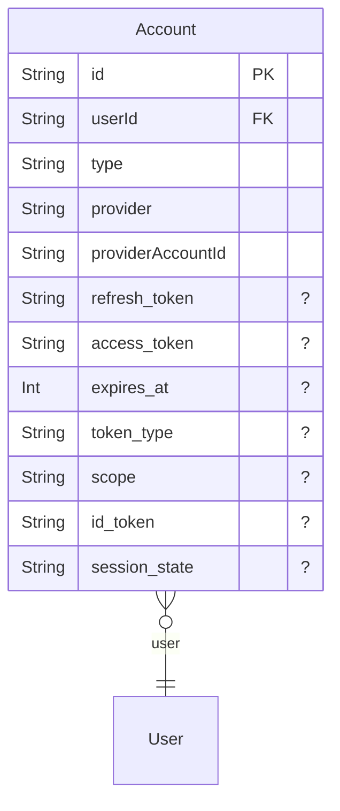
- Deny all operations to unauthenticated users.
- Allow creation of accounts for all users (primarily during the sign-in/sign-up process).
- Allow read, update, and delete operations if the authenticated user is the owner of the account or has 'ADMIN' access.
### AllowedEmailDomain
Specifies email domains from which users are allowed to register, used for restricting sign-up.
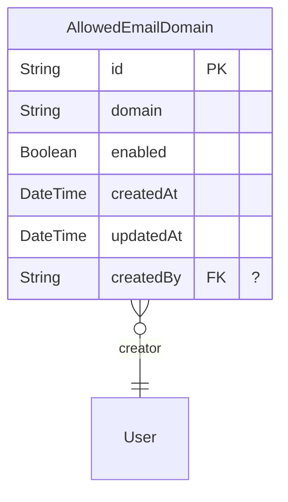
- Allow read access for all users, including unauthenticated users (necessary for sign-up validation).
- Allow create, update, and delete operations only for authenticated users with 'ADMIN' access.
### AppConfig
Stores application-wide configuration settings as key-value pairs.
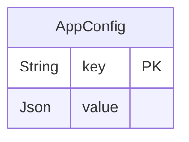
- Deny delete, update, and read access to unauthenticated users.
- Allow all operations for authenticated users who have 'ADMIN' access.
- Allow read access for any authenticated user.
### Attachments
Files or media attached to test cases, sessions, test runs, or results.
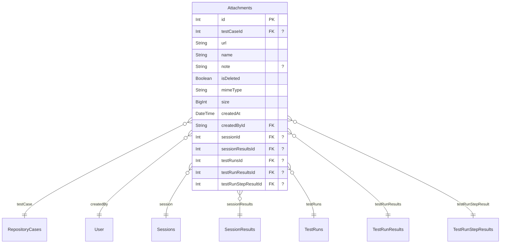
- Deny all operations to unauthenticated users.
- Deny all operations for authenticated users with 'NONE' access level.
- Allow all operations for authenticated users with 'ADMIN' access.
- Allow create, read, and update operations for any authenticated user.
### CaseFieldAssignment
Assigns specific field options to a custom test case field.
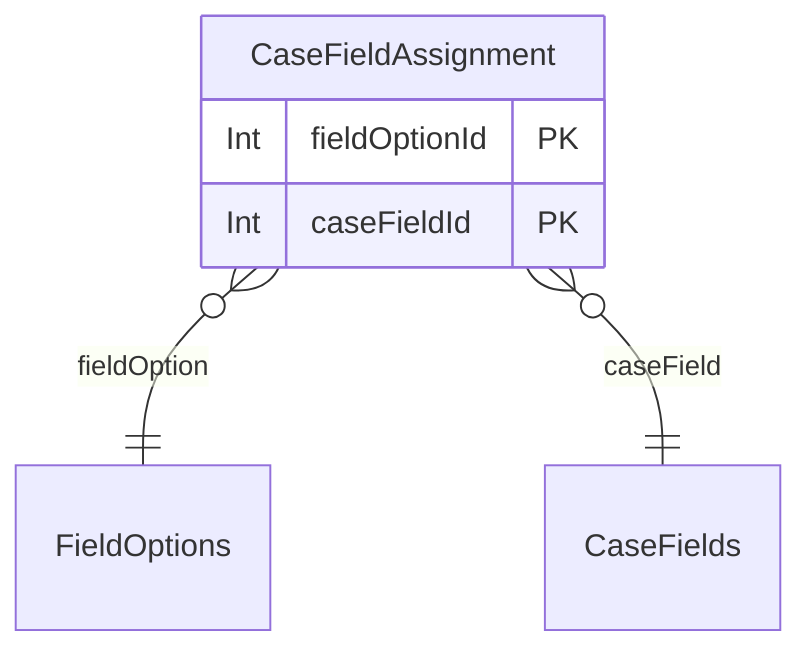
- Deny all operations to unauthenticated users.
- Allow all operations for authenticated users with 'ADMIN' access.
- Allow read access for any authenticated user.
### CaseFields
Defines custom fields that can be associated with test cases in the repository, including their type, validation, and default values.
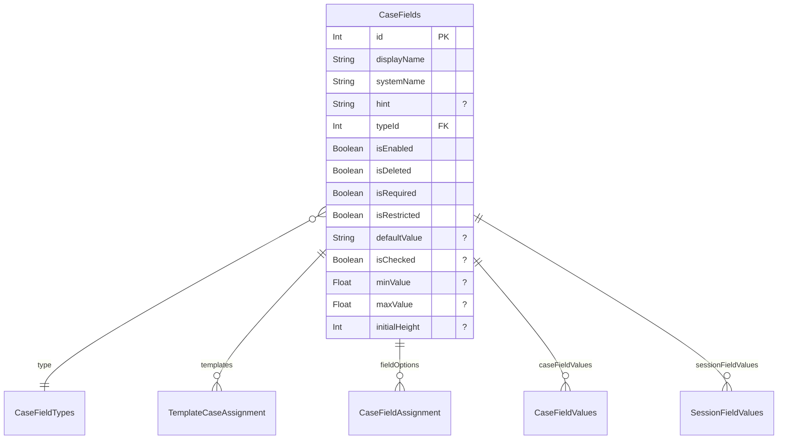
- Deny all operations to unauthenticated users.
- Allow all operations for authenticated users with 'ADMIN' or 'PROJECTADMIN' access.
- Allow all operations for any authenticated user (this is a broad rule, implying that if a user has add/edit access to test cases, they should have it for fields).
### CaseFieldTypes
Defines the data types for custom test case and result fields (e.g., text, number, dropdown) and their specific options.
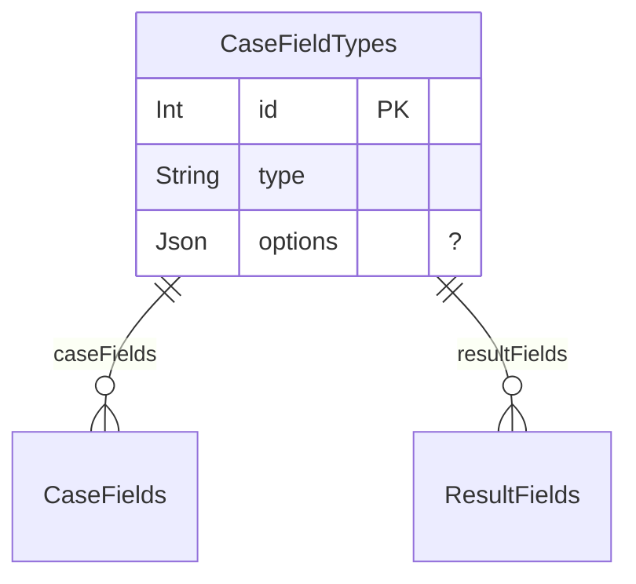
- Deny all operations to unauthenticated users.
- Allow all operations for authenticated users with 'ADMIN' access.
- Allow read access for any authenticated user.
### CaseFieldValues
Stores the actual values for custom test case fields for a specific test case.
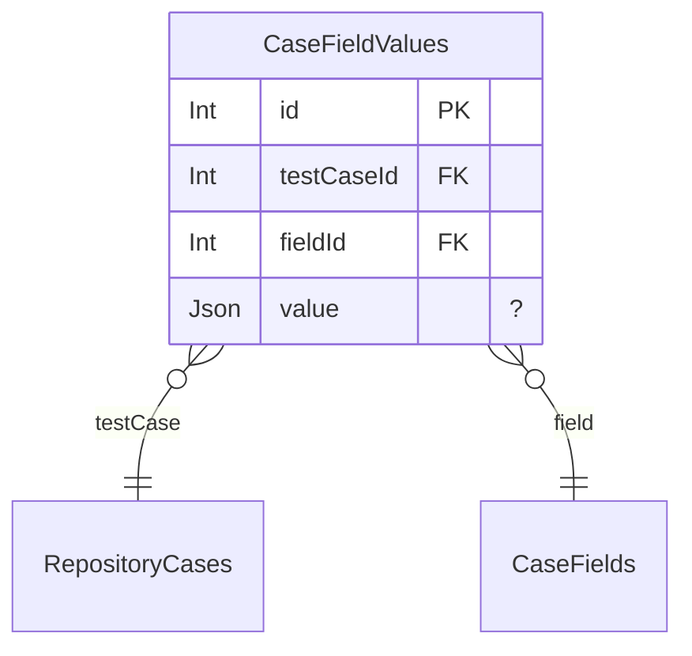
- Deny all operations to unauthenticated users.
- Deny all operations for authenticated users with 'NONE' access level.
- Deny read access if the authenticated user has 'NO_ACCESS' explicitly defined for the project associated with the test case.
- Allow all operations for authenticated users with 'ADMIN' access.
- Allow read access if the authenticated user is the project creator of the test case's project, or has explicit user/group permissions for that project, or if that project's default access type allows it for an authenticated user with a valid role.
- Allow create, update, and delete access if the authenticated user is the project creator of the test case's project, or has 'Project Admin' role in that project, or has 'canAddEdit' permission for the 'TestCaseRepository' application area via their user or group role, or has a system-wide 'PROJECTADMIN' access level and is assigned to that project.
### CaseFieldVersionValues
Stores custom field values for a specific version of a test case.
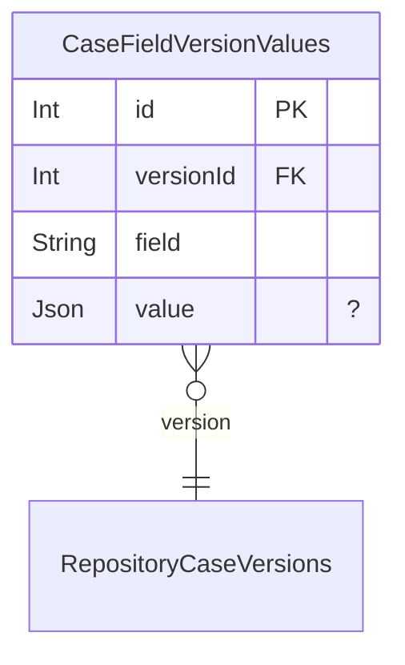
- Deny all operations to unauthenticated users.
- Deny all operations for authenticated users with 'NONE' access level.
- Deny read access if the authenticated user has 'NO_ACCESS' explicitly defined for the project associated with the test case version.
- Allow all operations for authenticated users with 'ADMIN' access.
- Allow read access if the authenticated user is the project creator of the version's project, or has explicit user/group permissions for that project, or if that project's default access type allows it for an authenticated user with a valid role.
- Allow create, update, and delete access if the authenticated user is the project creator of the version's project, or has 'Project Admin' role in that project, or has 'canAddEdit' permission for the 'TestCaseRepository' application area via their user or group role, or has a system-wide 'PROJECTADMIN' access level and is assigned to that project.
### Color
Defines specific colors that can be used for field options, statuses, and workflows.
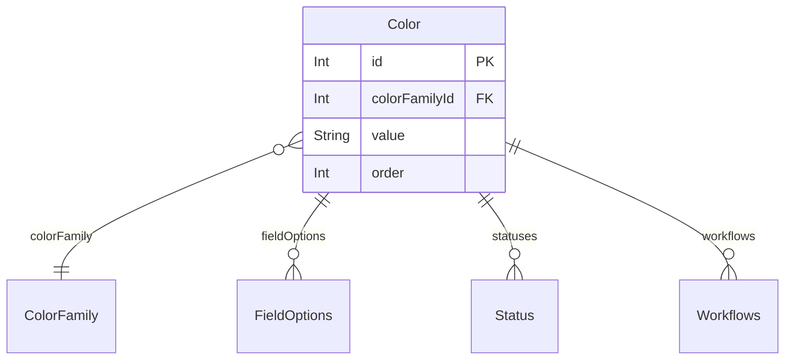
- Deny all operations to unauthenticated users.
- Allow all operations for authenticated users with 'ADMIN' access.
- Allow create and read access for any authenticated user.
### ColorFamily
Organizes colors into families for better visual management and consistency.
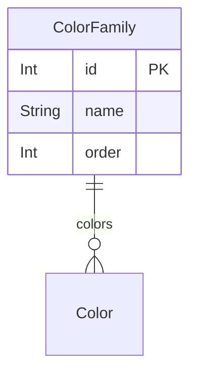
- Deny all operations to unauthenticated users.
- Allow all operations for authenticated users with 'ADMIN' access.
- Allow create and read access for any authenticated user.
### Comment
Represents a user comment, attached polymorphically to various entities like test cases, test runs, or sessions, supporting rich text content.
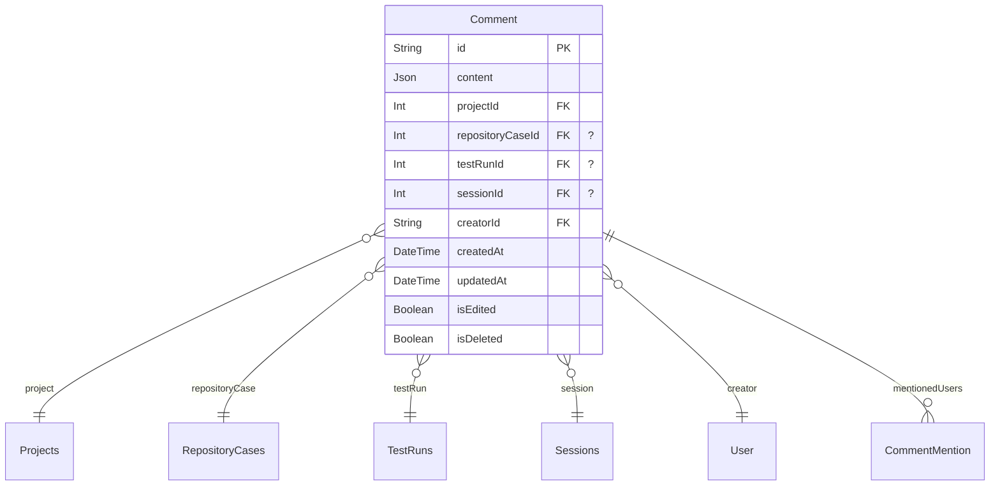
- Deny all operations to unauthenticated users.
- Deny all operations for authenticated users with 'NONE' access level.
- Deny read access if the authenticated user has 'NO_ACCESS' explicitly defined for the associated project.
- Allow all operations for authenticated users with 'ADMIN' access.
- Allow read access if the authenticated user has any form of access (project creator, explicit user/group permissions, or default project access) to the associated project.
- Allow create access if the authenticated user has any form of access (project creator, explicit user/group permissions, or default project access) to the associated project.
- Allow update operations if the authenticated user is the creator of the comment and the comment is not deleted.
- Allow delete operations if the authenticated user is the creator of the comment or has 'ADMIN' access.
### CommentMention
Records when a user is mentioned within a comment, facilitating notifications.
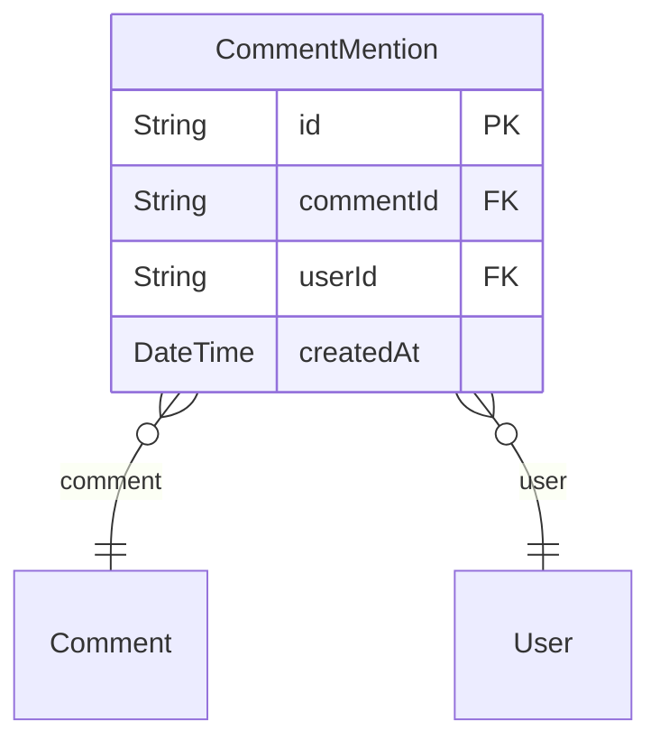
- Deny all operations to unauthenticated users.
- Allow all operations for authenticated users with 'ADMIN' access.
- Allow read and create operations for any authenticated user.
### ConfigCategories
Categories for configurations, used to group related configuration variants.
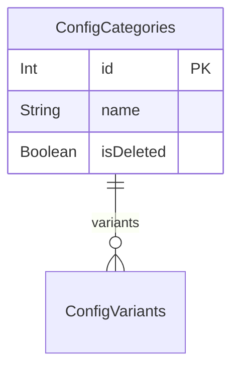
- Deny all operations to unauthenticated users.
- Allow all operations for authenticated users with 'ADMIN' access.
- Allow read access for any authenticated user.
### ConfigurationConfigVariant
Links specific configuration variants to a configuration.
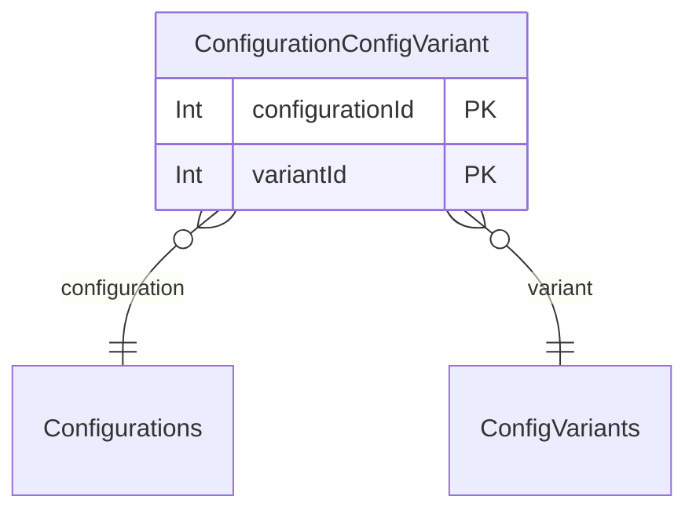
- Deny all operations to unauthenticated users.
- Allow all operations for authenticated users with 'ADMIN' access.
- Allow read access for any authenticated user.
### Configurations
Collections of configuration variants used for test runs or sessions, enabling testing under different setups.
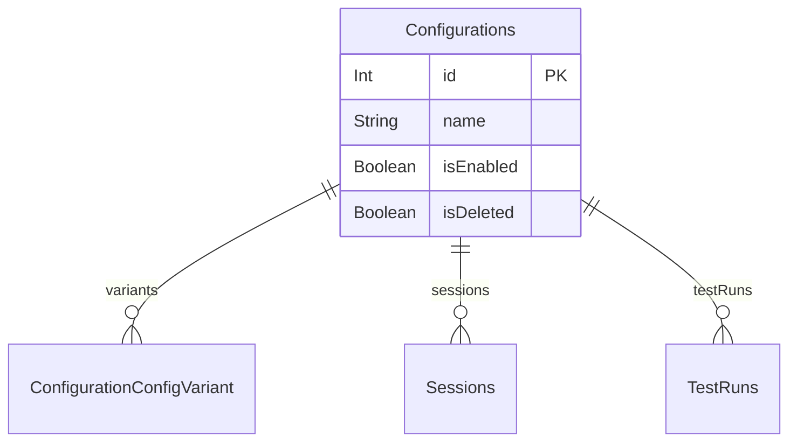
- Deny all operations to unauthenticated users.
- Allow all operations for authenticated users with 'ADMIN' access.
- Allow read access for any authenticated user.
### ConfigVariants
Individual configuration variants that belong to a configuration category.
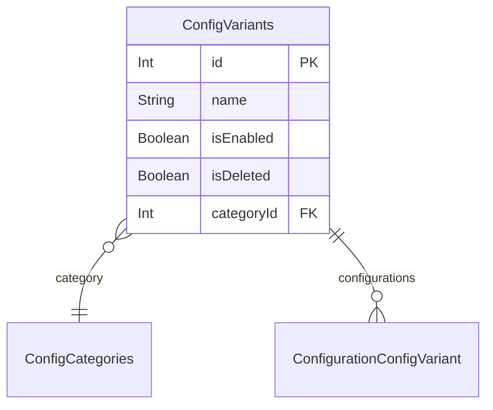
- Deny all operations to unauthenticated users.
- Allow all operations for authenticated users with 'ADMIN' access.
- Allow read access for any authenticated user.
### FieldIcon
Stores icons that can be associated with various fields, workflows, or milestone types for visual representation.
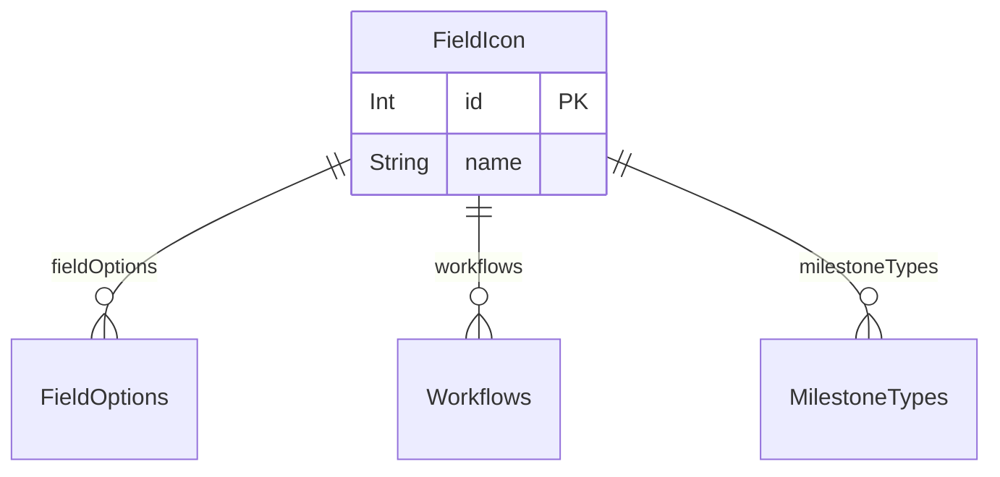
- Deny all operations to unauthenticated users.
- Allow all operations for authenticated users with 'ADMIN' access.
- Allow create and read access for any authenticated user.
### FieldOptions
Provides predefined options for custom fields, including name, icon, and color, and can be assigned to case or result fields.
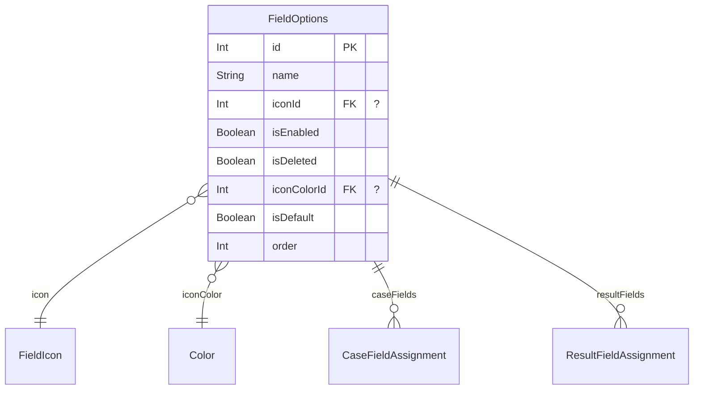
- Deny all operations to unauthenticated users.
- Allow all operations for authenticated users with 'ADMIN' access.
- Allow read access for any authenticated user.
### GroupAssignment
Links users to groups, assigning a user to a specific group.
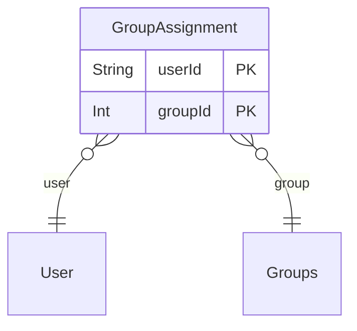
- Deny all operations to unauthenticated users.
- Allow all operations for authenticated users with 'ADMIN' access.
- Allow read access for any authenticated user.
### GroupProjectPermission
Explicitly defines a group's access type and role for a specific project.
```mermaid
erDiagram
"GroupProjectPermission" {
  Int groupId PK
  Int projectId PK
  ProjectAccessType accessType
  Int roleId FK "?"
}

"GroupProjectPermission" }o--|| "Groups": group
"GroupProjectPermission" }o--|| "Projects": project
"GroupProjectPermission" }o--|| "Roles": role

```
- Deny all operations to unauthenticated users.
- Deny create and update operations if the 'accessType' is 'SPECIFIC_ROLE' but no 'roleId' is provided.
- Allow all operations for authenticated users with 'ADMIN' access.
- Allow all operations for the user who created the project.
- Allow all operations if the authenticated user has a system-wide 'PROJECTADMIN' access level and is assigned to the project.
- Allow all operations if the authenticated user has an explicit 'Project Admin' role assigned within the project.
- Allow read access if the authenticated user is a member of the group.
- Allow read access if the authenticated user is assigned to the project (to see group permissions).
### Groups
Represents groups of users, allowing for collective assignment of permissions and easier management.
```mermaid
erDiagram
"Groups" {
  Int id PK
  String name
  String externalId  "?"
  String url  "?"
  String note  "?"
  Boolean isDeleted
}

"Groups" ||--o{ "GroupAssignment": assignedUsers
"Groups" ||--o{ "GroupProjectPermission": projectPermissions

```
- Deny all operations to unauthenticated users.
- Allow all operations for authenticated users with 'ADMIN' access.
- Allow read access for any authenticated user.
### Integration
Configures connections to external third-party systems like Jira, GitHub, or Azure DevOps.
```mermaid
erDiagram
"Integration" {
  Int id PK
  String name
  IntegrationProvider provider
  IntegrationAuthType authType
  IntegrationStatus status
  Json credentials
  Json settings  "?"
  DateTime lastSyncAt  "?"
  Boolean isDeleted
  DateTime createdAt
  DateTime updatedAt
}

"Integration" ||--o{ "UserIntegrationAuth": userIntegrationAuths
"Integration" ||--o{ "ProjectIntegration": projectIntegrations
"Integration" ||--o{ "Issue": issues

```
- Deny all operations to unauthenticated users.
- Allow read access for any authenticated user.
- Allow all operations for authenticated users with 'ADMIN' access.
### Issue
Represents an issue or bug, potentially linked to external bug tracking systems, associated with various testing entities.
```mermaid
erDiagram
"Issue" {
  Int id PK
  String name
  String title
  String description  "?"
  String status  "?"
  String priority  "?"
  String externalId  "?"
  String externalKey  "?"
  String externalUrl  "?"
  String externalStatus  "?"
  Json externalData  "?"
  String issueTypeId  "?"
  String issueTypeName  "?"
  String issueTypeIconUrl  "?"
  DateTime lastSyncedAt  "?"
  Json data  "?"
  Json note  "?"
  Boolean isDeleted
  DateTime createdAt
  String createdById FK
  Int projectId FK "?"
  Int integrationId FK "?"
}

"Issue" }o--|| "User": createdBy
"Issue" }o--o{ "RepositoryCases": repositoryCases
"Issue" }o--o{ "Sessions": sessions
"Issue" }o--o{ "SessionResults": sessionResults
"Issue" }o--o{ "TestRuns": testRuns
"Issue" }o--o{ "TestRunResults": testRunResults
"Issue" }o--o{ "TestRunStepResults": testRunStepResults
"Issue" }o--|| "Projects": project
"Issue" }o--|| "Integration": integration

```
- Deny all operations to unauthenticated users.
- Deny all operations for authenticated users with 'NONE' access level.
- Allow all operations for authenticated users with 'ADMIN' access.
- Allow create, read, and update operations for any authenticated user.
### JUnitAttachment
Stores attachments related to JUnit test results or repository cases.
```mermaid
erDiagram
"JUnitAttachment" {
  Int id PK
  String name
  String value
  JUnitAttachmentType type
  Int repositoryCaseId FK
  DateTime createdAt
  String createdById FK
}

"JUnitAttachment" }o--|| "RepositoryCases": repositoryCase
"JUnitAttachment" }o--|| "User": createdBy

```
- Deny all operations to unauthenticated users.
- Deny all operations for authenticated users with 'NONE' access level.
- Deny read access if the authenticated user has 'NO_ACCESS' explicitly defined for the project associated with the repository case.
- Allow all operations for authenticated users with 'ADMIN' access.
- Allow read access if the authenticated user has any form of access (project creator, explicit user/group permissions, or default project access) to the project associated with the repository case.
- Allow create and update operations if the authenticated user is the creator of the JUnit attachment.
### JUnitProperty
Stores properties associated with JUnit test suites or repository cases, typically key-value pairs.
```mermaid
erDiagram
"JUnitProperty" {
  Int id PK
  String name
  String value  "?"
  Int testSuiteId FK "?"
  Int repositoryCaseId FK "?"
  DateTime createdAt
  String createdById FK
}

"JUnitProperty" }o--|| "JUnitTestSuite": testSuite
"JUnitProperty" }o--|| "RepositoryCases": repositoryCase
"JUnitProperty" }o--|| "User": createdBy

```
- Deny all operations to unauthenticated users.
- Deny all operations for authenticated users with 'NONE' access level.
- Deny read access if the authenticated user has 'NO_ACCESS' explicitly defined for the project associated with either the test suite's test run or the repository case.
- Allow all operations for authenticated users with 'ADMIN' access.
- Allow read access if the authenticated user has any form of access (project creator, explicit user/group permissions, or default project access) to the project associated with the test suite's test run (if present) or the repository case (if present).
- Allow create and update operations if the authenticated user is the creator of the JUnit property.
### JUnitTestResult
Stores individual JUnit test results, linked to a test suite and a repository case.
```mermaid
erDiagram
"JUnitTestResult" {
  Int id PK
  JUnitResultType type
  String message  "?"
  String content  "?"
  Int repositoryCaseId FK
  DateTime executedAt  "?"
  Float time  "?"
  Int assertions  "?"
  String file  "?"
  Int line  "?"
  String systemOut  "?"
  String systemErr  "?"
  Int testSuiteId FK
  DateTime createdAt
  String createdById FK
  Int statusId FK "?"
}

"JUnitTestResult" }o--|| "RepositoryCases": repositoryCase
"JUnitTestResult" }o--|| "JUnitTestSuite": testSuite
"JUnitTestResult" }o--|| "User": createdBy
"JUnitTestResult" }o--|| "Status": status

```
- Deny all operations to unauthenticated users.
- Deny all operations for authenticated users with 'NONE' access level.
- Deny read access if the authenticated user has 'NO_ACCESS' explicitly defined for the project associated with the test suite's test run.
- Allow all operations for authenticated users with 'ADMIN' access.
- Allow read access if the authenticated user is the project creator of the test suite's test run project, or has explicit user/group permissions for that project, or if that project's default access type allows it for an authenticated user with a valid role.
- Allow create and update operations if the authenticated user is the creator of the JUnit test result.
### JUnitTestStep
Represents individual steps within a JUnit test, linked to a repository case, providing granular detail on test execution.
```mermaid
erDiagram
"JUnitTestStep" {
  Int id PK
  String name
  String content  "?"
  Int statusId FK "?"
  Int repositoryCaseId FK
  DateTime createdAt
  String createdById FK
}

"JUnitTestStep" }o--|| "Status": stepStatus
"JUnitTestStep" }o--|| "RepositoryCases": repositoryCase
"JUnitTestStep" }o--|| "User": createdBy

```
- Deny all operations to unauthenticated users.
- Deny all operations for authenticated users with 'NONE' access level.
- Deny read access if the authenticated user has 'NO_ACCESS' explicitly defined for the project associated with the repository case.
- Allow all operations for authenticated users with 'ADMIN' access.
- Allow read access if the authenticated user has any form of access (project creator, explicit user/group permissions, or default project access) to the project associated with the repository case.
- Allow create and update operations if the authenticated user is the creator of the JUnit test step.
### JUnitTestSuite
Represents a JUnit test suite, containing test results and properties, typically imported from CI/CD systems.
```mermaid
erDiagram
"JUnitTestSuite" {
  Int id PK
  String name
  Float time  "?"
  Int tests  "?"
  Int failures  "?"
  Int errors  "?"
  Int skipped  "?"
  Int assertions  "?"
  DateTime timestamp  "?"
  String file  "?"
  String systemOut  "?"
  String systemErr  "?"
  Int parentId FK "?"
  Int testRunId FK
  DateTime createdAt
  String createdById FK
}

"JUnitTestSuite" ||--o{ "JUnitProperty": properties
"JUnitTestSuite" ||--o{ "JUnitTestResult": results
"JUnitTestSuite" }o--|| "JUnitTestSuite": parent
"JUnitTestSuite" ||--o{ "JUnitTestSuite": children
"JUnitTestSuite" }o--|| "TestRuns": testRun
"JUnitTestSuite" }o--|| "User": createdBy

```
- Deny all operations to unauthenticated users.
- Deny all operations for authenticated users with 'NONE' access level.
- Deny read access if the authenticated user has 'NO_ACCESS' explicitly defined for the project associated with the test run.
- Allow all operations for authenticated users with 'ADMIN' access or 'PROJECTADMIN' access.
- Allow read access if the authenticated user is the project creator of the test run's project, or has explicit user/group permissions for that project, or if that project's default access type allows it for an authenticated user with a valid role.
- Allow create and update operations if the authenticated user is the creator of the JUnit test suite.
### LlmFeatureConfig
Configures specific LLM features at the project level, including enabling/disabling, choosing integrations/templates, and setting overrides and usage limits.
```mermaid
erDiagram
"LlmFeatureConfig" {
  String id PK
  Int projectId FK
  String feature
  Boolean enabled
  Int llmIntegrationId FK "?"
  String templateId FK "?"
  String model  "?"
  Float temperature  "?"
  Int maxTokens  "?"
  Boolean autoTrigger
  Json triggerConditions  "?"
  String outputFormat  "?"
  Json postProcessing  "?"
  Int dailyLimit  "?"
  Int monthlyLimit  "?"
  DateTime createdAt
  DateTime updatedAt
}

"LlmFeatureConfig" }o--|| "Projects": project
"LlmFeatureConfig" }o--|| "LlmIntegration": llmIntegration
"LlmFeatureConfig" }o--|| "LlmPromptTemplate": template

```
- Deny all operations to unauthenticated users.
- Allow all operations for authenticated users with 'ADMIN' access.
- Allow read access if the authenticated user is assigned to the project.
- Allow create, update, and delete operations if the authenticated user is a 'PROJECTADMIN' assigned to the project.
### LlmIntegration
Configures connections to external Large Language Model (LLM) providers like OpenAI, Anthropic, etc.
```mermaid
erDiagram
"LlmIntegration" {
  Int id PK
  String name
  LlmProvider provider
  IntegrationStatus status
  Json credentials
  Json settings  "?"
  Boolean isDeleted
  DateTime createdAt
  DateTime updatedAt
}

"LlmIntegration" ||--o| "LlmProviderConfig": llmProviderConfig
"LlmIntegration" ||--o{ "OllamaModelRegistry": ollamaModelRegistry
"LlmIntegration" ||--o{ "LlmUsage": llmUsages
"LlmIntegration" ||--o{ "LlmFeatureConfig": llmFeatureConfigs
"LlmIntegration" ||--o{ "LlmResponseCache": llmResponseCaches
"LlmIntegration" ||--o{ "ProjectLlmIntegration": projectLlmIntegrations
"LlmIntegration" ||--o{ "LlmPromptTemplate": llmPromptTemplates
"LlmIntegration" ||--o{ "LlmRateLimit": llmRateLimits

```
- Deny all operations to unauthenticated users.
- Allow read access for any authenticated user.
- Allow all operations for authenticated users with 'ADMIN' access.
### LlmPromptTemplate
Stores reusable prompt templates for various LLM features, with system and user prompts, variables, and model preferences.
```mermaid
erDiagram
"LlmPromptTemplate" {
  String id PK
  String name
  String feature
  Int version
  Int llmIntegrationId FK "?"
  String systemPrompt
  String userPrompt
  Json variables
  Json examples  "?"
  String recommendedModel  "?"
  Int minContextWindow
  Int maxOutputTokens
  Float temperature
  String description  "?"
  String tags
  Boolean isActive
  Boolean isDefault
  DateTime createdAt
  DateTime updatedAt
}

"LlmPromptTemplate" }o--|| "LlmIntegration": llmIntegration
"LlmPromptTemplate" ||--o{ "LlmFeatureConfig": featureConfigs

```
- Deny all operations to unauthenticated users.
- Allow all operations for authenticated users with 'ADMIN' access.
- Allow read access for any authenticated user.
- Allow create and update operations for authenticated users with 'ADMIN' or 'PROJECTADMIN' access.
### LlmProviderConfig
Stores configurations for specific LLM providers, including model details, rate limits, and cost tracking.
```mermaid
erDiagram
"LlmProviderConfig" {
  Int id PK
  Int llmIntegrationId FK "?"
  String defaultModel
  Json availableModels
  Int maxTokensPerRequest
  Int maxRequestsPerMinute
  Int maxRequestsPerDay  "?"
  Decimal costPerInputToken
  Decimal costPerOutputToken
  Decimal monthlyBudget  "?"
  Float defaultTemperature
  Int defaultMaxTokens
  Int timeout
  Int retryAttempts
  Boolean streamingEnabled
  Boolean isDefault
  Json settings  "?"
  DateTime createdAt
  DateTime updatedAt
}

"LlmProviderConfig" ||--o| "LlmIntegration": llmIntegration

```
- Deny all operations to unauthenticated users.
- Allow all operations for authenticated users with 'ADMIN' access.
- Allow read access for any authenticated user.
### LlmRateLimit
Defines and tracks rate limits for LLM usage across different scopes (global, integration, project, user).
```mermaid
erDiagram
"LlmRateLimit" {
  String id PK
  Int llmIntegrationId FK "?"
  String scope
  String scopeId  "?"
  String feature  "?"
  String windowType
  Int windowSize
  Int maxRequests
  Int maxTokens  "?"
  Int currentRequests
  Int currentTokens
  DateTime windowStart
  Boolean blockOnExceed
  Boolean queueOnExceed
  Boolean alertOnExceed
  Int priority
  Boolean isActive
  DateTime createdAt
  DateTime updatedAt
}

"LlmRateLimit" }o--|| "LlmIntegration": llmIntegration

```
- Deny all operations to unauthenticated users.
- Allow all operations for authenticated users with 'ADMIN' access.
- Allow read access for any authenticated user.
- Allow create, update, and delete operations for authenticated users with 'ADMIN' access.
### LlmResponseCache
Caches responses from LLM interactions to improve performance and reduce costs, uniquely identified by feature, model, and prompt/context hash.
```mermaid
erDiagram
"LlmResponseCache" {
  String id PK
  String feature
  String model
  String promptHash
  String contextHash  "?"
  Json response
  Int promptTokens
  Int completionTokens
  Int projectId FK "?"
  Int llmIntegrationId FK
  Int hits
  DateTime lastAccessedAt
  DateTime expiresAt
  DateTime createdAt
}

"LlmResponseCache" }o--|| "Projects": project
"LlmResponseCache" }o--|| "LlmIntegration": llmIntegration

```
- Deny all operations to unauthenticated users.
- Allow all operations for authenticated users with 'ADMIN' access.
- Allow read access for any authenticated user.
- Allow create and delete operations for authenticated users with 'ADMIN' or 'PROJECTADMIN' access.
### LlmUsage
Tracks the usage of LLM features, including token counts, costs, and performance metrics, linked to users and projects.
```mermaid
erDiagram
"LlmUsage" {
  String id PK
  Int llmIntegrationId FK "?"
  Int projectId FK "?"
  String userId FK
  String feature
  String model
  Int promptTokens
  Int completionTokens
  Int totalTokens
  Decimal inputCost
  Decimal outputCost
  Decimal totalCost
  Int latency
  Boolean success
  String error  "?"
  DateTime createdAt
}

"LlmUsage" }o--|| "LlmIntegration": llmIntegration
"LlmUsage" }o--|| "Projects": project
"LlmUsage" }o--|| "User": user

```
- Deny all operations to unauthenticated users.
- Allow all operations for authenticated users with 'ADMIN' access.
- Allow read access if the authenticated user is the user who performed the LLM usage or is assigned to the project (if applicable).
- Allow create operations for any authenticated user.
### Milestones
Represents project milestones, used for tracking progress and organizing work, with hierarchical support.
```mermaid
erDiagram
"Milestones" {
  Int id PK
  Int projectId FK
  Int rootId FK "?"
  Int parentId FK "?"
  Int milestoneTypesId FK
  String name
  Json note  "?"
  Json docs  "?"
  Boolean isStarted
  Boolean isCompleted
  Boolean isDeleted
  DateTime startedAt  "?"
  DateTime completedAt  "?"
  DateTime createdAt
  String createdBy FK
}

"Milestones" }o--|| "Projects": project
"Milestones" }o--|| "Milestones": root
"Milestones" ||--o{ "Milestones": descendants
"Milestones" }o--|| "Milestones": parent
"Milestones" ||--o{ "Milestones": children
"Milestones" }o--|| "MilestoneTypes": milestoneType
"Milestones" }o--|| "User": creator
"Milestones" ||--o{ "Sessions": sessions
"Milestones" ||--o{ "TestRuns": testRuns

```
- Deny all operations to unauthenticated users.
- Deny all operations for authenticated users with 'NONE' access level.
- Deny read access if the authenticated user has 'NO_ACCESS' explicitly defined for the associated project.
- Allow read access if the authenticated user is the project creator, or has explicit user/group permissions for the project, or if the project's default access type allows it for an authenticated user with a valid role.
- Allow create, update, and delete access if the authenticated user is the project creator, or has 'Project Admin' role in the project, or has 'canAddEdit' permission for the 'Milestones' application area via their user or group role, or has a system-wide 'PROJECTADMIN' access level and is assigned to the project.
- Allow all operations for authenticated users with 'ADMIN' access.
### MilestoneTypes
Defines different types of milestones (e.g., Release, Sprint), allowing for categorization and custom icons.
```mermaid
erDiagram
"MilestoneTypes" {
  Int id PK
  String name
  Int iconId FK "?"
  Boolean isDefault
  Boolean isDeleted
}

"MilestoneTypes" }o--|| "FieldIcon": icon
"MilestoneTypes" ||--o{ "MilestoneTypesAssignment": projects
"MilestoneTypes" ||--o{ "Milestones": milestones

```
- Deny all operations to unauthenticated users.
- Allow all operations for authenticated users with 'ADMIN' access.
- Allow read access for any authenticated user.
### MilestoneTypesAssignment
Links milestone types to projects, making specific types available for use within a project.
```mermaid
erDiagram
"MilestoneTypesAssignment" {
  Int projectId PK
  Int milestoneTypeId PK
}

"MilestoneTypesAssignment" }o--|| "Projects": project
"MilestoneTypesAssignment" }o--|| "MilestoneTypes": milestoneType

```
- Deny all operations to unauthenticated users.
- Allow all operations for authenticated users with 'ADMIN' access.
- Allow read access for any authenticated user.
### Notification
Stores notifications for users, such as work assignments, system announcements, or comment mentions.
```mermaid
erDiagram
"Notification" {
  String id PK
  String userId FK
  NotificationType type
  String title
  String message
  Json data  "?"
  Boolean isRead
  Boolean isDeleted
  String relatedEntityId  "?"
  String relatedEntityType  "?"
  DateTime createdAt
  DateTime updatedAt
}

"Notification" }o--|| "User": user

```
- Deny all operations to unauthenticated users.
- Allow all operations for authenticated users with 'ADMIN' access.
- Allow read access if the authenticated user is the recipient of the notification.
- Allow update operations if the authenticated user is the recipient and is modifying the 'isRead' or 'isDeleted' status of the notification.
- Allow create operations for any authenticated user.
### OllamaModelRegistry
Manages the registry of Ollama models, tracking their installation status, capabilities, and usage.
```mermaid
erDiagram
"OllamaModelRegistry" {
  String id PK
  Int llmIntegrationId FK
  String modelName
  String modelTag
  BigInt modelSize  "?"
  String digest  "?"
  Int contextWindow
  Json capabilities
  String quantization  "?"
  Boolean isInstalled
  Boolean isPulling
  Float pullProgress  "?"
  DateTime lastUsedAt  "?"
  DateTime installedAt  "?"
  DateTime createdAt
  DateTime updatedAt
}

"OllamaModelRegistry" }o--|| "LlmIntegration": llmIntegration

```
- Deny all operations to unauthenticated users.
- Allow all operations for authenticated users with 'ADMIN' access.
- Allow read access for any authenticated user.
### ProjectAssignment
Links users to projects, indicating a user's direct involvement in a project.
```mermaid
erDiagram
"ProjectAssignment" {
  String userId PK
  Int projectId PK
}

"ProjectAssignment" }o--|| "User": user
"ProjectAssignment" }o--|| "Projects": project

```
- Deny all operations to unauthenticated users.
- Allow all operations for authenticated users with 'ADMIN' access.
- Allow read access for any authenticated user.
### ProjectIntegration
Associates external integrations with specific projects, allowing project-level configuration and activation.
```mermaid
erDiagram
"ProjectIntegration" {
  String id PK
  Int projectId FK
  Int integrationId FK
  Json config  "?"
  Json fieldMappings  "?"
  Boolean isActive
  DateTime lastSyncAt  "?"
  String syncStatus  "?"
  String syncError  "?"
  Int issueCount
  DateTime createdAt
  DateTime updatedAt
}

"ProjectIntegration" }o--|| "Projects": project
"ProjectIntegration" }o--|| "Integration": integration

```
- Deny all operations to unauthenticated users.
- Deny read access if the authenticated user has 'NO_ACCESS' explicitly defined for the associated project.
- Allow all operations for authenticated users with 'ADMIN' access.
- Allow read access if the authenticated user is the project creator, or has explicit user/group permissions for the project, or if the project's default access type allows it for an authenticated user with a valid role.
- Allow create, update, and delete access if the authenticated user is the project creator, or has an explicit 'Project Admin' role in the project, or has a system-wide 'PROJECTADMIN' access level and is assigned to the project.
### ProjectLlmIntegration
Associates LLM integrations with specific projects, allowing project-level configuration and activation of AI features.
```mermaid
erDiagram
"ProjectLlmIntegration" {
  String id PK
  Int projectId FK
  Int llmIntegrationId FK
  Json config  "?"
  Boolean isActive
  DateTime createdAt
  DateTime updatedAt
}

"ProjectLlmIntegration" }o--|| "Projects": project
"ProjectLlmIntegration" }o--|| "LlmIntegration": llmIntegration

```
- Deny all operations to unauthenticated users.
- Allow read access for any authenticated user.
- Allow all operations for authenticated users with 'ADMIN' or 'PROJECTADMIN' access.
### Projects
Represents a project, acting as a container for test cases, test runs, milestones, and other related entities. It has complex, granular access control based on user roles, group assignments, and explicit project permissions.
```mermaid
erDiagram
"Projects" {
  Int id PK
  String name
  String iconUrl  "?"
  String note  "?"
  String docs  "?"
  Boolean isCompleted
  Boolean isDeleted
  DateTime completedAt  "?"
  DateTime createdAt
  String createdBy FK
  ProjectAccessType defaultAccessType
  Int defaultRoleId FK "?"
}

"Projects" }o--|| "User": creator
"Projects" ||--o{ "ProjectAssignment": assignedUsers
"Projects" ||--o{ "ProjectStatusAssignment": assignedStatuses
"Projects" ||--o{ "MilestoneTypesAssignment": milestoneTypes
"Projects" ||--o{ "TemplateProjectAssignment": assignedTemplates
"Projects" ||--o{ "ProjectWorkflowAssignment": assignedWorkflows
"Projects" ||--o{ "Milestones": milestones
"Projects" ||--o{ "Repositories": repositories
"Projects" ||--o{ "RepositoryFolders": repositoryFolders
"Projects" ||--o{ "RepositoryCases": repositoryCases
"Projects" ||--o{ "RepositoryCaseVersions": repositoryCaseVersions
"Projects" ||--o{ "Sessions": sessions
"Projects" ||--o{ "SessionVersions": sessionVersions
"Projects" ||--o{ "TestRuns": testRuns
"Projects" }o--|| "Roles": defaultRole
"Projects" ||--o{ "UserProjectPermission": userPermissions
"Projects" ||--o{ "GroupProjectPermission": groupPermissions
"Projects" ||--o{ "SharedStepGroup": sharedStepGroups
"Projects" ||--o{ "ProjectIntegration": projectIntegrations
"Projects" ||--o{ "ProjectLlmIntegration": projectLlmIntegrations
"Projects" ||--o{ "Issue": issues
"Projects" ||--o{ "LlmUsage": llmUsages
"Projects" ||--o{ "LlmFeatureConfig": llmFeatureConfigs
"Projects" ||--o{ "LlmResponseCache": llmResponseCaches
"Projects" ||--o{ "Comment": comments

```
- Deny all operations to unauthenticated users.
- Deny all operations for authenticated users with 'NONE' access level.
- Deny all operations if the project is marked as deleted.
- Allow all operations for authenticated users with 'ADMIN' access.
- Allow all operations for the user who created the project.
- Allow all operations for authenticated users who have an explicit 'Project Admin' role assigned within this project.
- Allow all operations for authenticated users with a system-wide 'PROJECTADMIN' access level who are also assigned to this project.
- Deny read access if the authenticated user has 'NO_ACCESS' explicitly defined for this project.
- Allow read access if the user has explicit 'SPECIFIC_ROLE' or 'GLOBAL_ROLE' project permissions, or if the user belongs to a group with such permissions (and no explicit user denial overrides), or if the project's default access type (GLOBAL_ROLE, SPECIFIC_ROLE, or DEFAULT) allows it for an authenticated user with a valid role and not 'NONE' access.
- Deny update and delete access if the authenticated user has 'NO_ACCESS' explicitly defined for this project.
- Allow update access if the user has explicit 'SPECIFIC_ROLE' permission within the project and their role has 'canAddEdit' for 'Documentation', or if they belong to a group with such permissions (for 'Documentation' area).
- Allow delete access if the user has explicit 'SPECIFIC_ROLE' permission within the project and their role has 'canDelete' for 'Documentation', or if they belong to a group with such permissions (for 'Documentation' area).
### ProjectStatusAssignment
Associates specific statuses with a project, defining the available statuses for entities within that project.
```mermaid
erDiagram
"ProjectStatusAssignment" {
  Int statusId PK
  Int projectId PK
}

"ProjectStatusAssignment" }o--|| "Status": status
"ProjectStatusAssignment" }o--|| "Projects": project

```
- Deny all operations to unauthenticated users.
- Allow all operations for authenticated users with 'ADMIN' access.
- Allow read access for any authenticated user.
### ProjectWorkflowAssignment
Associates specific workflows with a project, defining the available workflows for entities within that project.
```mermaid
erDiagram
"ProjectWorkflowAssignment" {
  Int workflowId PK
  Int projectId PK
}

"ProjectWorkflowAssignment" }o--|| "Workflows": workflow
"ProjectWorkflowAssignment" }o--|| "Projects": project

```
- Deny all operations to unauthenticated users.
- Allow all operations for authenticated users with 'ADMIN' access.
- Allow read access for any authenticated user.
### RegistrationSettings
Global settings controlling user registration behavior, such as email domain restrictions and open registration.
```mermaid
erDiagram
"RegistrationSettings" {
  String id PK
  Boolean restrictEmailDomains
  Boolean allowOpenRegistration
  DateTime createdAt
  DateTime updatedAt
}


```
- Allow read access for all users, including unauthenticated users (necessary for sign-up page).
- Allow create, update, and delete operations only for authenticated users with 'ADMIN' access.
### Repositories
Stores test cases and test folders for a project, serving as the main container for test artifacts.
```mermaid
erDiagram
"Repositories" {
  Int id PK
  Int projectId FK
  Boolean isActive
  Boolean isArchived
  Boolean isDeleted
}

"Repositories" }o--|| "Projects": project
"Repositories" ||--o{ "RepositoryFolders": folders
"Repositories" ||--o{ "RepositoryCases": cases

```
- Deny all operations to unauthenticated users.
- Deny all operations for authenticated users with 'NONE' access level.
- Deny read access if the authenticated user has 'NO_ACCESS' explicitly defined for the associated project.
- Allow all operations for authenticated users with 'ADMIN' access.
- Allow read access if the authenticated user is the project creator, or has explicit user/group permissions for the project, or if the project's default access type allows it for an authenticated user with a valid role.
- Allow update and delete access if the authenticated user is the project creator, or has an explicit 'Project Admin' role in the project, or has a system-wide 'PROJECTADMIN' access level and is assigned to the project.
- Allow create access if the authenticated user is the project creator, or has an explicit 'Project Admin' role in the project, or has 'canAddEdit' permission for the 'TestCaseRepository' application area via user permissions, or has a system-wide 'PROJECTADMIN' access level and is assigned to the project.
### RepositoryCaseLink
Defines relationships between test cases, such as dependencies or different source mappings.
```mermaid
erDiagram
"RepositoryCaseLink" {
  Int id PK
  Int caseAId FK
  Int caseBId FK
  LinkType type
  Boolean isDeleted
  DateTime createdAt
  String createdById FK
}

"RepositoryCaseLink" }o--|| "RepositoryCases": caseA
"RepositoryCaseLink" }o--|| "RepositoryCases": caseB
"RepositoryCaseLink" }o--|| "User": createdBy

```
- Deny all operations to unauthenticated users.
- Deny all operations for authenticated users with 'NONE' access level.
- Deny read access if the authenticated user has 'NO_ACCESS' explicitly defined for the project associated with 'caseA' (the primary linked test case).
- Allow all operations for authenticated users with 'ADMIN' access.
- Allow read access if the authenticated user is the project creator of 'caseA''s project, or has explicit user/group permissions for that project, or if that project's default access type allows it for an authenticated user with a valid role.
- Allow create, update, and delete access if the authenticated user is the project creator of 'caseA''s project, or has 'Project Admin' role in that project, or has 'canAddEdit' permission for the 'TestCaseRepository' application area via their user or group role, or has a system-wide 'PROJECTADMIN' access level and is assigned to that project.
### RepositoryCases
Represents individual test cases stored in a repository, including their details, workflow state, and versions.
```mermaid
erDiagram
"RepositoryCases" {
  Int id PK
  Int projectId FK
  Int repositoryId FK
  Int folderId FK
  Int templateId FK
  String name
  String className  "?"
  RepositoryCaseSource source
  Int stateId FK
  Int estimate  "?"
  Int forecastManual  "?"
  Float forecastAutomated  "?"
  Int order
  DateTime createdAt
  String creatorId FK
  Boolean automated
  Boolean isArchived
  Boolean isDeleted
  Int currentVersion
}

"RepositoryCases" }o--|| "Projects": project
"RepositoryCases" }o--|| "Repositories": repository
"RepositoryCases" }o--|| "RepositoryFolders": folder
"RepositoryCases" }o--|| "Templates": template
"RepositoryCases" }o--|| "Workflows": state
"RepositoryCases" }o--|| "User": creator
"RepositoryCases" ||--o{ "RepositoryCaseVersions": repositoryCaseVersions
"RepositoryCases" ||--o{ "CaseFieldValues": caseFieldValues
"RepositoryCases" ||--o{ "ResultFieldValues": resultFieldValues
"RepositoryCases" ||--o{ "Attachments": attachments
"RepositoryCases" ||--o{ "Steps": steps
"RepositoryCases" ||--o{ "TestRunCases": testRuns
"RepositoryCases" }o--o{ "Tags": tags
"RepositoryCases" }o--o{ "Issue": issues
"RepositoryCases" ||--o{ "JUnitTestResult": junitResults
"RepositoryCases" ||--o{ "JUnitProperty": junitProperties
"RepositoryCases" ||--o{ "JUnitAttachment": junitAttachments
"RepositoryCases" ||--o{ "JUnitTestStep": junitTestSteps
"RepositoryCases" ||--o{ "RepositoryCaseLink": linksFrom
"RepositoryCases" ||--o{ "RepositoryCaseLink": linksTo
"RepositoryCases" ||--o{ "Comment": comments

```
- Deny all operations to unauthenticated users.
- Deny all operations for authenticated users with 'NONE' access level.
- Deny read access if the authenticated user has 'NO_ACCESS' explicitly defined for the associated project.
- Allow all operations for authenticated users with 'ADMIN' access.
- Allow read access if the authenticated user is the project creator, or has explicit user/group permissions for the project, or if the project's default access type allows it for an authenticated user with a valid role.
- Allow create, update, and delete access if the authenticated user is the project creator, or has an explicit 'Project Admin' role in the project, or has 'canAddEdit' permission for the 'TestCaseRepository' application area via their user or group role, or has a system-wide 'PROJECTADMIN' access level and is assigned to the project.
### RepositoryCaseVersions
Stores historical versions of test cases, allowing for tracking changes over time.
```mermaid
erDiagram
"RepositoryCaseVersions" {
  Int id PK
  Int repositoryCaseId FK
  Int staticProjectId
  String staticProjectName
  Int projectId FK
  Int repositoryId
  Int folderId
  String folderName
  Int templateId
  String templateName
  String name
  Int stateId
  String stateName
  Int estimate  "?"
  Int forecastManual  "?"
  Float forecastAutomated  "?"
  Int order
  DateTime createdAt
  String creatorId
  String creatorName
  Boolean automated
  Boolean isArchived
  Boolean isDeleted
  Int version
  Json steps  "?"
  Json tags  "?"
  Json issues  "?"
  Json links  "?"
  Json attachments  "?"
}

"RepositoryCaseVersions" }o--|| "RepositoryCases": repositoryCase
"RepositoryCaseVersions" }o--|| "Projects": project
"RepositoryCaseVersions" ||--o{ "CaseFieldVersionValues": caseFieldVersionValues

```
- Deny all operations to unauthenticated users.
- Deny all operations for authenticated users with 'NONE' access level.
- Deny read access if the authenticated user has 'NO_ACCESS' explicitly defined for the associated project.
- Allow all operations for authenticated users with 'ADMIN' access.
- Allow read access if the authenticated user is the project creator, or has explicit user/group permissions for the project, or if the project's default access type allows it for an authenticated user with a valid role.
- Allow create, update, and delete access if the authenticated user is the project creator, or has an explicit 'Project Admin' role in the project, or has 'canAddEdit' permission for the 'TestCaseRepository' application area via their user or group role, or has a system-wide 'PROJECTADMIN' access level and is assigned to the project.
### RepositoryFolders
Organizes test cases within a repository into a hierarchical folder structure.
```mermaid
erDiagram
"RepositoryFolders" {
  Int id PK
  Int projectId FK
  Int repositoryId FK
  Int parentId FK "?"
  String name
  Json docs  "?"
  DateTime createdAt
  String creatorId FK
  Int order
  Boolean isDeleted
}

"RepositoryFolders" }o--|| "Projects": project
"RepositoryFolders" }o--|| "Repositories": repository
"RepositoryFolders" }o--|| "RepositoryFolders": parent
"RepositoryFolders" ||--o{ "RepositoryFolders": children
"RepositoryFolders" }o--|| "User": creator
"RepositoryFolders" ||--o{ "RepositoryCases": cases

```
- Deny all operations to unauthenticated users.
- Deny all operations for authenticated users with 'NONE' access level.
- Deny read access if the authenticated user has 'NO_ACCESS' explicitly defined for the associated project.
- Allow all operations for authenticated users with 'ADMIN' access.
- Allow read access if the authenticated user is the project creator, or has explicit user/group permissions for the project, or if the project's default access type allows it for an authenticated user with a valid role.
- Allow create, update, and delete access if the authenticated user is the project creator, or has 'Project Admin' role in the project, or has 'canAddEdit' permission for the 'TestCaseRepository' application area via their user or group role, or has a system-wide 'PROJECTADMIN' access level and is assigned to the project, or is a regular 'USER' with 'canAddEdit' for 'TestCaseRepository'.
### ResultFieldAssignment
Assigns specific field options to a custom test result field, defining their order.
```mermaid
erDiagram
"ResultFieldAssignment" {
  Int fieldOptionId PK
  Int resultFieldId PK
  Int order
}

"ResultFieldAssignment" }o--|| "FieldOptions": fieldOption
"ResultFieldAssignment" }o--|| "ResultFields": resultField

```
- Deny all operations to unauthenticated users.
- Allow all operations for authenticated users with 'ADMIN' access.
- Allow read access for any authenticated user.
### ResultFields
Defines custom fields that can be associated with test results, including their type, validation, and default values.
```mermaid
erDiagram
"ResultFields" {
  Int id PK
  String displayName
  String systemName
  String hint  "?"
  Int typeId FK
  Boolean isEnabled
  Boolean isDeleted
  Boolean isRequired
  Boolean isRestricted
  String defaultValue  "?"
  Boolean isChecked  "?"
  Float minValue  "?"
  Float maxValue  "?"
  Int initialHeight  "?"
}

"ResultFields" }o--|| "CaseFieldTypes": type
"ResultFields" ||--o{ "TemplateResultAssignment": templates
"ResultFields" ||--o{ "ResultFieldAssignment": fieldOptions
"ResultFields" ||--o{ "ResultFieldValues": resultFieldValues

```
- Deny all operations to unauthenticated users.
- Allow all operations for authenticated users with 'ADMIN' access.
- Allow read access for any authenticated user.
### ResultFieldValues
Stores the actual values for custom result fields for a session result or test run result.
```mermaid
erDiagram
"ResultFieldValues" {
  Int id PK
  Int testCaseId FK "?"
  Int fieldId FK
  Json value  "?"
  Int sessionResultsId FK "?"
  Int testRunResultsId FK "?"
}

"ResultFieldValues" }o--|| "RepositoryCases": testCase
"ResultFieldValues" }o--|| "ResultFields": field
"ResultFieldValues" }o--|| "SessionResults": sessionResults
"ResultFieldValues" }o--|| "TestRunResults": testRunResults

```
- Deny all operations to unauthenticated users.
- Allow all operations for authenticated users with 'ADMIN' access.
- Allow read access for any authenticated user.
- Allow create operations for any authenticated user.
### RolePermission
Defines specific permissions for a role across different application areas (e.g., 'canAddEdit' for 'Documentation').
```mermaid
erDiagram
"RolePermission" {
  Int roleId PK
  ApplicationArea area PK
  Boolean canAddEdit
  Boolean canDelete
  Boolean canClose
}

"RolePermission" }o--|| "Roles": role

```
- Deny all operations to unauthenticated users.
- Allow all operations for authenticated users with 'ADMIN' access.
- Allow read access for any authenticated user.
### Roles
Defines user roles within the system, which are then used to grant permissions.
```mermaid
erDiagram
"Roles" {
  Int id PK
  String name
  Boolean isDefault
  Boolean isDeleted
}

"Roles" ||--o{ "User": users
"Roles" ||--o{ "RolePermission": rolePermissions
"Roles" ||--o{ "Projects": defaultForProjects
"Roles" ||--o{ "UserProjectPermission": userProjectPermissions
"Roles" ||--o{ "GroupProjectPermission": groupProjectPermissions

```
- Deny all operations to unauthenticated users.
- Allow update and create operations for authenticated users with 'ADMIN' access.
- Allow delete operations for authenticated users with 'ADMIN' access, provided the role is not a default role.
- Allow read access for any authenticated user.
### SamlConfiguration
Stores specific configuration details for SAML-based SSO providers.
```mermaid
erDiagram
"SamlConfiguration" {
  String id PK
  String providerId FK
  String entryPoint
  String issuer
  String cert
  String callbackUrl
  String logoutUrl  "?"
  Json attributeMapping
  Boolean autoProvisionUsers
  Access defaultAccess
  DateTime createdAt
  DateTime updatedAt
}

"SamlConfiguration" |o--|| "SsoProvider": provider

```
- Allow read access for all users, including unauthenticated users (necessary for sign-in page).
- Allow create, update, and delete operations only for authenticated users with 'ADMIN' access.
### SessionFieldValues
Stores the actual values for custom fields associated with a specific session.
```mermaid
erDiagram
"SessionFieldValues" {
  Int id PK
  Int sessionId FK
  Int fieldId FK
  Json value  "?"
}

"SessionFieldValues" }o--|| "Sessions": session
"SessionFieldValues" }o--|| "CaseFields": field

```
- Deny all operations to unauthenticated users.
- Deny all operations for authenticated users with 'NONE' access level.
- Deny read access if the authenticated user has 'NO_ACCESS' explicitly defined for the project associated with the session.
- Allow all operations for authenticated users with 'ADMIN' access.
- Allow read access if the authenticated user is the project creator of the session's project, or has explicit user/group permissions for that project, or if that project's default access type allows it for an authenticated user with a valid role.
- Allow create, update, and delete access if the authenticated user is the project creator of the session's project, or has 'Project Admin' role in that project, or has 'canAddEdit' permission for the 'Sessions' application area via user permissions, or has a system-wide 'PROJECTADMIN' access level and is assigned to that project.
### SessionResults
Stores the outcome and details of a specific session execution, including status, attachments, and field values.
```mermaid
erDiagram
"SessionResults" {
  Int id PK
  Boolean isDeleted
  Int sessionId FK
  Json resultData  "?"
  DateTime createdAt
  String createdById FK
  Int statusId FK
  Int elapsed  "?"
}

"SessionResults" }o--|| "Sessions": session
"SessionResults" }o--|| "User": createdBy
"SessionResults" }o--|| "Status": status
"SessionResults" ||--o{ "Attachments": attachments
"SessionResults" ||--o{ "ResultFieldValues": resultFieldValues
"SessionResults" }o--o{ "Issue": issues

```
- Deny all operations to unauthenticated users.
- Deny all operations for authenticated users with 'NONE' access level.
- Deny read access if the authenticated user has 'NO_ACCESS' explicitly defined for the project associated with the session.
- Allow all operations for authenticated users with 'ADMIN' access.
- Allow read access if the authenticated user is the project creator of the session's project, or has explicit user/group permissions for that project, or if that project's default access type allows it for an authenticated user with a valid role.
- Allow create access if the authenticated user is the project creator of the session's project, or has 'Project Admin' role in that project, or has 'canAddEdit' permission for the 'SessionResults' application area via user permissions, or has a system-wide 'PROJECTADMIN' access level and is assigned to that project.
- Allow update and delete access if the authenticated user is the session result creator, or is the project creator of the session's project, or has 'Project Admin' role in that project via user permissions, or has a system-wide 'PROJECTADMIN' access level and is assigned to that project.
### Sessions
Represents a testing session, typically used for exploratory testing, with details on mission, configuration, and results.
```mermaid
erDiagram
"Sessions" {
  Int id PK
  Int projectId FK
  Int templateId FK
  String name
  Json note  "?"
  Json mission  "?"
  Int configId FK "?"
  Int milestoneId FK "?"
  Int stateId FK
  String assignedToId FK "?"
  Int estimate  "?"
  Int forecastManual  "?"
  Float forecastAutomated  "?"
  Int elapsed  "?"
  Boolean isCompleted
  Boolean isDeleted
  DateTime completedAt  "?"
  DateTime createdAt
  String createdById FK
  Int currentVersion
}

"Sessions" }o--|| "Projects": project
"Sessions" }o--|| "Templates": template
"Sessions" }o--|| "Configurations": configuration
"Sessions" }o--|| "Milestones": milestone
"Sessions" }o--|| "Workflows": state
"Sessions" }o--|| "User": assignedTo
"Sessions" }o--|| "User": createdBy
"Sessions" ||--o{ "SessionResults": sessionResults
"Sessions" ||--o{ "SessionFieldValues": sessionFieldValues
"Sessions" ||--o{ "SessionVersions": versions
"Sessions" ||--o{ "Attachments": attachments
"Sessions" }o--o{ "Tags": tags
"Sessions" }o--o{ "Issue": issues
"Sessions" ||--o{ "Comment": comments

```
- Deny all operations to unauthenticated users.
- Deny all operations for authenticated users with 'NONE' access level.
- Deny read access if the authenticated user has 'NO_ACCESS' explicitly defined for the associated project.
- Allow all operations for authenticated users with 'ADMIN' access.
- Allow read access if the authenticated user is the project creator, or has explicit user/group permissions for the project, or if the project's default access type allows it for an authenticated user with a valid role.
- Allow create access if the authenticated user is the project creator, or has 'Project Admin' role in the project, or has 'canAddEdit' permission for the 'Sessions' application area via their user or group role, or has a system-wide 'PROJECTADMIN' access level and is assigned to the project.
- Allow update and delete access if the authenticated user is the session creator, or is the project creator, or has 'Project Admin' role in the project, or has 'canAddEdit' or 'canDelete' permission for the 'Sessions' application area via user permissions, or has a system-wide 'PROJECTADMIN' access level and is assigned to the project.
### SessionVersions
Stores historical versions of sessions, including their static project, template, and configuration details.
```mermaid
erDiagram
"SessionVersions" {
  Int id PK
  Int sessionId FK
  String name
  Int staticProjectId
  String staticProjectName
  Int projectId FK
  Int templateId
  String templateName
  Int configId  "?"
  String configurationName  "?"
  Int milestoneId  "?"
  String milestoneName  "?"
  Int stateId
  String stateName
  String assignedToId  "?"
  String assignedToName  "?"
  String createdById
  String createdByName
  Int estimate  "?"
  Int forecastManual  "?"
  Float forecastAutomated  "?"
  Int elapsed  "?"
  Json note  "?"
  Json mission  "?"
  Boolean isCompleted
  DateTime completedAt  "?"
  DateTime createdAt
  DateTime updatedAt
  Int version
  Json tags  "?"
  Json attachments  "?"
  Json issues  "?"
}

"SessionVersions" }o--|| "Sessions": session
"SessionVersions" }o--|| "Projects": project

```
- Deny all operations to unauthenticated users.
- Deny all operations for authenticated users with 'NONE' access level.
- Deny read access if the authenticated user has 'NO_ACCESS' explicitly defined for the associated project.
- Allow all operations for authenticated users with 'ADMIN' access.
- Allow read access if the authenticated user is the project creator, or has explicit user/group permissions for the project, or if the project's default access type allows it for an authenticated user with a valid role.
- Allow create access if the authenticated user is the project creator, or has 'Project Admin' role in the project, or has 'canAddEdit' permission for the 'Sessions' application area via user permissions, or has a system-wide 'PROJECTADMIN' access level and is assigned to the project.
### SharedStepGroup
Groups reusable test steps that can be included in multiple test cases, promoting reusability and consistency.
```mermaid
erDiagram
"SharedStepGroup" {
  Int id PK
  String name
  Int projectId FK
  Boolean isDeleted
  DateTime deletedAt  "?"
  DateTime createdAt
  DateTime updatedAt
  String createdById FK
}

"SharedStepGroup" }o--|| "Projects": project
"SharedStepGroup" }o--|| "User": createdBy
"SharedStepGroup" ||--o{ "SharedStepItem": items
"SharedStepGroup" ||--o{ "Steps": placeholderSteps

```
- Deny all operations to unauthenticated users.
- Deny all operations for authenticated users with 'NONE' access level.
- Deny read access if the authenticated user has 'NO_ACCESS' explicitly defined for the associated project.
- Allow all operations for authenticated users with 'ADMIN' access.
- Allow read access if the authenticated user is the project creator, or has explicit user/group permissions for the project, or if the project's default access type allows it for an authenticated user with a valid role.
- Allow create, update, and delete access if the authenticated user is the project creator, or has 'Project Admin' role in the project, or has 'canAddEdit' or 'canDelete' permission for the 'SharedSteps' application area via their user or group role, or has a system-wide 'PROJECTADMIN' access level and is assigned to the project.
### SharedStepItem
Individual steps within a SharedStepGroup, defining the action and expected result for a reusable step.
```mermaid
erDiagram
"SharedStepItem" {
  Int id PK
  Int sharedStepGroupId FK
  Int order
  Json step
  Json expectedResult
  DateTime createdAt
  DateTime updatedAt
}

"SharedStepItem" }o--|| "SharedStepGroup": sharedStepGroup
"SharedStepItem" ||--o{ "TestRunStepResults": testRunStepResults

```
- Deny all operations to unauthenticated users.
- Deny all operations for authenticated users with 'NONE' access level.
- Deny read access if the authenticated user has 'NO_ACCESS' explicitly defined for the project associated with the shared step group.
- Allow all operations for authenticated users with 'ADMIN' access.
- Allow read access if the authenticated user is the project creator of the shared step group's project, or has explicit user/group permissions for that project, or if that project's default access type allows it for an authenticated user with a valid role.
- Allow create, update, and delete access if the authenticated user is the project creator of the shared step group's project, or has 'Project Admin' role in that project, or has 'canAddEdit' or 'canDelete' permission for the 'SharedSteps' application area via user permissions, or has a system-wide 'PROJECTADMIN' access level and is assigned to that project.
### SsoProvider
Configures various Single Sign-On (SSO) providers (e.g., Google, SAML) for user authentication.
```mermaid
erDiagram
"SsoProvider" {
  String id PK
  String name
  SsoProviderType type
  Boolean enabled
  Boolean forceSso
  Json config  "?"
  DateTime createdAt
  DateTime updatedAt
}

"SsoProvider" ||--o| "SamlConfiguration": samlConfig

```
- Allow read access for all users, including unauthenticated users (necessary for sign-in page to display options).
- Allow create, update, and delete operations only for authenticated users with 'ADMIN' access.
### Status
Defines various statuses (e.g., Passed, Failed, Blocked) for test cases, results, and other entities, including their color and behavior.
```mermaid
erDiagram
"Status" {
  Int id PK
  Int order
  String name
  String systemName
  String aliases  "?"
  Int colorId FK
  Boolean isDeleted
  Boolean isEnabled
  Boolean isSuccess
  Boolean isFailure
  Boolean isCompleted
}

"Status" }o--|| "Color": color
"Status" ||--o{ "StatusScopeAssignment": scope
"Status" ||--o{ "ProjectStatusAssignment": projects
"Status" ||--o{ "SessionResults": sessionResults
"Status" ||--o{ "TestRunCases": testRunCases
"Status" ||--o{ "TestRunResults": testRunResults
"Status" ||--o{ "TestRunStepResults": testRunStepResults
"Status" ||--o{ "JUnitTestResult": junitTestResults
"Status" ||--o{ "JUnitTestStep": junitTestSteps

```
- Deny all operations to unauthenticated users.
- Allow all operations for authenticated users with 'ADMIN' access.
- Allow read access for any authenticated user.
### StatusScope
Defines scopes for statuses, categorizing where a status can be applied (e.g., for cases, runs, sessions).
```mermaid
erDiagram
"StatusScope" {
  Int id PK
  String name
  String icon  "?"
}

"StatusScope" ||--o{ "StatusScopeAssignment": statuses

```
- Deny all operations to unauthenticated users.
- Allow update operations for authenticated users with 'ADMIN' access.
- Allow read access for any authenticated user.
### StatusScopeAssignment
Links statuses to status scopes, specifying which statuses are valid for certain entity types.
```mermaid
erDiagram
"StatusScopeAssignment" {
  Int statusId PK
  Int scopeId PK
}

"StatusScopeAssignment" }o--|| "Status": status
"StatusScopeAssignment" }o--|| "StatusScope": scope

```
- Deny all operations to unauthenticated users.
- Allow all operations for authenticated users with 'ADMIN' access.
- Allow read access for any authenticated user.
### Steps
Individual steps within a test case, outlining the actions and expected results.
```mermaid
erDiagram
"Steps" {
  Int id PK
  Boolean isDeleted
  Json step  "?"
  Json expectedResult  "?"
  Int testCaseId FK
  Int order
  Int sharedStepGroupId FK "?"
}

"Steps" }o--|| "RepositoryCases": testCase
"Steps" ||--o{ "TestRunStepResults": stepResults
"Steps" }o--|| "SharedStepGroup": sharedStepGroup

```
- Deny all operations to unauthenticated users.
- Deny all operations for authenticated users with 'NONE' access level.
- Deny read access if the authenticated user has 'NO_ACCESS' explicitly defined for the project associated with the test case.
- Allow all operations for authenticated users with 'ADMIN' access.
- Allow read access if the authenticated user is the project creator of the test case's project, or has explicit user/group permissions for that project, or if that project's default access type allows it for an authenticated user with a valid role.
- Allow create, update, and delete access if the authenticated user is the project creator of the test case's project, or has 'Project Admin' role in that project, or has 'canAddEdit' permission for the 'TestCaseRepository' application area via their user or group role, or has a system-wide 'PROJECTADMIN' access level and is assigned to that project.
### Tags
Labels that can be applied to test cases, sessions, and test runs for categorization and filtering.
```mermaid
erDiagram
"Tags" {
  Int id PK
  String name
  Boolean isDeleted
}

"Tags" }o--o{ "RepositoryCases": repositoryCases
"Tags" }o--o{ "Sessions": sessions
"Tags" }o--o{ "TestRuns": testRuns

```
- Deny all operations to unauthenticated users.
- Deny all operations for authenticated users with 'NONE' access level.
- Allow all operations for authenticated users with 'ADMIN' access.
- Allow create, read, update, and delete operations for any authenticated user.
### TemplateCaseAssignment
Associates custom fields with a template for test cases, defining their order.
```mermaid
erDiagram
"TemplateCaseAssignment" {
  Int caseFieldId PK
  Int templateId PK
  Int order
}

"TemplateCaseAssignment" }o--|| "CaseFields": caseField
"TemplateCaseAssignment" }o--|| "Templates": template

```
- Deny all operations to unauthenticated users.
- Allow all operations for authenticated users with 'ADMIN' access.
- Allow read access for any authenticated user.
### TemplateProjectAssignment
Links templates to projects, making specific templates available for use within a project.
```mermaid
erDiagram
"TemplateProjectAssignment" {
  Int templateId PK
  Int projectId PK
}

"TemplateProjectAssignment" }o--|| "Templates": template
"TemplateProjectAssignment" }o--|| "Projects": project

```
- Deny all operations to unauthenticated users.
- Allow all operations for authenticated users with 'ADMIN' access.
- Allow read access for any authenticated user.
### TemplateResultAssignment
Associates custom fields with a template for test results, defining their order.
```mermaid
erDiagram
"TemplateResultAssignment" {
  Int resultFieldId PK
  Int templateId PK
  Int order
}

"TemplateResultAssignment" }o--|| "ResultFields": resultField
"TemplateResultAssignment" }o--|| "Templates": template

```
- Deny all operations to unauthenticated users.
- Allow all operations for authenticated users with 'ADMIN' access.
- Allow read access for any authenticated user.
### Templates
Reusable templates for creating test cases or sessions, pre-configuring custom fields.
```mermaid
erDiagram
"Templates" {
  Int id PK
  String templateName
  Boolean isEnabled
  Boolean isDeleted
  Boolean isDefault
}

"Templates" ||--o{ "TemplateCaseAssignment": caseFields
"Templates" ||--o{ "TemplateResultAssignment": resultFields
"Templates" ||--o{ "TemplateProjectAssignment": projects
"Templates" ||--o{ "RepositoryCases": repositoryCases
"Templates" ||--o{ "Sessions": sessions

```
- Deny all operations to unauthenticated users.
- Allow all operations for authenticated users with 'ADMIN' access.
- Allow read access for any authenticated user.
### TestmoImportDataset
Represents a dataset within a Testmo import job, containing schema and sample rows.
```mermaid
erDiagram
"TestmoImportDataset" {
  Int id PK
  String jobId FK
  String name
  Int rowCount
  Int sampleRowCount
  Boolean truncated
  Json schema  "?"
  Json sampleRows  "?"
  Json allRows  "?"
  DateTime createdAt
}

"TestmoImportDataset" }o--|| "TestmoImportJob": job

```
- Deny all operations to unauthenticated users.
- Allow read, create, update, and delete operations for authenticated users with 'ADMIN' access.
### TestmoImportJob
Represents a job for importing data from Testmo, tracking its status, progress, and configuration.
```mermaid
erDiagram
"TestmoImportJob" {
  String id PK
  DateTime createdAt
  DateTime updatedAt
  String createdById FK
  TestmoImportStatus status
  String statusMessage  "?"
  TestmoImportPhase phase  "?"
  String storageKey
  String storageBucket  "?"
  String originalFileName
  BigInt originalFileSize  "?"
  Int totalDatasets  "?"
  Int processedDatasets
  BigInt totalRows  "?"
  BigInt processedRows
  Int durationMs  "?"
  DateTime startedAt  "?"
  DateTime completedAt  "?"
  DateTime canceledAt  "?"
  Boolean cancelRequested
  String error  "?"
  Int processedCount
  Int errorCount
  Int skippedCount
  Int totalCount
  String currentEntity  "?"
  String estimatedTimeRemaining  "?"
  String processingRate  "?"
  Json activityLog  "?"
  Json entityProgress  "?"
  Json options  "?"
  Json configuration  "?"
  Json analysis  "?"
  DateTime analysisGeneratedAt  "?"
  DateTime lastImportStartedAt  "?"
}

"TestmoImportJob" }o--|| "User": createdBy
"TestmoImportJob" ||--o{ "TestmoImportDataset": datasets

```
- Deny all operations to unauthenticated users.
- Allow read, create, update, and delete operations for authenticated users with 'ADMIN' access.
### TestmoImportMapping
Stores mappings between Testmo entities (e.g., projects, workflows) and corresponding entities in the application during import.
```mermaid
erDiagram
"TestmoImportMapping" {
  String id PK
  String jobId
  String entityType
  Int sourceId
  String targetId  "?"
  String targetType
  Json metadata  "?"
  DateTime createdAt
}


```
- Deny all operations to unauthenticated users.
- Allow all operations for authenticated users with 'ADMIN' access.
### TestmoImportStaging
Stores staging data for Testmo imports, holding raw rows before processing.
```mermaid
erDiagram
"TestmoImportStaging" {
  String id PK
  String jobId
  String datasetName
  Int rowIndex
  Json rowData
  String fieldName  "?"
  String fieldValue  "?"
  String text1  "?"
  String text2  "?"
  String text3  "?"
  String text4  "?"
  Boolean processed
  String error  "?"
  DateTime createdAt
  DateTime updatedAt
}


```
- Deny all operations to unauthenticated users.
- Allow all operations for authenticated users with 'ADMIN' access.
### TestRunCases
Links specific test cases from a repository to a test run, allowing assignment and status tracking within the run.
```mermaid
erDiagram
"TestRunCases" {
  Int id PK
  Int testRunId FK
  Int repositoryCaseId FK
  Int order
  Int statusId FK "?"
  String assignedToId FK "?"
  Boolean isCompleted
  Json notes  "?"
  DateTime startedAt  "?"
  DateTime completedAt  "?"
  Int elapsed  "?"
  DateTime createdAt
}

"TestRunCases" }o--|| "TestRuns": testRun
"TestRunCases" }o--|| "RepositoryCases": repositoryCase
"TestRunCases" }o--|| "Status": status
"TestRunCases" }o--|| "User": assignedTo
"TestRunCases" ||--o{ "TestRunResults": results

```
- Deny all operations to unauthenticated users.
- Deny all operations for authenticated users with 'NONE' access level.
- Deny read access if the authenticated user has 'NO_ACCESS' explicitly defined for the project associated with the test run.
- Allow all operations for authenticated users with 'ADMIN' access.
- Allow read access if the authenticated user is the project creator of the test run's project, or has explicit user/group permissions for that project, or if that project's default access type allows it for an authenticated user with a valid role.
- Allow create access if the authenticated user is the test run creator, or is the project creator of the test run's project, or has 'Project Admin' role in that project, or has 'canAddEdit' permission for the 'TestRuns' application area via user permissions, or has a system-wide 'PROJECTADMIN' access level and is assigned to that project.
- Allow update access if the authenticated user is the test run creator, or is assigned to the test run case, or is the project creator of the test run's project, or has 'Project Admin' role in that project, or has 'canAddEdit' permission for the 'TestRuns' application area via user permissions, or has a system-wide 'PROJECTADMIN' access level and is assigned to that project.
### TestRunResults
Stores the results of executing a test case within a test run, including status, executor, and notes.
```mermaid
erDiagram
"TestRunResults" {
  Int id PK
  Int testRunId FK
  Int testRunCaseId FK
  Int testRunCaseVersion
  Int statusId FK
  String executedById FK
  DateTime executedAt
  String editedById FK "?"
  DateTime editedAt  "?"
  Int elapsed  "?"
  Json notes  "?"
  Json evidence  "?"
  Int attempt
  Boolean isDeleted
}

"TestRunResults" }o--|| "TestRuns": testRun
"TestRunResults" }o--|| "TestRunCases": testRunCase
"TestRunResults" }o--|| "Status": status
"TestRunResults" }o--|| "User": executedBy
"TestRunResults" }o--|| "User": editedBy
"TestRunResults" ||--o{ "Attachments": attachments
"TestRunResults" ||--o{ "ResultFieldValues": resultFieldValues
"TestRunResults" ||--o{ "TestRunStepResults": stepResults
"TestRunResults" }o--o{ "Issue": issues

```
- Deny all operations to unauthenticated users.
- Deny all operations for authenticated users with 'NONE' access level.
- Deny read access if the authenticated user has 'NO_ACCESS' explicitly defined for the project associated with the test run.
- Allow all operations for authenticated users with 'ADMIN' access.
- Allow read access if the authenticated user is the project creator of the test run's project, or has explicit user/group permissions for that project, or if that project's default access type allows it for an authenticated user with a valid role.
- Allow create and update access if the authenticated user is the executor of the result, or is the project creator of the test run's project, or has 'Project Admin' role in that project, or has 'canAddEdit' permission for the 'TestRunResults' application area via user permissions, or has a system-wide 'PROJECTADMIN' access level and is assigned to that project.
### TestRuns
Represents a planned execution of test cases, often linked to milestones and configurations.
```mermaid
erDiagram
"TestRuns" {
  Int id PK
  Int projectId FK
  String name
  Json note  "?"
  Json docs  "?"
  Int configId FK "?"
  Int milestoneId FK "?"
  Int stateId FK
  Int forecastManual  "?"
  Float forecastAutomated  "?"
  Int elapsed  "?"
  Boolean isCompleted
  Boolean isDeleted
  DateTime completedAt  "?"
  DateTime createdAt
  String createdById FK
  TestRunType testRunType
}

"TestRuns" }o--|| "Projects": project
"TestRuns" }o--|| "Configurations": configuration
"TestRuns" }o--|| "Milestones": milestone
"TestRuns" }o--|| "Workflows": state
"TestRuns" }o--|| "User": createdBy
"TestRuns" ||--o{ "Attachments": attachments
"TestRuns" ||--o{ "TestRunCases": testCases
"TestRuns" ||--o{ "TestRunResults": results
"TestRuns" }o--o{ "Tags": tags
"TestRuns" }o--o{ "Issue": issues
"TestRuns" ||--o{ "JUnitTestSuite": junitTestSuites
"TestRuns" ||--o{ "Comment": comments

```
- Deny all operations to unauthenticated users.
- Deny all operations for authenticated users with 'NONE' access level.
- Deny read access if the authenticated user has 'NO_ACCESS' explicitly defined for the associated project.
- Allow all operations for authenticated users with 'ADMIN' access.
- Allow read access if the authenticated user is the project creator, or has explicit user/group permissions for the project, or if the project's default access type allows it for an authenticated user with a valid role.
- Allow create access if the authenticated user is the project creator, or has 'Project Admin' role in the project, or has 'canAddEdit' permission for the 'TestRuns' application area via their user or group role, or has a system-wide 'PROJECTADMIN' access level and is assigned to the project.
- Allow update and delete access if the authenticated user is the test run creator, or is the project creator, or has 'Project Admin' role in the project, or has 'canAddEdit' or 'canDelete' permission for the 'TestRuns' application area via user permissions, or has a system-wide 'PROJECTADMIN' access level and is assigned to the project.
### TestRunStepResults
Stores the outcome for individual steps within a test case's execution result.
```mermaid
erDiagram
"TestRunStepResults" {
  Int id PK
  Int testRunResultId FK
  Int stepId FK
  Int sharedStepItemId FK "?"
  Int statusId FK
  Json notes  "?"
  Json evidence  "?"
  DateTime executedAt
  Int elapsed  "?"
  Boolean isDeleted
}

"TestRunStepResults" }o--|| "TestRunResults": testRunResult
"TestRunStepResults" }o--|| "Steps": step
"TestRunStepResults" }o--|| "SharedStepItem": sharedStepItem
"TestRunStepResults" }o--|| "Status": stepStatus
"TestRunStepResults" ||--o{ "Attachments": attachments
"TestRunStepResults" }o--o{ "Issue": issues

```
- Deny all operations to unauthenticated users.
- Deny all operations for authenticated users with 'NONE' access level.
- Deny read access if the authenticated user has 'NO_ACCESS' explicitly defined for the project associated with the test run result's test run.
- Allow all operations for authenticated users with 'ADMIN' access.
- Allow read access if the authenticated user is the project creator of the test run result's project, or has explicit user/group permissions for that project, or if that project's default access type allows it for an authenticated user with a valid role.
- Allow create and update access if the authenticated user is the executor of the parent test run result, or is the project creator of the test run result's project, or has 'Project Admin' role in that project, or has 'canAddEdit' permission for the 'TestRunResults' application area via user permissions, or has a system-wide 'PROJECTADMIN' access level and is assigned to that project.
### User
Represents a user within the application, including authentication details, roles, and preferences, and is linked to various activities and creations.
```mermaid
erDiagram
"User" {
  String id PK
  String name
  String email
  DateTime emailVerified  "?"
  String emailVerifToken  "?"
  DateTime emailTokenExpires  "?"
  String password
  String image  "?"
  AuthMethod authMethod
  String externalId  "?"
  Access access
  Int roleId FK
  Boolean isActive
  Boolean isDeleted
  Boolean isApi
  DateTime createdAt
  String createdById FK "?"
  DateTime updatedAt
  DateTime lastActiveAt  "?"
}

"User" ||--o{ "Account": accounts
"User" }o--|| "Roles": role
"User" }o--|| "User": createdBy
"User" ||--o| "UserPreferences": userPreferences
"User" ||--o{ "User": createdUsers
"User" ||--o{ "ProjectAssignment": projects
"User" ||--o{ "Projects": createdProjects
"User" ||--o{ "GroupAssignment": groups
"User" ||--o{ "Milestones": createdMilestones
"User" ||--o{ "RepositoryFolders": repositoryFolders
"User" ||--o{ "RepositoryCases": repositoryCases
"User" ||--o{ "Attachments": attachments
"User" ||--o{ "Sessions": assignedSessions
"User" ||--o{ "Sessions": createdSessions
"User" ||--o{ "SessionResults": sessionResults
"User" ||--o{ "TestRuns": testRunCreatedBy
"User" ||--o{ "TestRunCases": testRunCasesAssigned
"User" ||--o{ "TestRunResults": testRunResults
"User" ||--o{ "TestRunResults": editedTestRunResults
"User" ||--o{ "Issue": createdIssues
"User" ||--o{ "UserProjectPermission": projectPermissions
"User" ||--o{ "JUnitTestSuite": junitTestSuites
"User" ||--o{ "JUnitTestResult": junitTestResults
"User" ||--o{ "JUnitProperty": junitProperties
"User" ||--o{ "JUnitAttachment": junitAttachments
"User" ||--o{ "JUnitTestStep": junitTestSteps
"User" ||--o{ "RepositoryCaseLink": createdCaseLinks
"User" ||--o{ "SharedStepGroup": createdSharedStepGroups
"User" ||--o{ "Notification": notifications
"User" ||--o{ "UserIntegrationAuth": userIntegrationAuths
"User" ||--o{ "AllowedEmailDomain": createdEmailDomains
"User" ||--o{ "LlmUsage": llmUsages
"User" ||--o{ "TestmoImportJob": testmoImportJobs
"User" ||--o{ "Comment": createdComments
"User" ||--o{ "CommentMention": commentMentions

```
- Deny delete, update, and read access to unauthenticated users.
- Allow creation of new user accounts for any user.
- Allow create and delete operations for authenticated users with 'ADMIN' access.
- Allow update operations if the authenticated user has 'ADMIN' access or is modifying their own user record.
- Allow read access for any authenticated user.
### UserIntegrationAuth
Stores user-specific authentication tokens and data for third-party integrations.
```mermaid
erDiagram
"UserIntegrationAuth" {
  String id PK
  String userId FK
  Int integrationId FK
  String accessToken
  String refreshToken  "?"
  DateTime tokenExpiresAt  "?"
  Json additionalData  "?"
  Boolean isActive
  DateTime lastUsedAt  "?"
  DateTime createdAt
  DateTime updatedAt
}

"UserIntegrationAuth" }o--|| "User": user
"UserIntegrationAuth" }o--|| "Integration": integration

```
- Deny all operations to unauthenticated users.
- Allow read access if the authenticated user is the owner of the authentication record or has 'ADMIN' access.
- Allow create, update, and delete operations if the authenticated user is the owner of the authentication record.
- Allow all operations for authenticated users with 'ADMIN' access.
### UserPreferences
Stores individual user preferences such as theme, items per page, locale, date/time formats, timezone, and notification settings.
```mermaid
erDiagram
"UserPreferences" {
  String id PK
  String userId FK
  Theme theme
  ItemsPerPage itemsPerPage
  Locale locale
  DateFormat dateFormat
  TimeFormat timeFormat
  String timezone
  NotificationMode notificationMode
  Boolean emailNotifications
  Boolean inAppNotifications
  Boolean hasCompletedWelcomeTour
}

"UserPreferences" |o--|| "User": user

```
- Deny delete, update, and read access to unauthenticated users.
- Allow create, update, and delete operations if the authenticated user is the owner of the preferences or has 'ADMIN' access.
- Allow read access for any authenticated user.
### UserProjectPermission
Explicitly defines a user's access type and role for a specific project, overriding default project access.
```mermaid
erDiagram
"UserProjectPermission" {
  String userId PK
  Int projectId PK
  ProjectAccessType accessType
  Int roleId FK "?"
}

"UserProjectPermission" }o--|| "User": user
"UserProjectPermission" }o--|| "Projects": project
"UserProjectPermission" }o--|| "Roles": role

```
- Deny all operations to unauthenticated users.
- Deny create and update operations if the 'accessType' is 'SPECIFIC_ROLE' but no 'roleId' is provided.
- Allow all operations for authenticated users with 'ADMIN' access.
- Allow all operations for the user who created the project.
- Allow all operations if the authenticated user has a system-wide 'PROJECTADMIN' access level and is assigned to the project.
- Allow all operations if the authenticated user has an explicit 'Project Admin' role assigned within the project.
- Allow read access if the authenticated user is viewing their own project permissions.
- Allow read access if the authenticated user is assigned to the project (to see other members' permissions).
### Workflows
Defines workflows with states, icons, and colors, used to manage the lifecycle of cases, runs, or sessions.
```mermaid
erDiagram
"Workflows" {
  Int id PK
  Int order
  String name
  Int iconId FK
  Int colorId FK
  Boolean isEnabled
  Boolean isDeleted
  Boolean isDefault
  WorkflowType workflowType
  WorkflowScope scope
}

"Workflows" }o--|| "FieldIcon": icon
"Workflows" }o--|| "Color": color
"Workflows" ||--o{ "ProjectWorkflowAssignment": projects
"Workflows" ||--o{ "RepositoryCases": repositoryCases
"Workflows" ||--o{ "Sessions": sessions
"Workflows" ||--o{ "TestRuns": testRuns

```
- Deny all operations to unauthenticated users.
- Allow all operations for authenticated users with 'ADMIN' access.
- Allow read access for any authenticated user.

## Security Considerations

- Granular Access Control: The application employs a sophisticated access control system, particularly for project-related data. Access to core entities like Projects, Milestones, Repositories, TestRuns, and Sessions is highly restricted and depends on a combination of system-wide access levels, project roles, explicit user permissions, and group permissions. This helps prevent unauthorized data access and modification.
- Role-Based Access Control (RBAC): User permissions are managed through roles and application areas, ensuring that users can only perform actions relevant to their assigned responsibilities (e.g., 'canAddEdit' for 'Documentation').
- Admin Override: System administrators ('ADMIN' access level) generally have full access to all data and can bypass most access policies. This privilege requires careful management of admin accounts.
- Project Creator Privileges: The creator of a project retains full administrative control over that project, similar to a project administrator.
- User Self-Management: Users are typically allowed to read and update their own preferences and manage their personal integration authentications, reducing the need for administrative intervention for common user tasks.
- Authentication Requirement: Most data models enforce a strict policy of denying all operations to unauthenticated users, ensuring that core system resources are protected behind an authentication wall.
- Explicit Denials: The use of explicit 'NO_ACCESS' permissions and checks for deleted entities provides strong mechanisms to enforce restrictions and data integrity.
- Sensitive Data Handling: While the schema defines JSON fields for credentials (e.g., Integration.credentials, LlmIntegration.credentials, UserIntegrationAuth.accessToken), it is critical that these fields are encrypted at rest and in transit, and that passwords (e.g., User.password) are always hashed and never exposed.
- Input Validation: Fields with `@email`, `@url`, and `@length` attributes provide basic input validation, which helps mitigate common vulnerabilities such as injection attacks or buffer overflows.
- Polymorphic Relationships: The 'Comment' model demonstrates a polymorphic relationship, associating comments with different parent entities. Access control for such comments correctly cascades from the parent entity's project permissions.