# Technical Design Document

## Overview

This data model defines the schema for a comprehensive test management application, supporting user authentication, project organization, test case management with versioning, test execution (sessions and test runs), issue tracking integration, and advanced AI/LLM capabilities. It emphasizes granular access control, collaboration, and extensibility.

## Functionality

- User authentication and authorization through internal methods, OAuth (NextAuth), and SAML.
- Role-based and project-specific access control for fine-grained permissions.
- Management of projects, milestones, repositories, and test cases.
- Customizable fields and templates for test cases, sessions, and test results.
- Tracking of exploratory testing sessions and scheduled test runs.
- Detailed logging of test results, including steps and attachments.
- Integration with external issue tracking systems (Jira, GitHub, Azure DevOps).
- AI/LLM integrations for features like test case generation, bug analysis, and content creation.
- Notification system for user events and reminders.
- Import functionality for external test management tools like Testmo and JUnit XML reports.
- Collaboration features through comments and user mentions.
- Versioning for critical entities like test cases and sessions to track changes.

## Enums

### Access

- NONE
- USER
- PROJECTADMIN
- ADMIN

### ApplicationArea

- Documentation
- Milestones
- TestCaseRepository
- TestCaseRestrictedFields
- TestRuns
- ClosedTestRuns
- TestRunResults
- TestRunResultRestrictedFields
- Sessions
- SessionsRestrictedFields
- ClosedSessions
- SessionResults
- Tags
- SharedSteps
- Issues
- IssueIntegration
- Forecasting
- Reporting
- Settings

### AuthMethod

- INTERNAL
- SSO
- BOTH

### DateFormat

- MM_DD_YYYY_SLASH
- MM_DD_YYYY_DASH
- DD_MM_YYYY_SLASH
- DD_MM_YYYY_DASH
- YYYY_MM_DD
- MMM_D_YYYY
- D_MMM_YYYY

### IntegrationAuthType

- NONE
- OAUTH2
- PERSONAL_ACCESS_TOKEN
- API_KEY

### IntegrationProvider

- JIRA
- GITHUB
- AZURE_DEVOPS
- SIMPLE_URL

### IntegrationStatus

- ACTIVE
- INACTIVE
- ERROR

### ItemsPerPage

- P10
- P25
- P50
- P100
- P250

### JUnitAttachmentType

- FILE
- URL
- INLINE

### JUnitResultType

- PASSED
- FAILURE
- ERROR
- SKIPPED

### LinkType

- SAME_TEST_DIFFERENT_SOURCE
- DEPENDS_ON

### LlmProvider

- OPENAI
- ANTHROPIC
- AZURE_OPENAI
- GEMINI
- OLLAMA
- CUSTOM_LLM

### Locale

- en_US
- es_ES
- fr_FR

### NotificationMode

- NONE
- IN_APP
- IN_APP_EMAIL_IMMEDIATE
- IN_APP_EMAIL_DAILY
- USE_GLOBAL

### NotificationType

- WORK_ASSIGNED
- SESSION_ASSIGNED
- SYSTEM_ANNOUNCEMENT
- USER_REGISTERED
- COMMENT_MENTION
- MILESTONE_DUE_REMINDER

### ProjectAccessType

- DEFAULT
- NO_ACCESS
- GLOBAL_ROLE
- SPECIFIC_ROLE

### RepositoryCaseSource

- MANUAL
- JUNIT
- API

### SsoProviderType

- GOOGLE
- SAML
- APPLE
- MAGIC_LINK

### TestmoImportPhase

- UPLOADING
- ANALYZING
- CONFIGURING
- IMPORTING
- FINALIZING

### TestmoImportStatus

- QUEUED
- RUNNING
- READY
- COMPLETED
- FAILED
- CANCELED

### TestRunType

- REGULAR
- JUNIT

### Theme

- Light
- Dark
- System
- Green
- Orange
- Purple

### TimeFormat

- HH_MM
- HH_MM_A
- HH_MM_Z
- HH_MM_Z_A

### WorkflowScope

- CASES
- RUNS
- SESSIONS

### WorkflowType

- NOT_STARTED
- IN_PROGRESS
- DONE

## Models

- [Account](#account)
- [AllowedEmailDomain](#allowedemaildomain)
- [AppConfig](#appconfig)
- [Attachments](#attachments)
- [CaseFieldAssignment](#casefieldassignment)
- [CaseFields](#casefields)
- [CaseFieldTypes](#casefieldtypes)
- [CaseFieldValues](#casefieldvalues)
- [CaseFieldVersionValues](#casefieldversionvalues)
- [Color](#color)
- [ColorFamily](#colorfamily)
- [Comment](#comment)
- [CommentMention](#commentmention)
- [ConfigCategories](#configcategories)
- [ConfigurationConfigVariant](#configurationconfigvariant)
- [Configurations](#configurations)
- [ConfigVariants](#configvariants)
- [FieldIcon](#fieldicon)
- [FieldOptions](#fieldoptions)
- [GroupAssignment](#groupassignment)
- [GroupProjectPermission](#groupprojectpermission)
- [Groups](#groups)
- [Integration](#integration)
- [Issue](#issue)
- [JUnitAttachment](#junitattachment)
- [JUnitProperty](#junitproperty)
- [JUnitTestResult](#junittestresult)
- [JUnitTestStep](#junitteststep)
- [JUnitTestSuite](#junittestsuite)
- [LlmFeatureConfig](#llmfeatureconfig)
- [LlmIntegration](#llmintegration)
- [LlmPromptTemplate](#llmprompttemplate)
- [LlmProviderConfig](#llmproviderconfig)
- [LlmRateLimit](#llmratelimit)
- [LlmResponseCache](#llmresponsecache)
- [LlmUsage](#llmusage)
- [Milestones](#milestones)
- [MilestoneTypes](#milestonetypes)
- [MilestoneTypesAssignment](#milestonetypesassignment)
- [Notification](#notification)
- [OllamaModelRegistry](#ollamamodelregistry)
- [ProjectAssignment](#projectassignment)
- [ProjectIntegration](#projectintegration)
- [ProjectLlmIntegration](#projectllmintegration)
- [Projects](#projects)
- [ProjectStatusAssignment](#projectstatusassignment)
- [ProjectWorkflowAssignment](#projectworkflowassignment)
- [RegistrationSettings](#registrationsettings)
- [Repositories](#repositories)
- [RepositoryCaseLink](#repositorycaselink)
- [RepositoryCases](#repositorycases)
- [RepositoryCaseVersions](#repositorycaseversions)
- [RepositoryFolders](#repositoryfolders)
- [ResultFieldAssignment](#resultfieldassignment)
- [ResultFields](#resultfields)
- [ResultFieldValues](#resultfieldvalues)
- [RolePermission](#rolepermission)
- [Roles](#roles)
- [SamlConfiguration](#samlconfiguration)
- [SessionFieldValues](#sessionfieldvalues)
- [SessionResults](#sessionresults)
- [Sessions](#sessions)
- [SessionVersions](#sessionversions)
- [SharedStepGroup](#sharedstepgroup)
- [SharedStepItem](#sharedstepitem)
- [SsoProvider](#ssoprovider)
- [Status](#status)
- [StatusScope](#statusscope)
- [StatusScopeAssignment](#statusscopeassignment)
- [Steps](#steps)
- [Tags](#tags)
- [TemplateCaseAssignment](#templatecaseassignment)
- [TemplateProjectAssignment](#templateprojectassignment)
- [TemplateResultAssignment](#templateresultassignment)
- [Templates](#templates)
- [TestmoImportDataset](#testmoimportdataset)
- [TestmoImportJob](#testmoimportjob)
- [TestmoImportMapping](#testmoimportmapping)
- [TestmoImportStaging](#testmoimportstaging)
- [TestRunCases](#testruncases)
- [TestRunResults](#testrunresults)
- [TestRuns](#testruns)
- [TestRunStepResults](#testrunstepresults)
- [User](#user)
- [UserIntegrationAuth](#userintegrationauth)
- [UserPreferences](#userpreferences)
- [UserProjectPermission](#userprojectpermission)
- [VerificationToken](#verificationtoken)
- [Workflows](#workflows)

### Account

Stores user account information for OAuth providers, required by NextAuth.
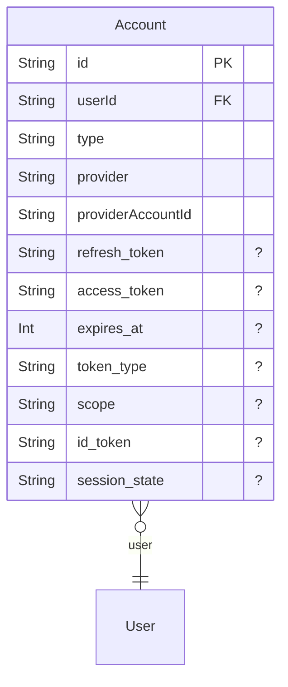

- Denies all operations to unauthenticated users.
- Allows creation of accounts, primarily during the sign-in process.
- Allows read, update, and delete operations if the authenticated user's ID matches the account's userId or if the authenticated user has 'ADMIN' access.

### AllowedEmailDomain

Specifies email domains that are permitted for user registration.
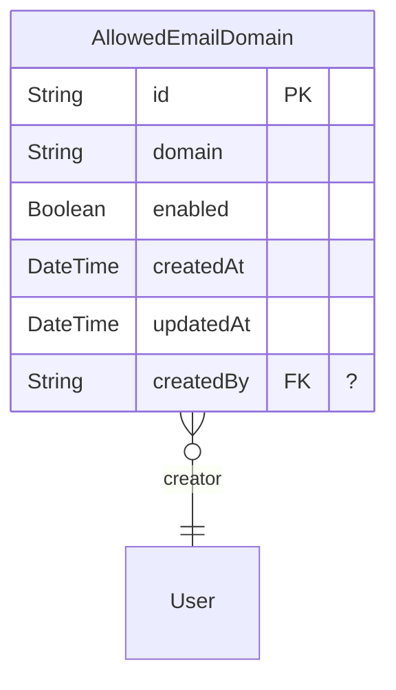

- Allows read operations to all users, including unauthenticated ones, for sign-up validation.
- Allows create, update, and delete operations only if the authenticated user has 'ADMIN' access.

### AppConfig

Stores global application configuration settings as key-value pairs.
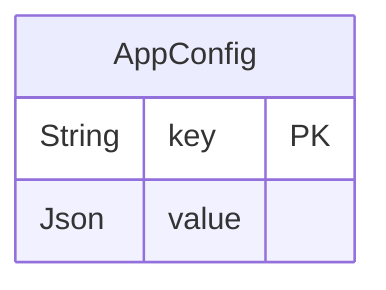

- Denies delete, update, and read operations to unauthenticated users.
- Allows all operations if the authenticated user has 'ADMIN' access.
- Allows read operations if the authenticated user has any access level (not null).

### Attachments

Manages file attachments associated with test cases, sessions, test runs, and results.
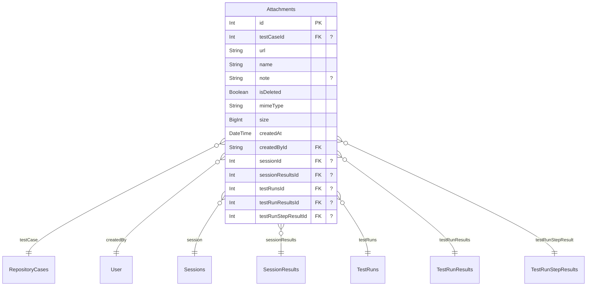

- Denies all operations to unauthenticated users.
- Denies all operations to authenticated users with 'NONE' system access.
- Allows all operations if the authenticated user has 'ADMIN' access.
- Allows create, read, and update operations if the authenticated user has any access level (not null).

### CaseFieldAssignment

Assigns predefined field options to a specific case field.
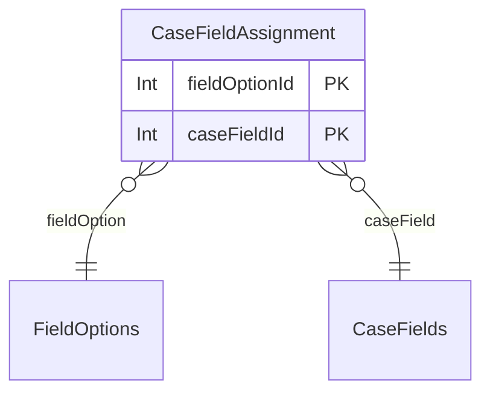

- Denies all operations to unauthenticated users.
- Allows all operations if the authenticated user has 'ADMIN' access.
- Allows read operations if the authenticated user has any access level (not null).

### CaseFields

Defines customizable fields that can be associated with test cases, allowing flexible data collection.
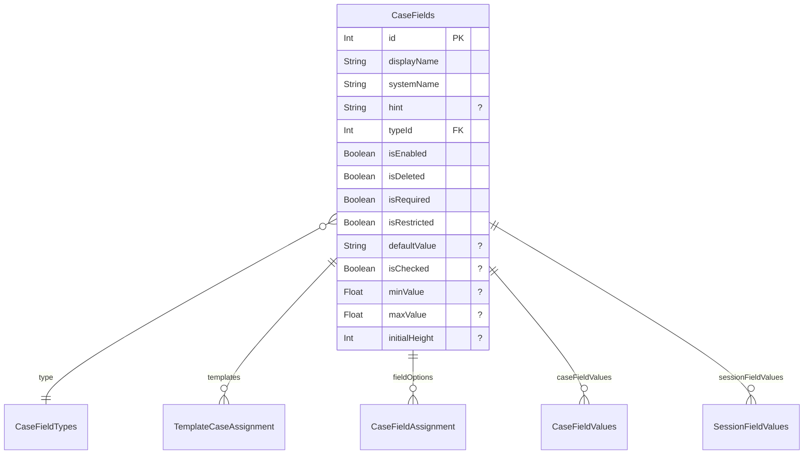

- Denies all operations to unauthenticated users.
- Allows all operations if the authenticated user has 'ADMIN' access or 'PROJECTADMIN' access.
- Allows all operations if the authenticated user has any access level (not null), which is required for users with add/edit access to test cases.

### CaseFieldTypes

Defines the various types of custom fields available for test cases and results (e.g., text, number, checkbox).
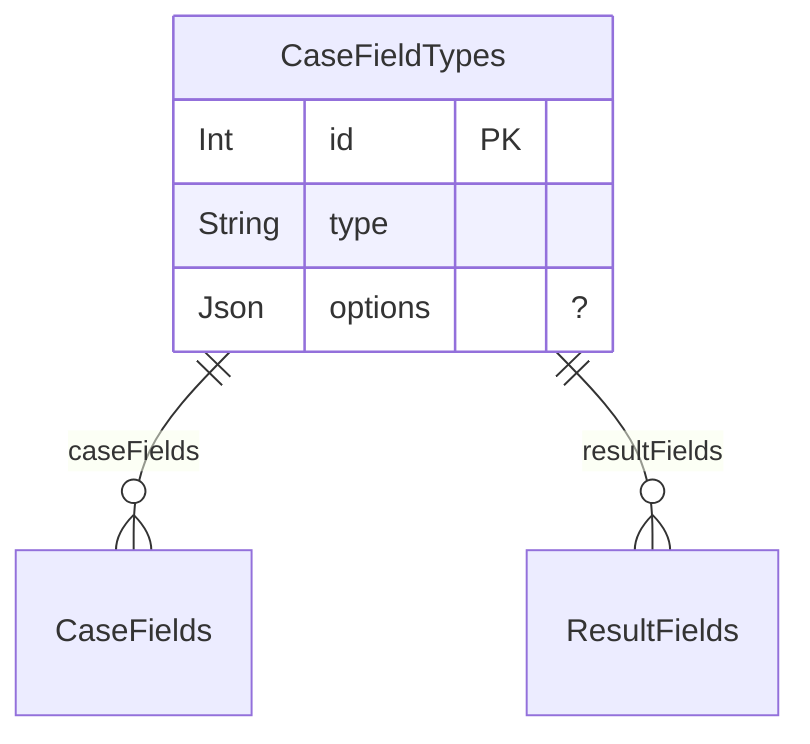

- Denies all operations to unauthenticated users.
- Allows all operations if the authenticated user has 'ADMIN' access.
- Allows read operations if the authenticated user has any access level (not null).

### CaseFieldValues

Stores the actual values for custom case fields associated with a specific test case.
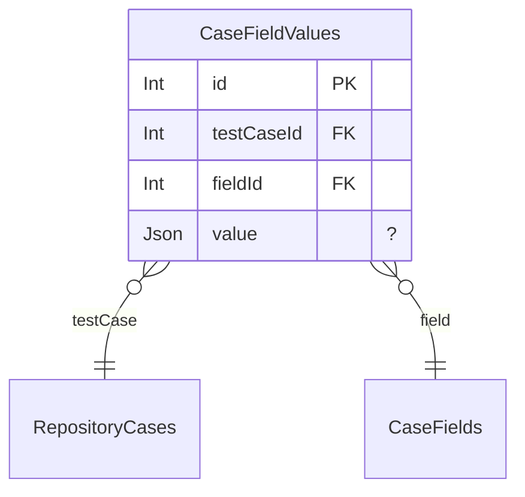

- Denies all operations to unauthenticated users.
- Denies all operations to authenticated users with 'NONE' system access.
- Denies read access if the authenticated user has an explicit 'NO_ACCESS' permission for the test case's project.
- Allows read access if the authenticated user is the test case's project creator, has explicit 'SPECIFIC_ROLE' or 'GLOBAL_ROLE' project permissions, or is part of a group with such permissions and a valid role.
- Allows read access if the test case's project's default access type is 'GLOBAL_ROLE' and the user has a global role (not 'NONE').
- Allows read access if the user is assigned to the test case's project and its default access type is 'SPECIFIC_ROLE' with a defined default role.
- Allows create, update, and delete operations if the authenticated user is the test case's project creator.
- Allows create, update, and delete operations if the authenticated user has explicit 'SPECIFIC_ROLE' project permission for the test case's project and their role is 'Project Admin' or grants 'canAddEdit' in the 'TestCaseRepository' area.
- Allows create, update, and delete operations if the authenticated user has explicit 'GLOBAL_ROLE' project permission for the test case's project and their global role grants 'canAddEdit' in the 'TestCaseRepository' area.
- Allows create, update, and delete operations if the authenticated user has system-level 'PROJECTADMIN' access and is assigned to the test case's project.
- Allows create, update, and delete operations if the authenticated user is part of a group with 'SPECIFIC_ROLE' or 'GLOBAL_ROLE' project permissions for the test case's project, and their role (or global role) grants 'canAddEdit' in the 'TestCaseRepository' area.
- Allows create, update, and delete operations if the test case's project's default access type is 'GLOBAL_ROLE' and the user's global role grants 'canAddEdit' in the 'TestCaseRepository' area.
- Allows create, update, and delete operations if the user is assigned to the test case's project and its default access type is 'SPECIFIC_ROLE', and the project's default role grants 'canAddEdit' in the 'TestCaseRepository' area.
- Allows all operations if the authenticated user has 'ADMIN' access.

### CaseFieldVersionValues

Stores the values of custom case fields for a specific version of a test case.
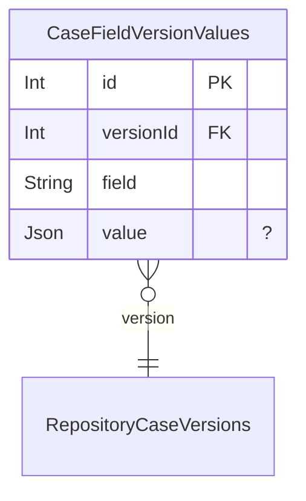

- Denies all operations to unauthenticated users.
- Denies all operations to authenticated users with 'NONE' system access.
- Denies read access if the authenticated user has an explicit 'NO_ACCESS' permission for the version's project.
- Allows read access if the authenticated user is the version's project creator, has explicit 'SPECIFIC_ROLE' or 'GLOBAL_ROLE' project permissions, or is part of a group with such permissions and a valid role.
- Allows read access if the version's project's default access type is 'GLOBAL_ROLE' and the user has a global role (not 'NONE').
- Allows read access if the user is assigned to the version's project and its default access type is 'SPECIFIC_ROLE' with a defined default role.
- Allows create, update, and delete operations if the authenticated user is the version's project creator.
- Allows create, update, and delete operations if the authenticated user has explicit 'SPECIFIC_ROLE' project permission for the version's project and their role is 'Project Admin' or grants 'canAddEdit' in the 'TestCaseRepository' area.
- Allows create, update, and delete operations if the authenticated user has explicit 'GLOBAL_ROLE' project permission for the version's project and their global role grants 'canAddEdit' in the 'TestCaseRepository' area.
- Allows create, update, and delete operations if the authenticated user has system-level 'PROJECTADMIN' access and is assigned to the version's project.
- Allows create, update, and delete operations if the authenticated user is part of a group with 'SPECIFIC_ROLE' or 'GLOBAL_ROLE' project permissions for the version's project, and their role (or global role) grants 'canAddEdit' in the 'TestCaseRepository' area.
- Allows create, update, and delete operations if the version's project's default access type is 'GLOBAL_ROLE' and the user's global role grants 'canAddEdit' in the 'TestCaseRepository' area.
- Allows create, update, and delete operations if the user is assigned to the version's project and its default access type is 'SPECIFIC_ROLE', and the project's default role grants 'canAddEdit' in the 'TestCaseRepository' area.
- Allows all operations if the authenticated user has 'ADMIN' access.

### Color

Defines individual colors, associated with a color family. Used for status indicators and other UI elements.
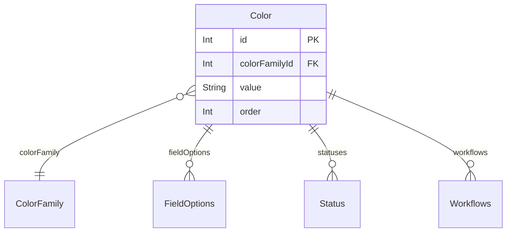

- Denies all operations to unauthenticated users.
- Allows all operations if the authenticated user has 'ADMIN' access.
- Allows creation and read operations if the authenticated user has any access level (not null).

### ColorFamily

Organizes colors into families for consistent visual branding and selection.
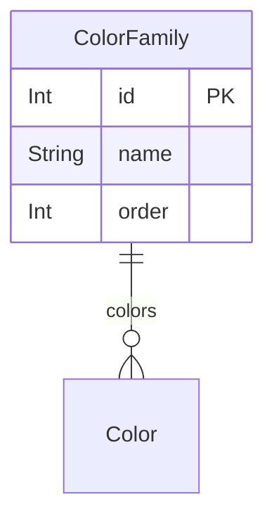

- Denies all operations to unauthenticated users.
- Allows all operations if the authenticated user has 'ADMIN' access.
- Allows creation and read operations if the authenticated user has any access level (not null).

### Comment

Represents a comment made by a user on various entities like test cases, test runs, or milestones.
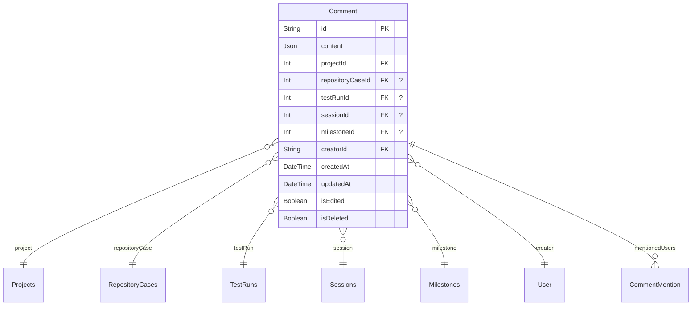

- Denies all operations to unauthenticated users.
- Denies all operations to authenticated users with 'NONE' system access.
- Denies read access if the authenticated user has an explicit 'NO_ACCESS' permission for the associated project.
- Allows read access if the authenticated user is the project's creator, has explicit 'SPECIFIC_ROLE' or 'GLOBAL_ROLE' project permissions, or is part of a group with such permissions and a valid role.
- Allows read access if the project's default access type is 'GLOBAL_ROLE' and the user has a global role (not 'NONE').
- Allows read access if the user is assigned to the project and the project's default access type is 'SPECIFIC_ROLE' with a defined default role.
- Allows creation operations using the same logic as read access to ensure users can comment on entities they can view.
- Allows update operations if the authenticated user is the creator of the comment and the comment is not deleted.
- Allows deletion operations if the authenticated user is the creator of the comment or has 'ADMIN' access.
- Allows all operations if the authenticated user has 'ADMIN' access.

### CommentMention

Records when a user is mentioned within a comment.
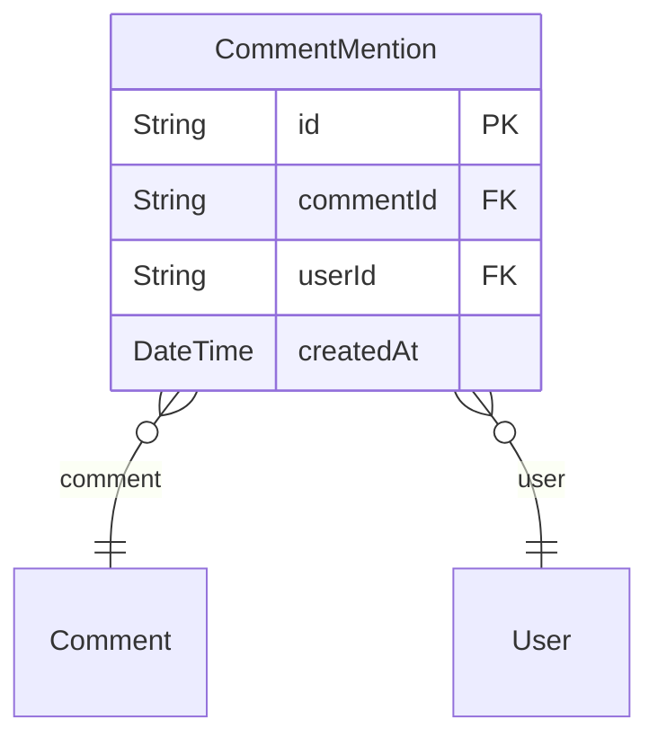

- Denies all operations to unauthenticated users.
- Allows read operations if the authenticated user has any access level (not null).
- Allows creation operations if the authenticated user has any access level (not null).
- Allows all operations if the authenticated user has 'ADMIN' access.

### ConfigCategories

Categorizes test configurations, helping to organize different sets of test environments or settings.
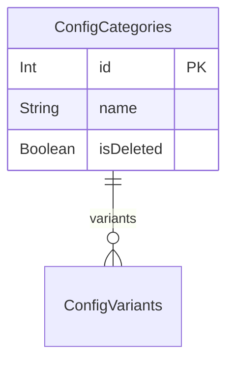

- Denies all operations to unauthenticated users.
- Allows all operations if the authenticated user has 'ADMIN' access.
- Allows read operations if the authenticated user has any access level (not null).

### ConfigurationConfigVariant

Links configurations to their constituent config variants.
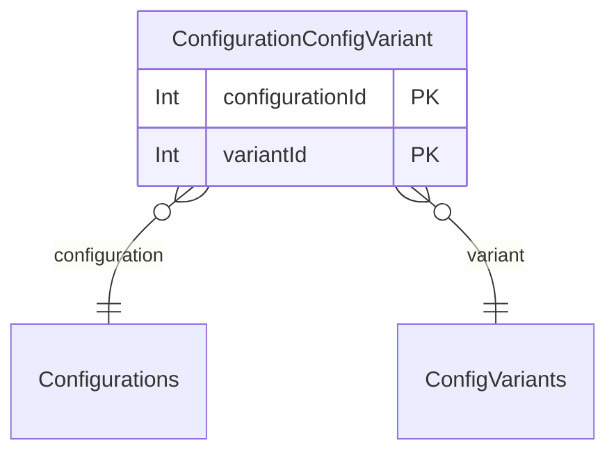

- Denies all operations to unauthenticated users.
- Allows all operations if the authenticated user has 'ADMIN' access.
- Allows read operations if the authenticated user has any access level (not null).

### Configurations

Defines a specific test configuration, composed of various config variants.
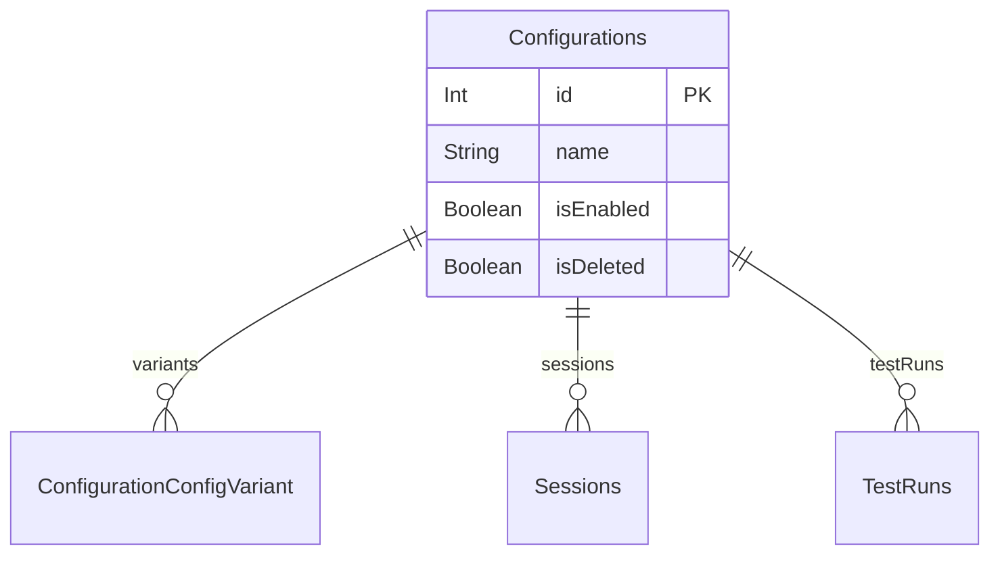

- Denies all operations to unauthenticated users.
- Allows all operations if the authenticated user has 'ADMIN' access.
- Allows read operations if the authenticated user has any access level (not null).

### ConfigVariants

Represents different variants within a configuration category (e.g., Browser: Chrome, Firefox).
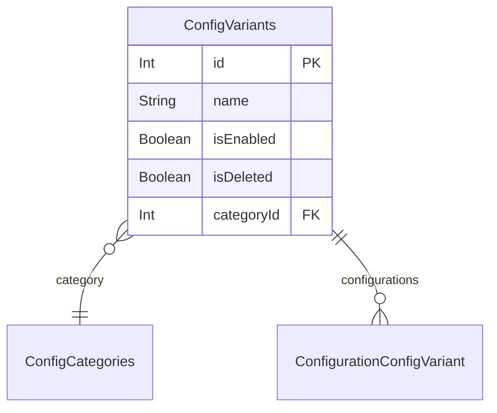

- Denies all operations to unauthenticated users.
- Allows all operations if the authenticated user has 'ADMIN' access.
- Allows read operations if the authenticated user has any access level (not null).

### FieldIcon

Stores icon definitions that can be used across various fields and entities for visual representation.
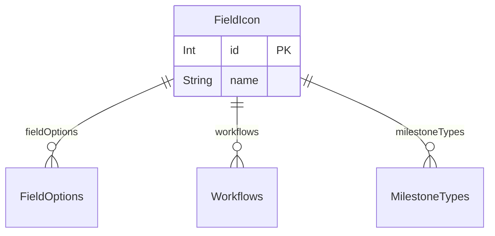

- Denies all operations to unauthenticated users.
- Allows all operations if the authenticated user has 'ADMIN' access.
- Allows creation and read operations if the authenticated user has any access level (not null).

### FieldOptions

Provides predefined options for customizable fields, often used for dropdowns or multi-select fields.
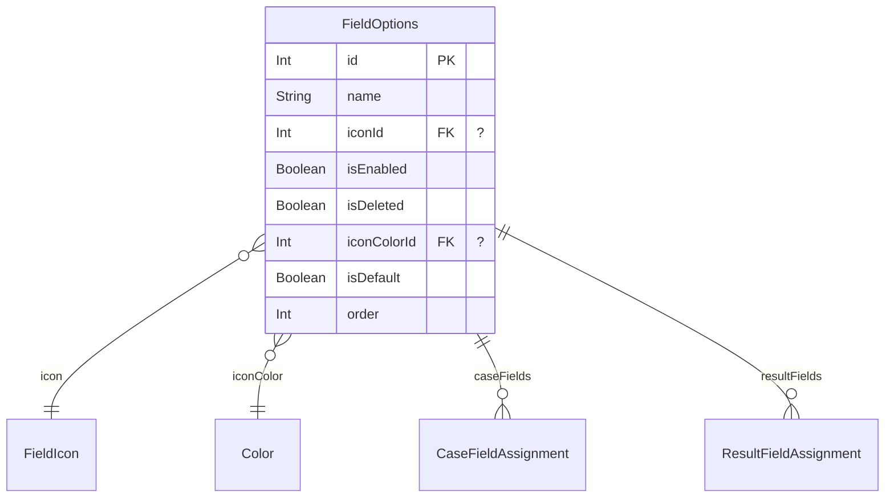

- Denies all operations to unauthenticated users.
- Allows all operations if the authenticated user has 'ADMIN' access.
- Allows read operations if the authenticated user has any access level (not null).

### GroupAssignment

Links users to specific groups, defining group membership.
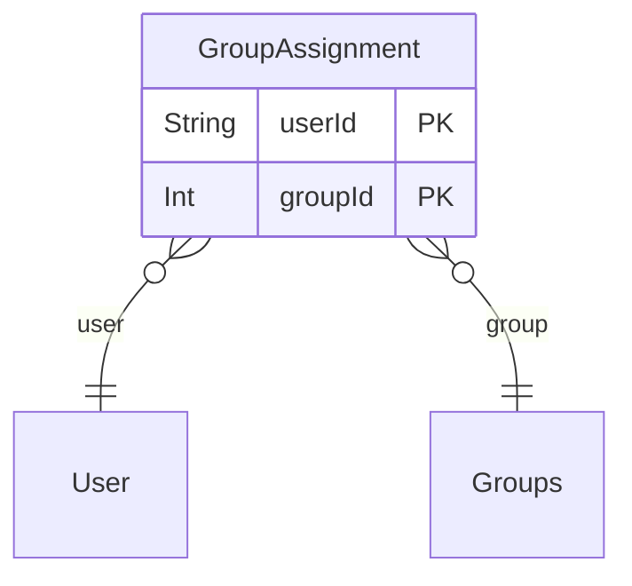

- Denies all operations to unauthenticated users.
- Allows all operations if the authenticated user has 'ADMIN' access.
- Allows read operations if the authenticated user has any access level (not null).

### GroupProjectPermission

Defines explicit, group-specific access permissions for a project.
```mermaid
erDiagram
"GroupProjectPermission" {
  Int groupId PK
  Int projectId PK
  ProjectAccessType accessType
  Int roleId FK "?"
}

"GroupProjectPermission" }o--|| "Groups": group
"GroupProjectPermission" }o--|| "Projects": project
"GroupProjectPermission" }o--|| "Roles": role

```

- Denies all operations to unauthenticated users.
- Allows all operations if the authenticated user has 'ADMIN' access.
- Allows all operations if the authenticated user is the project's creator.
- Allows all operations if the authenticated user has system-level 'PROJECTADMIN' access and is assigned to the project.
- Allows all operations if the authenticated user has an explicit 'Project Admin' role within the project.
- Allows read operations if the authenticated user is part of the group.
- Allows read operations if the authenticated user is assigned to the project.
- Denies creation and update operations if 'accessType' is 'SPECIFIC_ROLE' but 'roleId' is not provided.

### Groups

Manages user groups for organizing users and assigning group-level permissions.
```mermaid
erDiagram
"Groups" {
  Int id PK
  String name
  String externalId  "?"
  String url  "?"
  String note  "?"
  Boolean isDeleted
}

"Groups" ||--o{ "GroupAssignment": assignedUsers
"Groups" ||--o{ "GroupProjectPermission": projectPermissions

```

- Denies all operations to unauthenticated users.
- Allows all operations if the authenticated user has 'ADMIN' access.
- Allows read operations if the authenticated user has any access level (not null).

### Integration

Defines a general integration with external systems, such as issue trackers.
```mermaid
erDiagram
"Integration" {
  Int id PK
  String name
  IntegrationProvider provider
  IntegrationAuthType authType
  IntegrationStatus status
  Json credentials
  Json settings  "?"
  DateTime lastSyncAt  "?"
  Boolean isDeleted
  DateTime createdAt
  DateTime updatedAt
}

"Integration" ||--o{ "UserIntegrationAuth": userIntegrationAuths
"Integration" ||--o{ "ProjectIntegration": projectIntegrations
"Integration" ||--o{ "Issue": issues

```

- Denies all operations to unauthenticated users.
- Allows read operations if the authenticated user has any access level (not null).
- Allows all operations if the authenticated user has 'ADMIN' access.

### Issue

Represents an issue (e.g., bug, defect) linked from an external integration or created within the application.
```mermaid
erDiagram
"Issue" {
  Int id PK
  String name
  String title
  String description  "?"
  String status  "?"
  String priority  "?"
  String externalId  "?"
  String externalKey  "?"
  String externalUrl  "?"
  String externalStatus  "?"
  Json externalData  "?"
  String issueTypeId  "?"
  String issueTypeName  "?"
  String issueTypeIconUrl  "?"
  DateTime lastSyncedAt  "?"
  Json data  "?"
  Json note  "?"
  Boolean isDeleted
  DateTime createdAt
  String createdById FK
  Int projectId FK "?"
  Int integrationId FK "?"
}

"Issue" }o--|| "User": createdBy
"Issue" }o--o{ "RepositoryCases": repositoryCases
"Issue" }o--o{ "Sessions": sessions
"Issue" }o--o{ "SessionResults": sessionResults
"Issue" }o--o{ "TestRuns": testRuns
"Issue" }o--o{ "TestRunResults": testRunResults
"Issue" }o--o{ "TestRunStepResults": testRunStepResults
"Issue" }o--|| "Projects": project
"Issue" }o--|| "Integration": integration

```

- Denies all operations to unauthenticated users.
- Denies all operations to authenticated users with 'NONE' system access.
- Allows all operations if the authenticated user has 'ADMIN' access.
- Allows create, read, and update operations if the authenticated user has any access level (not null).

### JUnitAttachment

Stores attachments related to JUnit test cases.
```mermaid
erDiagram
"JUnitAttachment" {
  Int id PK
  String name
  String value
  JUnitAttachmentType type
  Int repositoryCaseId FK
  DateTime createdAt
  String createdById FK
}

"JUnitAttachment" }o--|| "RepositoryCases": repositoryCase
"JUnitAttachment" }o--|| "User": createdBy

```

- Denies all operations to unauthenticated users.
- Denies all operations to authenticated users with 'NONE' system access.
- Denies read access if the authenticated user has an explicit 'NO_ACCESS' permission for the repository case's project.
- Allows read access if the authenticated user is the repository case's project creator, has explicit 'SPECIFIC_ROLE' or 'GLOBAL_ROLE' project permissions, or is part of a group with such permissions and a valid role.
- Allows read access if the repository case's project's default access type is 'GLOBAL_ROLE' and the user has a global role (not 'NONE').
- Allows read access if the user is assigned to the repository case's project and its default access type is 'SPECIFIC_ROLE' with a defined default role.
- Allows create and update operations if the authenticated user is the creator of the JUnit attachment.
- Allows all operations if the authenticated user has 'ADMIN' access.

### JUnitProperty

Stores properties associated with JUnit test suites or test cases.
```mermaid
erDiagram
"JUnitProperty" {
  Int id PK
  String name
  String value  "?"
  Int testSuiteId FK "?"
  Int repositoryCaseId FK "?"
  DateTime createdAt
  String createdById FK
}

"JUnitProperty" }o--|| "JUnitTestSuite": testSuite
"JUnitProperty" }o--|| "RepositoryCases": repositoryCase
"JUnitProperty" }o--|| "User": createdBy

```

- Denies all operations to unauthenticated users.
- Denies all operations to authenticated users with 'NONE' system access.
- Denies read access if the authenticated user has an explicit 'NO_ACCESS' permission for the test suite's test run's project (if linked to a test suite) or the repository case's project (if linked to a repository case).
- Allows read access through the test suite if the authenticated user has read access to the test suite's test run's project.
- Allows read access through the repository case if the authenticated user has read access to the repository case's project.
- Allows create and update operations if the authenticated user is the creator of the JUnit property.
- Allows all operations if the authenticated user has 'ADMIN' access.

### JUnitTestResult

Represents an individual test result from a JUnit XML report, linked to a repository case.
```mermaid
erDiagram
"JUnitTestResult" {
  Int id PK
  JUnitResultType type
  String message  "?"
  String content  "?"
  Int repositoryCaseId FK
  DateTime executedAt  "?"
  Float time  "?"
  Int assertions  "?"
  String file  "?"
  Int line  "?"
  String systemOut  "?"
  String systemErr  "?"
  Int testSuiteId FK
  DateTime createdAt
  String createdById FK
  Int statusId FK "?"
}

"JUnitTestResult" }o--|| "RepositoryCases": repositoryCase
"JUnitTestResult" }o--|| "JUnitTestSuite": testSuite
"JUnitTestResult" }o--|| "User": createdBy
"JUnitTestResult" }o--|| "Status": status

```

- Denies all operations to unauthenticated users.
- Denies all operations to authenticated users with 'NONE' system access.
- Denies read access if the authenticated user has an explicit 'NO_ACCESS' permission for the test suite's test run's project.
- Allows read access if the authenticated user is the test suite's test run's project creator, has explicit 'SPECIFIC_ROLE' or 'GLOBAL_ROLE' project permissions, or is part of a group with such permissions and a valid role.
- Allows read access if the test suite's test run's project's default access type is 'GLOBAL_ROLE' and the user has a global role (not 'NONE').
- Allows read access if the user is assigned to the test suite's test run's project and its default access type is 'SPECIFIC_ROLE' with a defined default role.
- Allows create and update operations if the authenticated user is the creator of the JUnit test result.
- Allows all operations if the authenticated user has 'ADMIN' access.

### JUnitTestStep

Represents a step within a JUnit test case.
```mermaid
erDiagram
"JUnitTestStep" {
  Int id PK
  String name
  String content  "?"
  Int statusId FK "?"
  Int repositoryCaseId FK
  DateTime createdAt
  String createdById FK
}

"JUnitTestStep" }o--|| "Status": stepStatus
"JUnitTestStep" }o--|| "RepositoryCases": repositoryCase
"JUnitTestStep" }o--|| "User": createdBy

```

- Denies all operations to unauthenticated users.
- Denies all operations to authenticated users with 'NONE' system access.
- Denies read access if the authenticated user has an explicit 'NO_ACCESS' permission for the repository case's project.
- Allows read access if the authenticated user is the repository case's project creator, has explicit 'SPECIFIC_ROLE' or 'GLOBAL_ROLE' project permissions, or is part of a group with such permissions and a valid role.
- Allows read access if the repository case's project's default access type is 'GLOBAL_ROLE' and the user has a global role (not 'NONE').
- Allows read access if the user is assigned to the repository case's project and its default access type is 'SPECIFIC_ROLE' with a defined default role.
- Allows create and update operations if the authenticated user is the creator of the JUnit test step.
- Allows all operations if the authenticated user has 'ADMIN' access.

### JUnitTestSuite

Represents a test suite from a JUnit XML report, containing metadata about a group of tests.
```mermaid
erDiagram
"JUnitTestSuite" {
  Int id PK
  String name
  Float time  "?"
  Int tests  "?"
  Int failures  "?"
  Int errors  "?"
  Int skipped  "?"
  Int assertions  "?"
  DateTime timestamp  "?"
  String file  "?"
  String systemOut  "?"
  String systemErr  "?"
  Int parentId FK "?"
  Int testRunId FK
  DateTime createdAt
  String createdById FK
}

"JUnitTestSuite" ||--o{ "JUnitProperty": properties
"JUnitTestSuite" ||--o{ "JUnitTestResult": results
"JUnitTestSuite" }o--|| "JUnitTestSuite": parent
"JUnitTestSuite" ||--o{ "JUnitTestSuite": children
"JUnitTestSuite" }o--|| "TestRuns": testRun
"JUnitTestSuite" }o--|| "User": createdBy

```

- Denies all operations to unauthenticated users.
- Denies all operations to authenticated users with 'NONE' system access.
- Denies read access if the authenticated user has an explicit 'NO_ACCESS' permission for the test run's project.
- Allows read access if the authenticated user is the test run's project creator, has explicit 'SPECIFIC_ROLE' or 'GLOBAL_ROLE' project permissions, or is part of a group with such permissions and a valid role.
- Allows read access if the test run's project's default access type is 'GLOBAL_ROLE' and the user has a global role (not 'NONE').
- Allows read access if the user is assigned to the test run's project and its default access type is 'SPECIFIC_ROLE' with a defined default role.
- Allows create and update operations if the authenticated user is the creator of the JUnit test suite.
- Allows all operations if the authenticated user has 'PROJECTADMIN' access or 'ADMIN' access.

### LlmFeatureConfig

Configures specific LLM features for a project, including enabled status, integration, and template overrides.
```mermaid
erDiagram
"LlmFeatureConfig" {
  String id PK
  Int projectId FK
  String feature
  Boolean enabled
  Int llmIntegrationId FK "?"
  String templateId FK "?"
  String model  "?"
  Float temperature  "?"
  Int maxTokens  "?"
  Boolean autoTrigger
  Json triggerConditions  "?"
  String outputFormat  "?"
  Json postProcessing  "?"
  Int dailyLimit  "?"
  Int monthlyLimit  "?"
  DateTime createdAt
  DateTime updatedAt
}

"LlmFeatureConfig" }o--|| "Projects": project
"LlmFeatureConfig" }o--|| "LlmIntegration": llmIntegration
"LlmFeatureConfig" }o--|| "LlmPromptTemplate": template

```

- Denies all operations to unauthenticated users.
- Allows read operations if the authenticated user is assigned to the project.
- Allows create, update, and delete operations if the authenticated user is assigned to the project and has 'PROJECTADMIN' access.
- Allows all operations if the authenticated user has 'ADMIN' access.

### LlmIntegration

Defines a Large Language Model (LLM) integration, used for AI-powered features.
```mermaid
erDiagram
"LlmIntegration" {
  Int id PK
  String name
  LlmProvider provider
  IntegrationStatus status
  Json credentials
  Json settings  "?"
  Boolean isDeleted
  DateTime createdAt
  DateTime updatedAt
}

"LlmIntegration" ||--o| "LlmProviderConfig": llmProviderConfig
"LlmIntegration" ||--o{ "OllamaModelRegistry": ollamaModelRegistry
"LlmIntegration" ||--o{ "LlmUsage": llmUsages
"LlmIntegration" ||--o{ "LlmFeatureConfig": llmFeatureConfigs
"LlmIntegration" ||--o{ "LlmResponseCache": llmResponseCaches
"LlmIntegration" ||--o{ "ProjectLlmIntegration": projectLlmIntegrations
"LlmIntegration" ||--o{ "LlmPromptTemplate": llmPromptTemplates
"LlmIntegration" ||--o{ "LlmRateLimit": llmRateLimits

```

- Denies all operations to unauthenticated users.
- Allows read operations if the authenticated user has any access level (not null).
- Allows all operations if the authenticated user has 'ADMIN' access.

### LlmPromptTemplate

Defines reusable templates for LLM prompts, including system and user prompts, variables, and model preferences.
```mermaid
erDiagram
"LlmPromptTemplate" {
  String id PK
  String name
  String feature
  Int version
  Int llmIntegrationId FK "?"
  String systemPrompt
  String userPrompt
  Json variables
  Json examples  "?"
  String recommendedModel  "?"
  Int minContextWindow
  Int maxOutputTokens
  Float temperature
  String description  "?"
  String tags
  Boolean isActive
  Boolean isDefault
  DateTime createdAt
  DateTime updatedAt
}

"LlmPromptTemplate" }o--|| "LlmIntegration": llmIntegration
"LlmPromptTemplate" ||--o{ "LlmFeatureConfig": featureConfigs

```

- Denies all operations to unauthenticated users.
- Allows read operations if the authenticated user has any access level (not null).
- Allows create and update operations if the authenticated user has 'ADMIN' access or 'PROJECTADMIN' access.
- Allows all operations if the authenticated user has 'ADMIN' access.

### LlmProviderConfig

Configures specific settings for an LLM provider, including model details, rate limits, and cost tracking.
```mermaid
erDiagram
"LlmProviderConfig" {
  Int id PK
  Int llmIntegrationId FK "?"
  String defaultModel
  Json availableModels
  Int maxTokensPerRequest
  Int maxRequestsPerMinute
  Int maxRequestsPerDay  "?"
  Decimal costPerInputToken
  Decimal costPerOutputToken
  Decimal monthlyBudget  "?"
  Float defaultTemperature
  Int defaultMaxTokens
  Int timeout
  Int retryAttempts
  Boolean streamingEnabled
  Boolean isDefault
  Json settings  "?"
  DateTime createdAt
  DateTime updatedAt
}

"LlmProviderConfig" ||--o| "LlmIntegration": llmIntegration

```

- Denies all operations to unauthenticated users.
- Allows read operations if the authenticated user has any access level (not null).
- Allows all operations if the authenticated user has 'ADMIN' access.

### LlmRateLimit

Defines rate limits for LLM usage, applicable at global, integration, project, or user scopes.
```mermaid
erDiagram
"LlmRateLimit" {
  String id PK
  Int llmIntegrationId FK "?"
  String scope
  String scopeId  "?"
  String feature  "?"
  String windowType
  Int windowSize
  Int maxRequests
  Int maxTokens  "?"
  Int currentRequests
  Int currentTokens
  DateTime windowStart
  Boolean blockOnExceed
  Boolean queueOnExceed
  Boolean alertOnExceed
  Int priority
  Boolean isActive
  DateTime createdAt
  DateTime updatedAt
}

"LlmRateLimit" }o--|| "LlmIntegration": llmIntegration

```

- Denies all operations to unauthenticated users.
- Allows read operations if the authenticated user has any access level (not null).
- Allows create, update, and delete operations if the authenticated user has 'ADMIN' access.

### LlmResponseCache

Caches LLM responses to optimize performance and reduce API calls.
```mermaid
erDiagram
"LlmResponseCache" {
  String id PK
  String feature
  String model
  String promptHash
  String contextHash  "?"
  Json response
  Int promptTokens
  Int completionTokens
  Int projectId FK "?"
  Int llmIntegrationId FK
  Int hits
  DateTime lastAccessedAt
  DateTime expiresAt
  DateTime createdAt
}

"LlmResponseCache" }o--|| "Projects": project
"LlmResponseCache" }o--|| "LlmIntegration": llmIntegration

```

- Denies all operations to unauthenticated users.
- Allows read operations if the authenticated user has any access level (not null).
- Allows create and delete operations if the authenticated user has 'ADMIN' access or 'PROJECTADMIN' access.
- Allows all operations if the authenticated user has 'ADMIN' access.

### LlmUsage

Tracks usage and cost details for LLM interactions within the application.
```mermaid
erDiagram
"LlmUsage" {
  String id PK
  Int llmIntegrationId FK "?"
  Int projectId FK "?"
  String userId FK
  String feature
  String model
  Int promptTokens
  Int completionTokens
  Int totalTokens
  Decimal inputCost
  Decimal outputCost
  Decimal totalCost
  Int latency
  Boolean success
  String error  "?"
  DateTime createdAt
}

"LlmUsage" }o--|| "LlmIntegration": llmIntegration
"LlmUsage" }o--|| "Projects": project
"LlmUsage" }o--|| "User": user

```

- Denies all operations to unauthenticated users.
- Allows read operations if the authenticated user's ID matches the userId, or if the user is assigned to the project associated with the usage.
- Allows creation operations if the authenticated user has any access level (not null).
- Allows all operations if the authenticated user has 'ADMIN' access.

### Milestones

Represents project milestones, used for tracking progress and deadlines within a project.
```mermaid
erDiagram
"Milestones" {
  Int id PK
  Int projectId FK
  Int rootId FK "?"
  Int parentId FK "?"
  Int milestoneTypesId FK
  String name
  Json note  "?"
  Json docs  "?"
  Boolean isStarted
  Boolean isCompleted
  Boolean isDeleted
  Boolean automaticCompletion
  Int notifyDaysBefore
  DateTime startedAt  "?"
  DateTime completedAt  "?"
  DateTime createdAt
  String createdBy FK
}

"Milestones" }o--|| "Projects": project
"Milestones" }o--|| "Milestones": root
"Milestones" ||--o{ "Milestones": descendants
"Milestones" }o--|| "Milestones": parent
"Milestones" ||--o{ "Milestones": children
"Milestones" }o--|| "MilestoneTypes": milestoneType
"Milestones" }o--|| "User": creator
"Milestones" ||--o{ "Sessions": sessions
"Milestones" ||--o{ "TestRuns": testRuns
"Milestones" ||--o{ "Comment": comments

```

- Denies all operations to unauthenticated users.
- Denies all operations to authenticated users with 'NONE' system access.
- Denies read access if the authenticated user has an explicit 'NO_ACCESS' permission for the associated project.
- Allows read access if the authenticated user is the project's creator, has explicit 'SPECIFIC_ROLE' or 'GLOBAL_ROLE' project permissions, or is part of a group with such permissions and a valid role.
- Allows read access if the project's default access type is 'GLOBAL_ROLE' and the user has a global role (not 'NONE').
- Allows read access if the user is assigned to the project and the project's default access type is 'SPECIFIC_ROLE' with a defined default role.
- Allows create, update, and delete operations if the authenticated user is the project's creator.
- Allows create, update, and delete operations if the authenticated user has explicit 'SPECIFIC_ROLE' project permission and their role is 'Project Admin' or grants 'canAddEdit' in the 'Milestones' area.
- Allows create, update, and delete operations if the authenticated user has system-level 'PROJECTADMIN' access and is assigned to the project.
- Allows create, update, and delete operations if the authenticated user is part of a group with 'SPECIFIC_ROLE' or 'GLOBAL_ROLE' project permissions, and their role (or global role) is 'Project Admin' or grants 'canAddEdit' in the 'Milestones' area.
- Allows all operations if the authenticated user has 'ADMIN' access.

### MilestoneTypes

Defines different categories or types of milestones, each with a name, icon, and default status.
```mermaid
erDiagram
"MilestoneTypes" {
  Int id PK
  String name
  Int iconId FK "?"
  Boolean isDefault
  Boolean isDeleted
}

"MilestoneTypes" }o--|| "FieldIcon": icon
"MilestoneTypes" ||--o{ "MilestoneTypesAssignment": projects
"MilestoneTypes" ||--o{ "Milestones": milestones

```

- Denies all operations to unauthenticated users.
- Allows all operations if the authenticated user has 'ADMIN' access.
- Allows read operations if the authenticated user has any access level (not null).

### MilestoneTypesAssignment

Connects milestone types to specific projects, allowing project-specific availability of milestone types.
```mermaid
erDiagram
"MilestoneTypesAssignment" {
  Int projectId PK
  Int milestoneTypeId PK
}

"MilestoneTypesAssignment" }o--|| "Projects": project
"MilestoneTypesAssignment" }o--|| "MilestoneTypes": milestoneType

```

- Denies all operations to unauthenticated users.
- Allows all operations if the authenticated user has 'ADMIN' access.
- Allows read operations if the authenticated user has any access level (not null).

### Notification

Manages user notifications, including type, message, and read status.
```mermaid
erDiagram
"Notification" {
  String id PK
  String userId FK
  NotificationType type
  String title
  String message
  Json data  "?"
  Boolean isRead
  Boolean isDeleted
  String relatedEntityId  "?"
  String relatedEntityType  "?"
  DateTime createdAt
  DateTime updatedAt
}

"Notification" }o--|| "User": user

```

- Denies all operations to unauthenticated users.
- Allows read operations if the authenticated user's ID matches the userId or if the authenticated user has 'ADMIN' access.
- Allows update operations if the authenticated user's ID matches the userId and they are updating 'isRead' or 'isDeleted' fields.
- Allows creation operations if the authenticated user has any access level (not null).
- Allows deletion operations if the authenticated user has 'ADMIN' access.

### OllamaModelRegistry

Registers and tracks available Ollama models, including their installation status and capabilities.
```mermaid
erDiagram
"OllamaModelRegistry" {
  String id PK
  Int llmIntegrationId FK
  String modelName
  String modelTag
  BigInt modelSize  "?"
  String digest  "?"
  Int contextWindow
  Json capabilities
  String quantization  "?"
  Boolean isInstalled
  Boolean isPulling
  Float pullProgress  "?"
  DateTime lastUsedAt  "?"
  DateTime installedAt  "?"
  DateTime createdAt
  DateTime updatedAt
}

"OllamaModelRegistry" }o--|| "LlmIntegration": llmIntegration

```

- Denies all operations to unauthenticated users.
- Allows read operations if the authenticated user has any access level (not null).
- Allows all operations if the authenticated user has 'ADMIN' access.

### ProjectAssignment

Connects users to projects, indicating their direct involvement.
```mermaid
erDiagram
"ProjectAssignment" {
  String userId PK
  Int projectId PK
}

"ProjectAssignment" }o--|| "User": user
"ProjectAssignment" }o--|| "Projects": project

```

- Denies all operations to unauthenticated users.
- Allows all operations if the authenticated user has 'ADMIN' access.
- Allows read operations if the authenticated user has any access level (not null).

### ProjectIntegration

Links an external integration to a project, with project-specific configurations and field mappings.
```mermaid
erDiagram
"ProjectIntegration" {
  String id PK
  Int projectId FK
  Int integrationId FK
  Json config  "?"
  Json fieldMappings  "?"
  Boolean isActive
  DateTime lastSyncAt  "?"
  String syncStatus  "?"
  String syncError  "?"
  Int issueCount
  DateTime createdAt
  DateTime updatedAt
}

"ProjectIntegration" }o--|| "Projects": project
"ProjectIntegration" }o--|| "Integration": integration

```

- Denies all operations to unauthenticated users.
- Denies read access if the authenticated user has an explicit 'NO_ACCESS' permission for the associated project.
- Allows read access if the authenticated user is the project's creator, has explicit 'SPECIFIC_ROLE' or 'GLOBAL_ROLE' project permissions, or is part of a group with such permissions and a valid role.
- Allows read access if the project's default access type is 'GLOBAL_ROLE' and the user has a global role (not 'NONE').
- Allows read access if the user is assigned to the project and the project's default access type is 'SPECIFIC_ROLE' with a defined default role.
- Allows create, update, and delete operations if the authenticated user is the project's creator.
- Allows create, update, and delete operations if the authenticated user has explicit 'SPECIFIC_ROLE' project permission and their role is 'Project Admin'.
- Allows create, update, and delete operations if the authenticated user has system-level 'PROJECTADMIN' access and is assigned to the project.
- Allows all operations if the authenticated user has 'ADMIN' access.

### ProjectLlmIntegration

Links a specific LLM integration to a project, with project-specific configurations.
```mermaid
erDiagram
"ProjectLlmIntegration" {
  String id PK
  Int projectId FK
  Int llmIntegrationId FK
  Json config  "?"
  Boolean isActive
  DateTime createdAt
  DateTime updatedAt
}

"ProjectLlmIntegration" }o--|| "Projects": project
"ProjectLlmIntegration" }o--|| "LlmIntegration": llmIntegration

```

- Denies all operations to unauthenticated users.
- Allows read operations if the authenticated user has any access level (not null).
- Allows all operations if the authenticated user has 'ADMIN' access or 'PROJECTADMIN' access.

### Projects

Represents a project, a core entity for organizing test artifacts, users, and integrations.
```mermaid
erDiagram
"Projects" {
  Int id PK
  String name
  String iconUrl  "?"
  String note  "?"
  String docs  "?"
  Boolean isCompleted
  Boolean isDeleted
  DateTime completedAt  "?"
  DateTime createdAt
  String createdBy FK
  ProjectAccessType defaultAccessType
  Int defaultRoleId FK "?"
}

"Projects" }o--|| "User": creator
"Projects" ||--o{ "ProjectAssignment": assignedUsers
"Projects" ||--o{ "ProjectStatusAssignment": assignedStatuses
"Projects" ||--o{ "MilestoneTypesAssignment": milestoneTypes
"Projects" ||--o{ "TemplateProjectAssignment": assignedTemplates
"Projects" ||--o{ "ProjectWorkflowAssignment": assignedWorkflows
"Projects" ||--o{ "Milestones": milestones
"Projects" ||--o{ "Repositories": repositories
"Projects" ||--o{ "RepositoryFolders": repositoryFolders
"Projects" ||--o{ "RepositoryCases": repositoryCases
"Projects" ||--o{ "RepositoryCaseVersions": repositoryCaseVersions
"Projects" ||--o{ "Sessions": sessions
"Projects" ||--o{ "SessionVersions": sessionVersions
"Projects" ||--o{ "TestRuns": testRuns
"Projects" }o--|| "Roles": defaultRole
"Projects" ||--o{ "UserProjectPermission": userPermissions
"Projects" ||--o{ "GroupProjectPermission": groupPermissions
"Projects" ||--o{ "SharedStepGroup": sharedStepGroups
"Projects" ||--o{ "ProjectIntegration": projectIntegrations
"Projects" ||--o{ "ProjectLlmIntegration": projectLlmIntegrations
"Projects" ||--o{ "Issue": issues
"Projects" ||--o{ "LlmUsage": llmUsages
"Projects" ||--o{ "LlmFeatureConfig": llmFeatureConfigs
"Projects" ||--o{ "LlmResponseCache": llmResponseCaches
"Projects" ||--o{ "Comment": comments

```

- Denies all operations to unauthenticated users.
- Denies all operations to authenticated users with 'NONE' system access.
- Allows all operations if the authenticated user has 'ADMIN' access.
- Allows all operations if the authenticated user is the project's creator.
- Allows all operations if the authenticated user has an explicit 'Project Admin' role within the project.
- Allows all operations if the authenticated user has system-level 'PROJECTADMIN' access and is assigned to the project.
- Denies read access if the authenticated user has an explicit 'NO_ACCESS' permission for the project.
- Allows read access if the authenticated user has explicit 'SPECIFIC_ROLE' or 'GLOBAL_ROLE' project permissions.
- Allows read access if the authenticated user is part of a group with 'SPECIFIC_ROLE' or 'GLOBAL_ROLE' project permissions, and has a valid role.
- Allows read access if the project's default access type is 'GLOBAL_ROLE' and the user has a global role (not 'NONE').
- Allows read access if the user is assigned to the project and the project's default access type is 'SPECIFIC_ROLE' with a defined default role.
- Allows read access if the project's default access type is 'DEFAULT' and the user has a valid access level (not 'NONE').
- Denies update and delete access if the authenticated user has an explicit 'NO_ACCESS' permission for the project.
- Allows update access if the authenticated user has explicit 'SPECIFIC_ROLE' project permission and their role grants 'canAddEdit' in the 'Documentation' area.
- Allows update access if the authenticated user is part of a group with 'SPECIFIC_ROLE' or 'GLOBAL_ROLE' project permissions, and their role (or global role) grants 'canAddEdit' in the 'Documentation' area.
- Allows delete access if the authenticated user has explicit 'SPECIFIC_ROLE' project permission and their role grants 'canDelete' in the 'Documentation' area.
- Allows delete access if the authenticated user is part of a group with 'SPECIFIC_ROLE' or 'GLOBAL_ROLE' project permissions, and their role (or global role) grants 'canDelete' in the 'Documentation' area.
- Denies all operations if the project is marked as deleted.

### ProjectStatusAssignment

Associates specific statuses with a project, allowing project-specific status configurations.
```mermaid
erDiagram
"ProjectStatusAssignment" {
  Int statusId PK
  Int projectId PK
}

"ProjectStatusAssignment" }o--|| "Status": status
"ProjectStatusAssignment" }o--|| "Projects": project

```

- Denies all operations to unauthenticated users.
- Allows all operations if the authenticated user has 'ADMIN' access.
- Allows read operations if the authenticated user has any access level (not null).

### ProjectWorkflowAssignment

Associates specific workflows with a project.
```mermaid
erDiagram
"ProjectWorkflowAssignment" {
  Int workflowId PK
  Int projectId PK
}

"ProjectWorkflowAssignment" }o--|| "Workflows": workflow
"ProjectWorkflowAssignment" }o--|| "Projects": project

```

- Denies all operations to unauthenticated users.
- Allows all operations if the authenticated user has 'ADMIN' access.
- Allows read operations if the authenticated user has any access level (not null).

### RegistrationSettings

Global settings controlling user registration behavior, such as email domain restrictions and default access levels.
```mermaid
erDiagram
"RegistrationSettings" {
  String id PK
  Boolean restrictEmailDomains
  Boolean allowOpenRegistration
  Access defaultAccess
  DateTime createdAt
  DateTime updatedAt
}


```

- Allows read operations to all users, including unauthenticated ones, for displaying sign-up options.
- Allows create, update, and delete operations only if the authenticated user has 'ADMIN' access.

### Repositories

Manages test case repositories within a project.
```mermaid
erDiagram
"Repositories" {
  Int id PK
  Int projectId FK
  Boolean isActive
  Boolean isArchived
  Boolean isDeleted
}

"Repositories" }o--|| "Projects": project
"Repositories" ||--o{ "RepositoryFolders": folders
"Repositories" ||--o{ "RepositoryCases": cases

```

- Denies all operations to unauthenticated users.
- Denies all operations to authenticated users with 'NONE' system access.
- Denies read access if the authenticated user has an explicit 'NO_ACCESS' permission for the associated project.
- Allows read access if the authenticated user is the project's creator, has explicit 'SPECIFIC_ROLE' or 'GLOBAL_ROLE' project permissions, or is part of a group with such permissions and a valid role.
- Allows read access if the project's default access type is 'GLOBAL_ROLE' and the user has a global role (not 'NONE').
- Allows read access if the user is assigned to the project and the project's default access type is 'SPECIFIC_ROLE' with a defined default role.
- Allows update and delete operations if the authenticated user is the project's creator, has explicit 'SPECIFIC_ROLE' project permission with 'Project Admin' role, or has system-level 'PROJECTADMIN' access and is assigned to the project.
- Allows creation operations if the authenticated user is the project's creator.
- Allows creation operations if the authenticated user has explicit 'SPECIFIC_ROLE' project permission and their role grants 'canAddEdit' in the 'TestCaseRepository' area.
- Allows creation operations if the authenticated user has explicit 'GLOBAL_ROLE' project permission and their global role grants 'canAddEdit' in the 'TestCaseRepository' area.
- Allows creation operations if the authenticated user has system-level 'PROJECTADMIN' access and is assigned to the project.
- Allows creation operations if the authenticated user is part of a group with 'SPECIFIC_ROLE' or 'GLOBAL_ROLE' project permissions, and their role (or global role) grants 'canAddEdit' in the 'TestCaseRepository' area.
- Allows creation operations if the project's default access type is 'GLOBAL_ROLE' and the user's global role grants 'canAddEdit' in the 'TestCaseRepository' area.
- Allows creation operations if the user is assigned to the project and the project's default access type is 'SPECIFIC_ROLE', and the project's default role grants 'canAddEdit' in the 'TestCaseRepository' area.
- Allows all operations if the authenticated user has 'ADMIN' access.

### RepositoryCaseLink

Manages links between repository test cases, indicating relationships like dependencies or different sources for the same test.
```mermaid
erDiagram
"RepositoryCaseLink" {
  Int id PK
  Int caseAId FK
  Int caseBId FK
  LinkType type
  Boolean isDeleted
  DateTime createdAt
  String createdById FK
}

"RepositoryCaseLink" }o--|| "RepositoryCases": caseA
"RepositoryCaseLink" }o--|| "RepositoryCases": caseB
"RepositoryCaseLink" }o--|| "User": createdBy

```

- Denies all operations to unauthenticated users.
- Denies all operations to authenticated users with 'NONE' system access.
- Denies read access if the authenticated user has an explicit 'NO_ACCESS' permission for the project associated with case A.
- Allows read access if the authenticated user is the project's creator, has explicit 'SPECIFIC_ROLE' or 'GLOBAL_ROLE' project permissions for case A's project, or is part of a group with such permissions and a valid role.
- Allows read access if case A's project's default access type is 'GLOBAL_ROLE' and the user has a global role (not 'NONE').
- Allows read access if the user is assigned to case A's project and its default access type is 'SPECIFIC_ROLE' with a defined default role.
- Allows create, update, and delete operations if the authenticated user is case A's project's creator.
- Allows create, update, and delete operations if the authenticated user has explicit 'SPECIFIC_ROLE' project permission for case A's project and their role is 'Project Admin' or grants 'canAddEdit' in the 'TestCaseRepository' area.
- Allows create, update, and delete operations if the authenticated user has system-level 'PROJECTADMIN' access and is assigned to case A's project.
- Allows create, update, and delete operations if the authenticated user is part of a group with 'SPECIFIC_ROLE' or 'GLOBAL_ROLE' project permissions for case A's project, and their role (or global role) grants 'canAddEdit' in the 'TestCaseRepository' area.
- Allows all operations if the authenticated user has 'ADMIN' access.

### RepositoryCases

Represents individual test cases stored in a repository, including details like name, template, state, and versioning.
```mermaid
erDiagram
"RepositoryCases" {
  Int id PK
  Int projectId FK
  Int repositoryId FK
  Int folderId FK
  Int templateId FK
  String name
  String className  "?"
  RepositoryCaseSource source
  Int stateId FK
  Int estimate  "?"
  Int forecastManual  "?"
  Float forecastAutomated  "?"
  Int order
  DateTime createdAt
  String creatorId FK
  Boolean automated
  Boolean isArchived
  Boolean isDeleted
  Int currentVersion
}

"RepositoryCases" }o--|| "Projects": project
"RepositoryCases" }o--|| "Repositories": repository
"RepositoryCases" }o--|| "RepositoryFolders": folder
"RepositoryCases" }o--|| "Templates": template
"RepositoryCases" }o--|| "Workflows": state
"RepositoryCases" }o--|| "User": creator
"RepositoryCases" ||--o{ "RepositoryCaseVersions": repositoryCaseVersions
"RepositoryCases" ||--o{ "CaseFieldValues": caseFieldValues
"RepositoryCases" ||--o{ "ResultFieldValues": resultFieldValues
"RepositoryCases" ||--o{ "Attachments": attachments
"RepositoryCases" ||--o{ "Steps": steps
"RepositoryCases" ||--o{ "TestRunCases": testRuns
"RepositoryCases" }o--o{ "Tags": tags
"RepositoryCases" }o--o{ "Issue": issues
"RepositoryCases" ||--o{ "JUnitTestResult": junitResults
"RepositoryCases" ||--o{ "JUnitProperty": junitProperties
"RepositoryCases" ||--o{ "JUnitAttachment": junitAttachments
"RepositoryCases" ||--o{ "JUnitTestStep": junitTestSteps
"RepositoryCases" ||--o{ "RepositoryCaseLink": linksFrom
"RepositoryCases" ||--o{ "RepositoryCaseLink": linksTo
"RepositoryCases" ||--o{ "Comment": comments

```

- Denies all operations to unauthenticated users.
- Denies all operations to authenticated users with 'NONE' system access.
- Denies read access if the authenticated user has an explicit 'NO_ACCESS' permission for the associated project.
- Allows read access if the authenticated user is the project's creator, has explicit 'SPECIFIC_ROLE' or 'GLOBAL_ROLE' project permissions, or is part of a group with such permissions and a valid role.
- Allows read access if the project's default access type is 'GLOBAL_ROLE' and the user has a global role (not 'NONE').
- Allows read access if the user is assigned to the project and the project's default access type is 'SPECIFIC_ROLE' with a defined default role.
- Allows create, update, and delete operations if the authenticated user is the project's creator.
- Allows create, update, and delete operations if the authenticated user has explicit 'SPECIFIC_ROLE' project permission and their role is 'Project Admin' or grants 'canAddEdit' in the 'TestCaseRepository' area.
- Allows create, update, and delete operations if the authenticated user has explicit 'GLOBAL_ROLE' project permission and their global role grants 'canAddEdit' in the 'TestCaseRepository' area.
- Allows create, update, and delete operations if the authenticated user has system-level 'PROJECTADMIN' access and is assigned to the project.
- Allows create, update, and delete operations if the authenticated user is part of a group with 'SPECIFIC_ROLE' or 'GLOBAL_ROLE' project permissions, and their role (or global role) grants 'canAddEdit' in the 'TestCaseRepository' area.
- Allows create, update, and delete operations if the project's default access type is 'GLOBAL_ROLE' and the user's global role grants 'canAddEdit' in the 'TestCaseRepository' area.
- Allows create, update, and delete operations if the user is assigned to the project and the project's default access type is 'SPECIFIC_ROLE', and the project's default role grants 'canAddEdit' in the 'TestCaseRepository' area.
- Allows all operations if the authenticated user has 'ADMIN' access.

### RepositoryCaseVersions

Stores historical versions of test cases, preserving their state at different points in time.
```mermaid
erDiagram
"RepositoryCaseVersions" {
  Int id PK
  Int repositoryCaseId FK
  Int staticProjectId
  String staticProjectName
  Int projectId FK
  Int repositoryId
  Int folderId
  String folderName
  Int templateId
  String templateName
  String name
  Int stateId
  String stateName
  Int estimate  "?"
  Int forecastManual  "?"
  Float forecastAutomated  "?"
  Int order
  DateTime createdAt
  String creatorId
  String creatorName
  Boolean automated
  Boolean isArchived
  Boolean isDeleted
  Int version
  Json steps  "?"
  Json tags  "?"
  Json issues  "?"
  Json links  "?"
  Json attachments  "?"
}

"RepositoryCaseVersions" }o--|| "RepositoryCases": repositoryCase
"RepositoryCaseVersions" }o--|| "Projects": project
"RepositoryCaseVersions" ||--o{ "CaseFieldVersionValues": caseFieldVersionValues

```

- Denies all operations to unauthenticated users.
- Denies all operations to authenticated users with 'NONE' system access.
- Denies read access if the authenticated user has an explicit 'NO_ACCESS' permission for the associated project.
- Allows read access if the authenticated user is the project's creator, has explicit 'SPECIFIC_ROLE' or 'GLOBAL_ROLE' project permissions, or is part of a group with such permissions and a valid role.
- Allows read access if the project's default access type is 'GLOBAL_ROLE' and the user has a global role (not 'NONE').
- Allows read access if the user is assigned to the project and the project's default access type is 'SPECIFIC_ROLE' with a defined default role.
- Allows create, update, and delete operations if the authenticated user is the project's creator.
- Allows create, update, and delete operations if the authenticated user has explicit 'SPECIFIC_ROLE' project permission and their role is 'Project Admin' or grants 'canAddEdit' in the 'TestCaseRepository' area.
- Allows create, update, and delete operations if the authenticated user has system-level 'PROJECTADMIN' access and is assigned to the project.
- Allows create, update, and delete operations if the authenticated user is part of a group with 'SPECIFIC_ROLE' project permissions, and their role grants 'canAddEdit' in the 'TestCaseRepository' area.
- Allows all operations if the authenticated user has 'ADMIN' access.

### RepositoryFolders

Organizes test cases within repositories into a hierarchical folder structure.
```mermaid
erDiagram
"RepositoryFolders" {
  Int id PK
  Int projectId FK
  Int repositoryId FK
  Int parentId FK "?"
  String name
  Json docs  "?"
  DateTime createdAt
  String creatorId FK
  Int order
  Boolean isDeleted
}

"RepositoryFolders" }o--|| "Projects": project
"RepositoryFolders" }o--|| "Repositories": repository
"RepositoryFolders" }o--|| "RepositoryFolders": parent
"RepositoryFolders" ||--o{ "RepositoryFolders": children
"RepositoryFolders" }o--|| "User": creator
"RepositoryFolders" ||--o{ "RepositoryCases": cases

```

- Denies all operations to unauthenticated users.
- Denies all operations to authenticated users with 'NONE' system access.
- Allows all operations if the authenticated user has 'ADMIN' access.
- Denies read access if the authenticated user has an explicit 'NO_ACCESS' permission for the associated project.
- Allows read access if the authenticated user is the project's creator, has explicit 'SPECIFIC_ROLE' or 'GLOBAL_ROLE' project permissions, or is part of a group with such permissions and a valid role.
- Allows read access if the project's default access type is 'GLOBAL_ROLE' and the user has a global role (not 'NONE').
- Allows read access if the user is assigned to the project and the project's default access type is 'SPECIFIC_ROLE' with a defined default role.
- Allows create, update, and delete operations if the authenticated user is the project's creator.
- Allows create, update, and delete operations if the authenticated user has explicit 'SPECIFIC_ROLE' project permission and their role is 'Project Admin' or grants 'canAddEdit' in the 'TestCaseRepository' area.
- Allows create, update, and delete operations if the authenticated user is part of a group with 'SPECIFIC_ROLE' or 'GLOBAL_ROLE' project permissions, and their role (or global role) is 'Project Admin' or grants 'canAddEdit' in the 'TestCaseRepository' area.
- Allows create, update, and delete operations if the authenticated user has 'USER' system access and their role grants 'canAddEdit' in the 'TestCaseRepository' area.
- Allows create, update, and delete operations if the authenticated user has system-level 'PROJECTADMIN' access and is assigned to the project.

### ResultFieldAssignment

Assigns predefined field options to a specific result field.
```mermaid
erDiagram
"ResultFieldAssignment" {
  Int fieldOptionId PK
  Int resultFieldId PK
  Int order
}

"ResultFieldAssignment" }o--|| "FieldOptions": fieldOption
"ResultFieldAssignment" }o--|| "ResultFields": resultField

```

- Denies all operations to unauthenticated users.
- Allows all operations if the authenticated user has 'ADMIN' access.
- Allows read operations if the authenticated user has any access level (not null).

### ResultFields

Defines customizable fields that can be associated with test results, allowing flexible data collection for outcomes.
```mermaid
erDiagram
"ResultFields" {
  Int id PK
  String displayName
  String systemName
  String hint  "?"
  Int typeId FK
  Boolean isEnabled
  Boolean isDeleted
  Boolean isRequired
  Boolean isRestricted
  String defaultValue  "?"
  Boolean isChecked  "?"
  Float minValue  "?"
  Float maxValue  "?"
  Int initialHeight  "?"
}

"ResultFields" }o--|| "CaseFieldTypes": type
"ResultFields" ||--o{ "TemplateResultAssignment": templates
"ResultFields" ||--o{ "ResultFieldAssignment": fieldOptions
"ResultFields" ||--o{ "ResultFieldValues": resultFieldValues

```

- Denies all operations to unauthenticated users.
- Allows all operations if the authenticated user has 'ADMIN' access.
- Allows read operations if the authenticated user has any access level (not null).

### ResultFieldValues

Stores the actual values for custom result fields associated with a session result or test run result.
```mermaid
erDiagram
"ResultFieldValues" {
  Int id PK
  Int testCaseId FK "?"
  Int fieldId FK
  Json value  "?"
  Int sessionResultsId FK "?"
  Int testRunResultsId FK "?"
}

"ResultFieldValues" }o--|| "RepositoryCases": testCase
"ResultFieldValues" }o--|| "ResultFields": field
"ResultFieldValues" }o--|| "SessionResults": sessionResults
"ResultFieldValues" }o--|| "TestRunResults": testRunResults

```

- Denies all operations to unauthenticated users.
- Allows all operations if the authenticated user has 'ADMIN' access.
- Allows read operations if the authenticated user has any access level (not null).
- Allows creation operations if the user is authenticated.

### RolePermission

Defines granular permissions for a specific role across different application areas.
```mermaid
erDiagram
"RolePermission" {
  Int roleId PK
  ApplicationArea area PK
  Boolean canAddEdit
  Boolean canDelete
  Boolean canClose
}

"RolePermission" }o--|| "Roles": role

```

- Denies all operations to unauthenticated users.
- Allows all operations if the authenticated user has 'ADMIN' access.
- Allows read operations if the authenticated user has any access level (not null).

### Roles

Defines different roles within the application, each with a set of permissions.
```mermaid
erDiagram
"Roles" {
  Int id PK
  String name
  Boolean isDefault
  Boolean isDeleted
}

"Roles" ||--o{ "User": users
"Roles" ||--o{ "RolePermission": rolePermissions
"Roles" ||--o{ "Projects": defaultForProjects
"Roles" ||--o{ "UserProjectPermission": userProjectPermissions
"Roles" ||--o{ "GroupProjectPermission": groupProjectPermissions

```

- Denies all operations to unauthenticated users.
- Allows update and creation operations if the authenticated user has 'ADMIN' access.
- Allows deletion operations if the authenticated user has 'ADMIN' access and the role is not a default role.
- Allows read operations if the authenticated user has any access level (not null).

### SamlConfiguration

Stores specific configuration details for SAML SSO providers.
```mermaid
erDiagram
"SamlConfiguration" {
  String id PK
  String providerId FK
  String entryPoint
  String issuer
  String cert
  String callbackUrl
  String logoutUrl  "?"
  Json attributeMapping
  Boolean autoProvisionUsers
  Access defaultAccess
  DateTime createdAt
  DateTime updatedAt
}

"SamlConfiguration" |o--|| "SsoProvider": provider

```

- Allows read operations to all users, including unauthenticated ones, for displaying sign-in options.
- Allows create, update, and delete operations only if the authenticated user has 'ADMIN' access.

### SessionFieldValues

Stores the actual values for custom case fields associated with a specific session.
```mermaid
erDiagram
"SessionFieldValues" {
  Int id PK
  Int sessionId FK
  Int fieldId FK
  Json value  "?"
}

"SessionFieldValues" }o--|| "Sessions": session
"SessionFieldValues" }o--|| "CaseFields": field

```

- Denies all operations to unauthenticated users.
- Denies all operations to authenticated users with 'NONE' system access.
- Denies read access if the authenticated user has an explicit 'NO_ACCESS' permission for the session's project.
- Allows read access if the authenticated user is the session's project creator, has explicit 'SPECIFIC_ROLE' or 'GLOBAL_ROLE' project permissions, or is part of a group with such permissions and a valid role.
- Allows read access if the session's project's default access type is 'GLOBAL_ROLE' and the user has a global role (not 'NONE').
- Allows read access if the user is assigned to the session's project and its default access type is 'SPECIFIC_ROLE' with a defined default role.
- Allows create, update, and delete operations if the authenticated user is the session's project creator.
- Allows create, update, and delete operations if the authenticated user has explicit 'SPECIFIC_ROLE' project permission for the session's project and their role is 'Project Admin' or grants 'canAddEdit' in the 'Sessions' area.
- Allows create, update, and delete operations if the authenticated user has system-level 'PROJECTADMIN' access and is assigned to the session's project.
- Allows all operations if the authenticated user has 'ADMIN' access.

### SessionResults

Records the results of an exploratory testing session, including status, elapsed time, and custom field values.
```mermaid
erDiagram
"SessionResults" {
  Int id PK
  Boolean isDeleted
  Int sessionId FK
  Json resultData  "?"
  DateTime createdAt
  String createdById FK
  Int statusId FK
  Int elapsed  "?"
}

"SessionResults" }o--|| "Sessions": session
"SessionResults" }o--|| "User": createdBy
"SessionResults" }o--|| "Status": status
"SessionResults" ||--o{ "Attachments": attachments
"SessionResults" ||--o{ "ResultFieldValues": resultFieldValues
"SessionResults" }o--o{ "Issue": issues

```

- Denies all operations to unauthenticated users.
- Denies all operations to authenticated users with 'NONE' system access.
- Denies read access if the authenticated user has an explicit 'NO_ACCESS' permission for the session's project.
- Allows read access if the authenticated user is the session's project creator, has explicit 'SPECIFIC_ROLE' or 'GLOBAL_ROLE' project permissions, or is part of a group with such permissions and a valid role.
- Allows read access if the session's project's default access type is 'GLOBAL_ROLE' and the user has a global role (not 'NONE').
- Allows read access if the user is assigned to the session's project and its default access type is 'SPECIFIC_ROLE' with a defined default role.
- Allows creation operations if the authenticated user is the session's project creator.
- Allows creation operations if the authenticated user has explicit 'SPECIFIC_ROLE' project permission for the session's project and their role is 'Project Admin' or grants 'canAddEdit' in the 'SessionResults' area.
- Allows creation operations if the authenticated user has explicit 'GLOBAL_ROLE' project permission for the session's project and their global role grants 'canAddEdit' in the 'SessionResults' area.
- Allows creation operations if the authenticated user has system-level 'PROJECTADMIN' access and is assigned to the session's project.
- Allows creation operations if the authenticated user is part of a group with 'SPECIFIC_ROLE' or 'GLOBAL_ROLE' project permissions for the session's project, and their role (or global role) grants 'canAddEdit' in the 'SessionResults' area.
- Allows creation operations if the session's project's default access type is 'GLOBAL_ROLE' and the user's global role grants 'canAddEdit' in the 'SessionResults' area.
- Allows creation operations if the user is assigned to the session's project and its default access type is 'SPECIFIC_ROLE', and the project's default role grants 'canAddEdit' in the 'SessionResults' area.
- Allows update and delete operations if the authenticated user is the creator of the session result.
- Allows update and delete operations if the authenticated user is the session's project creator.
- Allows update and delete operations if the authenticated user has explicit 'SPECIFIC_ROLE' project permission for the session's project and their role is 'Project Admin'.
- Allows update and delete operations if the authenticated user has system-level 'PROJECTADMIN' access and is assigned to the session's project.
- Allows all operations if the authenticated user has 'ADMIN' access.

### Sessions

Represents exploratory testing sessions, including mission, configuration, assigned users, and results.
```mermaid
erDiagram
"Sessions" {
  Int id PK
  Int projectId FK
  Int templateId FK
  String name
  Json note  "?"
  Json mission  "?"
  Int configId FK "?"
  Int milestoneId FK "?"
  Int stateId FK
  String assignedToId FK "?"
  Int estimate  "?"
  Int forecastManual  "?"
  Float forecastAutomated  "?"
  Int elapsed  "?"
  Boolean isCompleted
  Boolean isDeleted
  DateTime completedAt  "?"
  DateTime createdAt
  String createdById FK
  Int currentVersion
}

"Sessions" }o--|| "Projects": project
"Sessions" }o--|| "Templates": template
"Sessions" }o--|| "Configurations": configuration
"Sessions" }o--|| "Milestones": milestone
"Sessions" }o--|| "Workflows": state
"Sessions" }o--|| "User": assignedTo
"Sessions" }o--|| "User": createdBy
"Sessions" ||--o{ "SessionResults": sessionResults
"Sessions" ||--o{ "SessionFieldValues": sessionFieldValues
"Sessions" ||--o{ "SessionVersions": versions
"Sessions" ||--o{ "Attachments": attachments
"Sessions" }o--o{ "Tags": tags
"Sessions" }o--o{ "Issue": issues
"Sessions" ||--o{ "Comment": comments

```

- Denies all operations to unauthenticated users.
- Denies all operations to authenticated users with 'NONE' system access.
- Denies read access if the authenticated user has an explicit 'NO_ACCESS' permission for the associated project.
- Allows read access if the authenticated user is the project's creator, has explicit 'SPECIFIC_ROLE' or 'GLOBAL_ROLE' project permissions, or is part of a group with such permissions and a valid role.
- Allows read access if the project's default access type is 'GLOBAL_ROLE' and the user has a global role (not 'NONE').
- Allows read access if the user is assigned to the project and the project's default access type is 'SPECIFIC_ROLE' with a defined default role.
- Allows creation operations if the authenticated user is the project's creator.
- Allows creation operations if the authenticated user has explicit 'SPECIFIC_ROLE' project permission and their role is 'Project Admin' or grants 'canAddEdit' in the 'Sessions' area.
- Allows creation operations if the authenticated user has system-level 'PROJECTADMIN' access and is assigned to the project.
- Allows creation operations if the authenticated user is part of a group with 'SPECIFIC_ROLE' project permissions, and their role grants 'canAddEdit' in the 'Sessions' area.
- Allows update and delete operations if the authenticated user is the creator of the session.
- Allows update and delete operations if the authenticated user is the project's creator.
- Allows update and delete operations if the authenticated user has explicit 'SPECIFIC_ROLE' project permission and their role is 'Project Admin' or grants 'canAddEdit' or 'canDelete' in the 'Sessions' area.
- Allows update and delete operations if the authenticated user has system-level 'PROJECTADMIN' access and is assigned to the project.
- Allows all operations if the authenticated user has 'ADMIN' access.

### SessionVersions

Stores historical versions of testing sessions, preserving their state at different points in time.
```mermaid
erDiagram
"SessionVersions" {
  Int id PK
  Int sessionId FK
  String name
  Int staticProjectId
  String staticProjectName
  Int projectId FK
  Int templateId
  String templateName
  Int configId  "?"
  String configurationName  "?"
  Int milestoneId  "?"
  String milestoneName  "?"
  Int stateId
  String stateName
  String assignedToId  "?"
  String assignedToName  "?"
  String createdById
  String createdByName
  Int estimate  "?"
  Int forecastManual  "?"
  Float forecastAutomated  "?"
  Int elapsed  "?"
  Json note  "?"
  Json mission  "?"
  Boolean isCompleted
  DateTime completedAt  "?"
  DateTime createdAt
  DateTime updatedAt
  Int version
  Json tags  "?"
  Json attachments  "?"
  Json issues  "?"
}

"SessionVersions" }o--|| "Sessions": session
"SessionVersions" }o--|| "Projects": project

```

- Denies all operations to unauthenticated users.
- Denies all operations to authenticated users with 'NONE' system access.
- Denies read access if the authenticated user has an explicit 'NO_ACCESS' permission for the associated project.
- Allows read access if the authenticated user is the project's creator, has explicit 'SPECIFIC_ROLE' or 'GLOBAL_ROLE' project permissions, or is part of a group with such permissions and a valid role.
- Allows read access if the project's default access type is 'GLOBAL_ROLE' and the user has a global role (not 'NONE').
- Allows read access if the user is assigned to the project and the project's default access type is 'SPECIFIC_ROLE' with a defined default role.
- Allows creation operations if the authenticated user is the project's creator.
- Allows creation operations if the authenticated user has explicit 'SPECIFIC_ROLE' project permission and their role is 'Project Admin' or grants 'canAddEdit' in the 'Sessions' area.
- Allows creation operations if the authenticated user has explicit 'GLOBAL_ROLE' project permission and their global role grants 'canAddEdit' in the 'Sessions' area.
- Allows creation operations if the authenticated user has system-level 'PROJECTADMIN' access and is assigned to the project.
- Allows creation operations if the authenticated user is part of a group with 'SPECIFIC_ROLE' or 'GLOBAL_ROLE' project permissions, and their role (or global role) grants 'canAddEdit' in the 'Sessions' area.
- Allows creation operations if the project's default access type is 'GLOBAL_ROLE' and the user's global role grants 'canAddEdit' in the 'Sessions' area.
- Allows creation operations if the user is assigned to the project and the project's default access type is 'SPECIFIC_ROLE', and the project's default role grants 'canAddEdit' in the 'Sessions' area.
- Allows all operations if the authenticated user has 'ADMIN' access.

### SharedStepGroup

Manages groups of reusable test steps that can be inserted into multiple test cases.
```mermaid
erDiagram
"SharedStepGroup" {
  Int id PK
  String name
  Int projectId FK
  Boolean isDeleted
  DateTime deletedAt  "?"
  DateTime createdAt
  DateTime updatedAt
  String createdById FK
}

"SharedStepGroup" }o--|| "Projects": project
"SharedStepGroup" }o--|| "User": createdBy
"SharedStepGroup" ||--o{ "SharedStepItem": items
"SharedStepGroup" ||--o{ "Steps": placeholderSteps

```

- Denies all operations to unauthenticated users.
- Denies all operations to authenticated users with 'NONE' system access.
- Denies read access if the authenticated user has an explicit 'NO_ACCESS' permission for the associated project.
- Allows read access if the authenticated user is the project's creator, has explicit 'SPECIFIC_ROLE' or 'GLOBAL_ROLE' project permissions, or is part of a group with such permissions and a valid role.
- Allows read access if the project's default access type is 'GLOBAL_ROLE' and the user has a global role (not 'NONE').
- Allows read access if the user is assigned to the project and the project's default access type is 'SPECIFIC_ROLE' with a defined default role.
- Allows create, update, and delete operations if the authenticated user is the project's creator.
- Allows create, update, and delete operations if the authenticated user has explicit 'SPECIFIC_ROLE' project permission and their role is 'Project Admin' or grants 'canAddEdit' or 'canDelete' in the 'SharedSteps' area.
- Allows create, update, and delete operations if the authenticated user has system-level 'PROJECTADMIN' access and is assigned to the project.
- Allows create, update, and delete operations if the authenticated user is part of a group with 'SPECIFIC_ROLE' project permissions, and their role grants 'canAddEdit' or 'canDelete' in the 'SharedSteps' area.
- Allows all operations if the authenticated user has 'ADMIN' access.

### SharedStepItem

Represents an individual step within a shared step group.
```mermaid
erDiagram
"SharedStepItem" {
  Int id PK
  Int sharedStepGroupId FK
  Int order
  Json step
  Json expectedResult
  DateTime createdAt
  DateTime updatedAt
}

"SharedStepItem" }o--|| "SharedStepGroup": sharedStepGroup
"SharedStepItem" ||--o{ "TestRunStepResults": testRunStepResults

```

- Denies all operations to unauthenticated users.
- Denies all operations to authenticated users with 'NONE' system access.
- Denies read access if the authenticated user has an explicit 'NO_ACCESS' permission for the shared step group's project.
- Allows read access if the authenticated user is the shared step group's project creator, has explicit 'SPECIFIC_ROLE' or 'GLOBAL_ROLE' project permissions, or is part of a group with such permissions and a valid role.
- Allows read access if the shared step group's project's default access type is 'GLOBAL_ROLE' and the user has a global role (not 'NONE').
- Allows read access if the user is assigned to the shared step group's project and its default access type is 'SPECIFIC_ROLE' with a defined default role.
- Allows create, update, and delete operations if the authenticated user is the shared step group's project creator.
- Allows create, update, and delete operations if the authenticated user has explicit 'SPECIFIC_ROLE' project permission for the shared step group's project and their role is 'Project Admin' or grants 'canAddEdit' or 'canDelete' in the 'SharedSteps' area.
- Allows create, update, and delete operations if the authenticated user has system-level 'PROJECTADMIN' access and is assigned to the shared step group's project.
- Allows all operations if the authenticated user has 'ADMIN' access.

### SsoProvider

Configures Single Sign-On (SSO) providers like Google or SAML.
```mermaid
erDiagram
"SsoProvider" {
  String id PK
  String name
  SsoProviderType type
  Boolean enabled
  Boolean forceSso
  Json config  "?"
  DateTime createdAt
  DateTime updatedAt
}

"SsoProvider" ||--o| "SamlConfiguration": samlConfig

```

- Allows read operations to all users, including unauthenticated ones, to display available SSO options.
- Allows create, update, and delete operations only if the authenticated user has 'ADMIN' access.

### Status

Defines various statuses (e.g., Passed, Failed, Blocked) that can be applied to test results or other entities.
```mermaid
erDiagram
"Status" {
  Int id PK
  Int order
  String name
  String systemName
  String aliases  "?"
  Int colorId FK
  Boolean isDeleted
  Boolean isEnabled
  Boolean isSuccess
  Boolean isFailure
  Boolean isCompleted
}

"Status" }o--|| "Color": color
"Status" ||--o{ "StatusScopeAssignment": scope
"Status" ||--o{ "ProjectStatusAssignment": projects
"Status" ||--o{ "SessionResults": sessionResults
"Status" ||--o{ "TestRunCases": testRunCases
"Status" ||--o{ "TestRunResults": testRunResults
"Status" ||--o{ "TestRunStepResults": testRunStepResults
"Status" ||--o{ "JUnitTestResult": junitTestResults
"Status" ||--o{ "JUnitTestStep": junitTestSteps

```

- Denies all operations to unauthenticated users.
- Allows all operations if the authenticated user has 'ADMIN' access.
- Allows read operations if the authenticated user has any access level (not null).

### StatusScope

Categorizes statuses by their scope of application (e.g., Cases, Runs, Sessions).
```mermaid
erDiagram
"StatusScope" {
  Int id PK
  String name
  String icon  "?"
}

"StatusScope" ||--o{ "StatusScopeAssignment": statuses

```

- Denies all operations to unauthenticated users.
- Allows update operations if the authenticated user has 'ADMIN' access.
- Allows read operations if the authenticated user has any access level (not null).

### StatusScopeAssignment

Links statuses to their respective scopes.
```mermaid
erDiagram
"StatusScopeAssignment" {
  Int statusId PK
  Int scopeId PK
}

"StatusScopeAssignment" }o--|| "Status": status
"StatusScopeAssignment" }o--|| "StatusScope": scope

```

- Denies all operations to unauthenticated users.
- Allows all operations if the authenticated user has 'ADMIN' access.
- Allows read operations if the authenticated user has any access level (not null).

### Steps

Defines the individual steps within a test case, including descriptions and expected results.
```mermaid
erDiagram
"Steps" {
  Int id PK
  Boolean isDeleted
  Json step  "?"
  Json expectedResult  "?"
  Int testCaseId FK
  Int order
  Int sharedStepGroupId FK "?"
}

"Steps" }o--|| "RepositoryCases": testCase
"Steps" ||--o{ "TestRunStepResults": stepResults
"Steps" }o--|| "SharedStepGroup": sharedStepGroup

```

- Denies all operations to unauthenticated users.
- Denies all operations to authenticated users with 'NONE' system access.
- Denies read access if the authenticated user has an explicit 'NO_ACCESS' permission for the test case's project.
- Allows read access if the authenticated user is the test case's project creator, has explicit 'SPECIFIC_ROLE' or 'GLOBAL_ROLE' project permissions, or is part of a group with such permissions and a valid role.
- Allows read access if the test case's project's default access type is 'GLOBAL_ROLE' and the user has a global role (not 'NONE').
- Allows read access if the user is assigned to the test case's project and its default access type is 'SPECIFIC_ROLE' with a defined default role.
- Allows create, update, and delete operations if the authenticated user is the test case's project creator.
- Allows create, update, and delete operations if the authenticated user has explicit 'SPECIFIC_ROLE' project permission for the test case's project and their role is 'Project Admin' or grants 'canAddEdit' in the 'TestCaseRepository' area.
- Allows create, update, and delete operations if the authenticated user has system-level 'PROJECTADMIN' access and is assigned to the test case's project.
- Allows create, update, and delete operations if the authenticated user is part of a group with 'SPECIFIC_ROLE' or 'GLOBAL_ROLE' project permissions for the test case's project, and their role (or global role) grants 'canAddEdit' in the 'TestCaseRepository' area.
- Allows all operations if the authenticated user has 'ADMIN' access.

### Tags

Provides a flexible way to categorize and organize test cases, sessions, and test runs.
```mermaid
erDiagram
"Tags" {
  Int id PK
  String name
  Boolean isDeleted
}

"Tags" }o--o{ "RepositoryCases": repositoryCases
"Tags" }o--o{ "Sessions": sessions
"Tags" }o--o{ "TestRuns": testRuns

```

- Denies all operations to unauthenticated users.
- Denies all operations to authenticated users with 'NONE' system access.
- Allows all operations if the authenticated user has 'ADMIN' access.
- Allows create, read, update, and delete operations if the authenticated user has any access level (not null).

### TemplateCaseAssignment

Associates specific case fields with a template, defining which fields are included in that template.
```mermaid
erDiagram
"TemplateCaseAssignment" {
  Int caseFieldId PK
  Int templateId PK
  Int order
}

"TemplateCaseAssignment" }o--|| "CaseFields": caseField
"TemplateCaseAssignment" }o--|| "Templates": template

```

- Denies all operations to unauthenticated users.
- Allows all operations if the authenticated user has 'ADMIN' access.
- Allows read operations if the authenticated user has any access level (not null).

### TemplateProjectAssignment

Links templates to specific projects, making them available for use within those projects.
```mermaid
erDiagram
"TemplateProjectAssignment" {
  Int templateId PK
  Int projectId PK
}

"TemplateProjectAssignment" }o--|| "Templates": template
"TemplateProjectAssignment" }o--|| "Projects": project

```

- Denies all operations to unauthenticated users.
- Allows all operations if the authenticated user has 'ADMIN' access.
- Allows read operations if the authenticated user has any access level (not null).

### TemplateResultAssignment

Associates specific result fields with a template, defining which fields are included in that template.
```mermaid
erDiagram
"TemplateResultAssignment" {
  Int resultFieldId PK
  Int templateId PK
  Int order
}

"TemplateResultAssignment" }o--|| "ResultFields": resultField
"TemplateResultAssignment" }o--|| "Templates": template

```

- Denies all operations to unauthenticated users.
- Allows all operations if the authenticated user has 'ADMIN' access.
- Allows read operations if the authenticated user has any access level (not null).

### Templates

Defines templates for test cases and sessions, pre-configuring fields and other settings for reusability.
```mermaid
erDiagram
"Templates" {
  Int id PK
  String templateName
  Boolean isEnabled
  Boolean isDeleted
  Boolean isDefault
}

"Templates" ||--o{ "TemplateCaseAssignment": caseFields
"Templates" ||--o{ "TemplateResultAssignment": resultFields
"Templates" ||--o{ "TemplateProjectAssignment": projects
"Templates" ||--o{ "RepositoryCases": repositoryCases
"Templates" ||--o{ "Sessions": sessions

```

- Denies all operations to unauthenticated users.
- Allows all operations if the authenticated user has 'ADMIN' access.
- Allows read operations if the authenticated user has any access level (not null).

### TestmoImportDataset

Represents a dataset within a Testmo import job, detailing its structure and sample rows.
```mermaid
erDiagram
"TestmoImportDataset" {
  Int id PK
  String jobId FK
  String name
  Int rowCount
  Int sampleRowCount
  Boolean truncated
  Json schema  "?"
  Json sampleRows  "?"
  Json allRows  "?"
  DateTime createdAt
}

"TestmoImportDataset" }o--|| "TestmoImportJob": job

```

- Denies all operations to unauthenticated users.
- Allows read operations if the authenticated user has 'ADMIN' access.
- Allows create, update, and delete operations if the authenticated user has 'ADMIN' access.

### TestmoImportJob

Manages jobs for importing data from Testmo, tracking status and progress.
```mermaid
erDiagram
"TestmoImportJob" {
  String id PK
  DateTime createdAt
  DateTime updatedAt
  String createdById FK
  TestmoImportStatus status
  String statusMessage  "?"
  TestmoImportPhase phase  "?"
  String storageKey
  String storageBucket  "?"
  String originalFileName
  BigInt originalFileSize  "?"
  Int totalDatasets  "?"
  Int processedDatasets
  BigInt totalRows  "?"
  BigInt processedRows
  Int durationMs  "?"
  DateTime startedAt  "?"
  DateTime completedAt  "?"
  DateTime canceledAt  "?"
  Boolean cancelRequested
  String error  "?"
  Int processedCount
  Int errorCount
  Int skippedCount
  Int totalCount
  String currentEntity  "?"
  String estimatedTimeRemaining  "?"
  String processingRate  "?"
  Json activityLog  "?"
  Json entityProgress  "?"
  Json options  "?"
  Json configuration  "?"
  Json analysis  "?"
  DateTime analysisGeneratedAt  "?"
  DateTime lastImportStartedAt  "?"
}

"TestmoImportJob" }o--|| "User": createdBy
"TestmoImportJob" ||--o{ "TestmoImportDataset": datasets

```

- Denies all operations to unauthenticated users.
- Allows read operations if the authenticated user has 'ADMIN' access.
- Allows create, update, and delete operations if the authenticated user has 'ADMIN' access.

### TestmoImportMapping

Defines how entities from Testmo (source) map to entities in the application (target) during import.
```mermaid
erDiagram
"TestmoImportMapping" {
  String id PK
  String jobId
  String entityType
  Int sourceId
  String targetId  "?"
  String targetType
  Json metadata  "?"
  DateTime createdAt
}


```

- Denies all operations to unauthenticated users.
- Allows all operations if the authenticated user has 'ADMIN' access.

### TestmoImportStaging

Temporarily stores individual rows of data during a Testmo import process.
```mermaid
erDiagram
"TestmoImportStaging" {
  String id PK
  String jobId
  String datasetName
  Int rowIndex
  Json rowData
  String fieldName  "?"
  String fieldValue  "?"
  String text1  "?"
  String text2  "?"
  String text3  "?"
  String text4  "?"
  Boolean processed
  String error  "?"
  DateTime createdAt
  DateTime updatedAt
}


```

- Denies all operations to unauthenticated users.
- Allows all operations if the authenticated user has 'ADMIN' access.

### TestRunCases

Links specific test cases from a repository to a test run, including status and assignment details.
```mermaid
erDiagram
"TestRunCases" {
  Int id PK
  Int testRunId FK
  Int repositoryCaseId FK
  Int order
  Int statusId FK "?"
  String assignedToId FK "?"
  Boolean isCompleted
  Json notes  "?"
  DateTime startedAt  "?"
  DateTime completedAt  "?"
  Int elapsed  "?"
  DateTime createdAt
}

"TestRunCases" }o--|| "TestRuns": testRun
"TestRunCases" }o--|| "RepositoryCases": repositoryCase
"TestRunCases" }o--|| "Status": status
"TestRunCases" }o--|| "User": assignedTo
"TestRunCases" ||--o{ "TestRunResults": results

```

- Denies all operations to unauthenticated users.
- Denies all operations to authenticated users with 'NONE' system access.
- Denies read access if the authenticated user has an explicit 'NO_ACCESS' permission for the test run's project.
- Allows read access if the authenticated user is the test run's project creator, has explicit 'SPECIFIC_ROLE' or 'GLOBAL_ROLE' project permissions, or is part of a group with such permissions and a valid role.
- Allows read access if the test run's project's default access type is 'GLOBAL_ROLE' and the user has a global role (not 'NONE').
- Allows read access if the user is assigned to the test run's project and its default access type is 'SPECIFIC_ROLE' with a defined default role.
- Allows creation operations if the authenticated user is the creator of the test run.
- Allows creation operations if the authenticated user is the test run's project creator.
- Allows creation operations if the authenticated user has explicit 'SPECIFIC_ROLE' project permission for the test run's project and their role is 'Project Admin' or grants 'canAddEdit' in the 'TestRuns' area.
- Allows creation operations if the authenticated user has explicit 'GLOBAL_ROLE' project permission for the test run's project and their global role grants 'canAddEdit' in the 'TestRuns' area.
- Allows creation operations if the authenticated user has system-level 'PROJECTADMIN' access and is assigned to the test run's project.
- Allows creation operations if the authenticated user is part of a group with 'SPECIFIC_ROLE' or 'GLOBAL_ROLE' project permissions for the test run's project, and their role (or global role) grants 'canAddEdit' in the 'TestRuns' area.
- Allows creation operations if the test run's project's default access type is 'GLOBAL_ROLE' and the user's global role grants 'canAddEdit' in the 'TestRuns' area.
- Allows creation operations if the user is assigned to the test run's project and its default access type is 'SPECIFIC_ROLE', and the project's default role grants 'canAddEdit' in the 'TestRuns' area.
- Allows update operations if the authenticated user is the creator of the test run.
- Allows update operations if the authenticated user is assigned to the test run case.
- Allows update operations if the authenticated user is the test run's project creator.
- Allows update operations if the authenticated user has explicit 'SPECIFIC_ROLE' project permission for the test run's project and their role is 'Project Admin' or grants 'canAddEdit' in the 'TestRuns' area.
- Allows update operations if the authenticated user has system-level 'PROJECTADMIN' access and is assigned to the test run's project.
- Allows all operations if the authenticated user has 'ADMIN' access.

### TestRunResults

Records the detailed result of a single test case execution within a test run.
```mermaid
erDiagram
"TestRunResults" {
  Int id PK
  Int testRunId FK
  Int testRunCaseId FK
  Int testRunCaseVersion
  Int statusId FK
  String executedById FK
  DateTime executedAt
  String editedById FK "?"
  DateTime editedAt  "?"
  Int elapsed  "?"
  Json notes  "?"
  Json evidence  "?"
  Int attempt
  Boolean isDeleted
}

"TestRunResults" }o--|| "TestRuns": testRun
"TestRunResults" }o--|| "TestRunCases": testRunCase
"TestRunResults" }o--|| "Status": status
"TestRunResults" }o--|| "User": executedBy
"TestRunResults" }o--|| "User": editedBy
"TestRunResults" ||--o{ "Attachments": attachments
"TestRunResults" ||--o{ "ResultFieldValues": resultFieldValues
"TestRunResults" ||--o{ "TestRunStepResults": stepResults
"TestRunResults" }o--o{ "Issue": issues

```

- Denies all operations to unauthenticated users.
- Denies all operations to authenticated users with 'NONE' system access.
- Denies read access if the authenticated user has an explicit 'NO_ACCESS' permission for the test run's project.
- Allows read access if the authenticated user is the test run's project creator, has explicit 'SPECIFIC_ROLE' or 'GLOBAL_ROLE' project permissions, or is part of a group with such permissions and a valid role.
- Allows read access if the test run's project's default access type is 'GLOBAL_ROLE' and the user has a global role (not 'NONE').
- Allows read access if the user is assigned to the test run's project and its default access type is 'SPECIFIC_ROLE' with a defined default role.
- Allows create and update operations if the authenticated user is the executor of the test run result.
- Allows create and update operations if the authenticated user is the test run's project creator.
- Allows create and update operations if the authenticated user has explicit 'SPECIFIC_ROLE' project permission for the test run's project and their role is 'Project Admin' or grants 'canAddEdit' in the 'TestRunResults' area.
- Allows create and update operations if the authenticated user has system-level 'PROJECTADMIN' access and is assigned to the test run's project.
- Allows all operations if the authenticated user has 'ADMIN' access.

### TestRuns

Represents scheduled test runs, organizing the execution of multiple test cases.
```mermaid
erDiagram
"TestRuns" {
  Int id PK
  Int projectId FK
  String name
  Json note  "?"
  Json docs  "?"
  Int configId FK "?"
  Int milestoneId FK "?"
  Int stateId FK
  Int forecastManual  "?"
  Float forecastAutomated  "?"
  Int elapsed  "?"
  Boolean isCompleted
  Boolean isDeleted
  DateTime completedAt  "?"
  DateTime createdAt
  String createdById FK
  TestRunType testRunType
  String configurationGroupId  "?"
}

"TestRuns" }o--|| "Projects": project
"TestRuns" }o--|| "Configurations": configuration
"TestRuns" }o--|| "Milestones": milestone
"TestRuns" }o--|| "Workflows": state
"TestRuns" }o--|| "User": createdBy
"TestRuns" ||--o{ "Attachments": attachments
"TestRuns" ||--o{ "TestRunCases": testCases
"TestRuns" ||--o{ "TestRunResults": results
"TestRuns" }o--o{ "Tags": tags
"TestRuns" }o--o{ "Issue": issues
"TestRuns" ||--o{ "JUnitTestSuite": junitTestSuites
"TestRuns" ||--o{ "Comment": comments

```

- Denies all operations to unauthenticated users.
- Denies all operations to authenticated users with 'NONE' system access.
- Denies read access if the authenticated user has an explicit 'NO_ACCESS' permission for the associated project.
- Allows read access if the authenticated user is the project's creator, has explicit 'SPECIFIC_ROLE' or 'GLOBAL_ROLE' project permissions, or is part of a group with such permissions and a valid role.
- Allows read access if the project's default access type is 'GLOBAL_ROLE' and the user has a global role (not 'NONE').
- Allows read access if the user is assigned to the project and the project's default access type is 'SPECIFIC_ROLE' with a defined default role.
- Allows creation operations if the authenticated user is the project's creator.
- Allows creation operations if the authenticated user has explicit 'SPECIFIC_ROLE' project permission and their role is 'Project Admin' or grants 'canAddEdit' in the 'TestRuns' area.
- Allows creation operations if the authenticated user has system-level 'PROJECTADMIN' access and is assigned to the project.
- Allows creation operations if the authenticated user is part of a group with 'SPECIFIC_ROLE' project permissions, and their role grants 'canAddEdit' in the 'TestRuns' area.
- Allows update and delete operations if the authenticated user is the creator of the test run.
- Allows update and delete operations if the authenticated user is the project's creator.
- Allows update and delete operations if the authenticated user has explicit 'SPECIFIC_ROLE' project permission and their role is 'Project Admin' or grants 'canAddEdit' or 'canDelete' in the 'TestRuns' area.
- Allows update and delete operations if the authenticated user has system-level 'PROJECTADMIN' access and is assigned to the project.
- Allows all operations if the authenticated user has 'ADMIN' access.

### TestRunStepResults

Records the outcome of an individual step within a test run result.
```mermaid
erDiagram
"TestRunStepResults" {
  Int id PK
  Int testRunResultId FK
  Int stepId FK
  Int sharedStepItemId FK "?"
  Int statusId FK
  Json notes  "?"
  Json evidence  "?"
  DateTime executedAt
  Int elapsed  "?"
  Boolean isDeleted
}

"TestRunStepResults" }o--|| "TestRunResults": testRunResult
"TestRunStepResults" }o--|| "Steps": step
"TestRunStepResults" }o--|| "SharedStepItem": sharedStepItem
"TestRunStepResults" }o--|| "Status": stepStatus
"TestRunStepResults" ||--o{ "Attachments": attachments
"TestRunStepResults" }o--o{ "Issue": issues

```

- Denies all operations to unauthenticated users.
- Denies all operations to authenticated users with 'NONE' system access.
- Denies read access if the authenticated user has an explicit 'NO_ACCESS' permission for the test run result's project.
- Allows read access if the authenticated user is the test run result's project creator, has explicit 'SPECIFIC_ROLE' or 'GLOBAL_ROLE' project permissions, or is part of a group with such permissions and a valid role.
- Allows read access if the test run result's project's default access type is 'GLOBAL_ROLE' and the user has a global role (not 'NONE').
- Allows read access if the user is assigned to the test run result's project and its default access type is 'SPECIFIC_ROLE' with a defined default role.
- Allows create and update operations if the authenticated user is the executor of the test run result.
- Allows create and update operations if the authenticated user is the test run result's project creator.
- Allows create and update operations if the authenticated user has explicit 'SPECIFIC_ROLE' project permission for the test run result's project and their role is 'Project Admin' or grants 'canAddEdit' in the 'TestRunResults' area.
- Allows create and update operations if the authenticated user has system-level 'PROJECTADMIN' access and is assigned to the test run result's project.
- Allows all operations if the authenticated user has 'ADMIN' access.

### User

Represents a user within the application, including authentication details, access levels, roles, and relationships to other entities.
```mermaid
erDiagram
"User" {
  String id PK
  String name
  String email
  DateTime emailVerified  "?"
  String emailVerifToken  "?"
  DateTime emailTokenExpires  "?"
  String password
  String image  "?"
  AuthMethod authMethod
  String externalId  "?"
  Access access
  Int roleId FK
  Boolean isActive
  Boolean isDeleted
  Boolean isApi
  DateTime createdAt
  String createdById FK "?"
  DateTime updatedAt
  DateTime lastActiveAt  "?"
  String lastSeenVersion  "?"
}

"User" ||--o{ "Account": accounts
"User" }o--|| "Roles": role
"User" }o--|| "User": createdBy
"User" ||--o| "UserPreferences": userPreferences
"User" ||--o{ "User": createdUsers
"User" ||--o{ "ProjectAssignment": projects
"User" ||--o{ "Projects": createdProjects
"User" ||--o{ "GroupAssignment": groups
"User" ||--o{ "Milestones": createdMilestones
"User" ||--o{ "RepositoryFolders": repositoryFolders
"User" ||--o{ "RepositoryCases": repositoryCases
"User" ||--o{ "Attachments": attachments
"User" ||--o{ "Sessions": assignedSessions
"User" ||--o{ "Sessions": createdSessions
"User" ||--o{ "SessionResults": sessionResults
"User" ||--o{ "TestRuns": testRunCreatedBy
"User" ||--o{ "TestRunCases": testRunCasesAssigned
"User" ||--o{ "TestRunResults": testRunResults
"User" ||--o{ "TestRunResults": editedTestRunResults
"User" ||--o{ "Issue": createdIssues
"User" ||--o{ "UserProjectPermission": projectPermissions
"User" ||--o{ "JUnitTestSuite": junitTestSuites
"User" ||--o{ "JUnitTestResult": junitTestResults
"User" ||--o{ "JUnitProperty": junitProperties
"User" ||--o{ "JUnitAttachment": junitAttachments
"User" ||--o{ "JUnitTestStep": junitTestSteps
"User" ||--o{ "RepositoryCaseLink": createdCaseLinks
"User" ||--o{ "SharedStepGroup": createdSharedStepGroups
"User" ||--o{ "Notification": notifications
"User" ||--o{ "UserIntegrationAuth": userIntegrationAuths
"User" ||--o{ "AllowedEmailDomain": createdEmailDomains
"User" ||--o{ "LlmUsage": llmUsages
"User" ||--o{ "TestmoImportJob": testmoImportJobs
"User" ||--o{ "Comment": createdComments
"User" ||--o{ "CommentMention": commentMentions

```

- Denies delete, update, and read operations to unauthenticated users.
- Allows creation of new users.
- Allows creation and deletion of users if the authenticated user has 'ADMIN' access.
- Allows update operations if the authenticated user has 'ADMIN' access or is updating their own user record.
- Allows read operations if the authenticated user has any access level (not null).

### UserIntegrationAuth

Stores user-specific authentication details for external integrations (e.g., OAuth tokens).
```mermaid
erDiagram
"UserIntegrationAuth" {
  String id PK
  String userId FK
  Int integrationId FK
  String accessToken
  String refreshToken  "?"
  DateTime tokenExpiresAt  "?"
  Json additionalData  "?"
  Boolean isActive
  DateTime lastUsedAt  "?"
  DateTime createdAt
  DateTime updatedAt
}

"UserIntegrationAuth" }o--|| "User": user
"UserIntegrationAuth" }o--|| "Integration": integration

```

- Denies all operations to unauthenticated users.
- Allows read operations if the authenticated user's ID matches the userId or if the authenticated user has 'ADMIN' access.
- Allows create, update, and delete operations if the authenticated user's ID matches the userId.
- Allows all operations if the authenticated user has 'ADMIN' access.

### UserPreferences

Stores individual user preferences such as theme, items per page, locale, date/time format, timezone, and notification settings.
```mermaid
erDiagram
"UserPreferences" {
  String id PK
  String userId FK
  Theme theme
  ItemsPerPage itemsPerPage
  Locale locale
  DateFormat dateFormat
  TimeFormat timeFormat
  String timezone
  NotificationMode notificationMode
  Boolean emailNotifications
  Boolean inAppNotifications
  Boolean hasCompletedWelcomeTour
  Boolean hasCompletedInitialPreferencesSetup
}

"UserPreferences" |o--|| "User": user

```

- Denies delete, update, and read operations to unauthenticated users.
- Allows creation of user preferences.
- Allows creation, update, and deletion operations if the authenticated user's ID matches the user preferences' userId or if the authenticated user has 'ADMIN' access.
- Allows read operations if the authenticated user has any access level (not null).

### UserProjectPermission

Defines explicit, user-specific access permissions for a project, overriding global or group roles.
```mermaid
erDiagram
"UserProjectPermission" {
  String userId PK
  Int projectId PK
  ProjectAccessType accessType
  Int roleId FK "?"
}

"UserProjectPermission" }o--|| "User": user
"UserProjectPermission" }o--|| "Projects": project
"UserProjectPermission" }o--|| "Roles": role

```

- Denies all operations to unauthenticated users.
- Allows all operations if the authenticated user has 'ADMIN' access.
- Allows all operations if the authenticated user is the project's creator.
- Allows all operations if the authenticated user has system-level 'PROJECTADMIN' access and is assigned to the project.
- Allows all operations if the authenticated user has an explicit 'Project Admin' role within the project.
- Allows read operations if the authenticated user is viewing their own permissions.
- Allows read operations if the authenticated user is assigned to the project.
- Denies creation and update operations if 'accessType' is 'SPECIFIC_ROLE' but 'roleId' is not provided.

### VerificationToken

Stores tokens for magic link (email) authentication, required by NextAuth.
```mermaid
erDiagram
"VerificationToken" {
  String identifier
  String token PK
  DateTime expires
}


```

- Allows all operations, as NextAuth requires unrestricted access for token verification.

### Workflows

Defines workflows for managing the lifecycle of test cases, sessions, and test runs.
```mermaid
erDiagram
"Workflows" {
  Int id PK
  Int order
  String name
  Int iconId FK
  Int colorId FK
  Boolean isEnabled
  Boolean isDeleted
  Boolean isDefault
  WorkflowType workflowType
  WorkflowScope scope
}

"Workflows" }o--|| "FieldIcon": icon
"Workflows" }o--|| "Color": color
"Workflows" ||--o{ "ProjectWorkflowAssignment": projects
"Workflows" ||--o{ "RepositoryCases": repositoryCases
"Workflows" ||--o{ "Sessions": sessions
"Workflows" ||--o{ "TestRuns": testRuns

```

- Denies all operations to unauthenticated users.
- Allows all operations if the authenticated user has 'ADMIN' access.
- Allows read operations if the authenticated user has any access level (not null).

## Security Considerations

- Robust user authentication and authorization are critical, leveraging NextAuth for secure handling of internal credentials, OAuth, and SAML.
- Sensitive user data, such as passwords, are omitted from queries by default and should be securely stored (e.g., hashed).
- Access to system-level configuration and sensitive operations (e.g., user deletion, role management) is strictly restricted to 'ADMIN' users.
- Project-level entities implement complex access control policies, ensuring users can only access data relevant to their assigned projects and roles, with explicit deny rules for 'NO_ACCESS'.
- Integration credentials and LLM API keys are stored in encrypted format (indicated by 'Json' type for credentials and notes about encryption).
- All critical data modification actions are tied to authenticated users, with `createdBy` fields for auditability.
- Many models explicitly deny access to unauthenticated users (`!auth()`) and users with 'NONE' access, enforcing a secure by default posture.
- User preferences and registration settings are publicly readable where necessary for application functionality (e.g., signup pages), but modification is restricted to the user themselves or administrators.
- The system provides mechanisms for controlling user registration (allowed email domains, open registration) and default access levels for new users.
